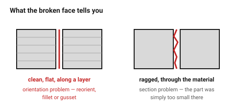

# Failure catalogue — symptom, cause, fix

What went wrong and which kind of fix it needs: a change in the **design**, or
a change in the **print settings**. Telling those apart is most of
troubleshooting — a design problem cannot be tuned away, and a settings
problem should not trigger a redesign.

## When this applies

After a print that did not come out right, and while designing something
similar to one that did not.

## Good starting values

### Structural failures — the part broke

| Symptom | Likely cause | Fix | Where |
|---|---|---|---|
| Snapped cleanly along a layer line | load pulled the layer welds apart | **reorient**; add a fillet or gusset | **design** |
| A snap-fit arm broke at its root on the first click | no root fillet, or printed standing up | fillet ≥ 0.5 × t; flex in the layer plane | **design** |
| A boss cracked when an insert went in | boss wall too thin | ≥ 1.6 mm of plastic, gussets | **design** |
| A screw stripped its boss | machine screw in a self-tapping hole, or too many cycles | coarse-thread screw, or an insert | **design** |
| A thin rib snapped off | below one line width, or unsupported while printing | thicken to wall thickness | **design** |
| Part cracked days later, unloaded | PLA in a warm place, or a press fit too tight | change material; open the fit | **design** |
| Layers separated under load | poor layer adhesion — too cold, too much cooling | raise temperature, reduce fan | settings |

### Dimensional failures — it doesn't fit

| Symptom | Likely cause | Fix | Where |
|---|---|---|---|
| Hole too small for the screw | printed holes come out undersize | add the print allowance | **design** |
| Part will not sit flat in a pocket | elephant foot | 0.5 mm bottom chamfer | **design** |
| Sliding fit is a rattle | clearance applied per side instead of diametral | halve it | **design** |
| A PETG version of a PLA part is too tight | missing material adjustment | +0.05–0.1 mm on every fit | **design** |
| Long ABS part finishes short | shrinkage | scale, or change material | **design** |
| Everything is slightly oversize | over-extrusion, uncalibrated flow | calibrate flow | settings |
| Everything is 25.4× wrong | units | re-export in millimetres | **design** |

### Surface and process failures

| Symptom | Likely cause | Fix | Where |
|---|---|---|---|
| Drooping, stringy underside | overhang beyond 45° | chamfer, teardrop, reorient | **design** |
| Sagging ceiling over a cavity | bridge too long | printed arch, or sacrificial bridge | **design** |
| Corners lifted off the bed | warping — sharp corners, large footprint, no enclosure | chamfer corners, mouse ears, change material | both |
| First layer not sticking | bed level, temperature, dirty sheet | clean and level | settings |
| Layer shift halfway up | belt, collision, or the part came loose | mechanical | settings |
| Fine webs between towers | stringing, usually PETG | group features closer; tune retraction | both |
| Top surface has pinholes | too few top layers, or infill too sparse | 5 top layers, 15 % infill | settings |
| Visible seam line up one side | the layer start point | move it to a corner | settings |
| Rough patch on one face only | supports were there | move the supported face, or design them out | **design** |

## How to build it

1. **Read the "where" column first.** A design fix cannot be tuned away, and
   tuning will not fix a 70° overhang.
2. For design fixes, follow the link and change the model — then note the rule
   in the relevant document so it does not recur.
3. For settings, change **one** thing and reprint a small coupon rather than
   the whole part.
4. When a part breaks, look at the **fracture surface**. A clean break along a
   layer line is an orientation problem. A ragged break through the material
   is a section problem.

## When to do it differently

- **It printed correctly last week** → nothing in the model changed, so it is
  the machine, the filament, or the profile.
- **Two symptoms at once** → usually one cause. Warping plus poor layer
  adhesion is almost always temperature, not two problems.

## Images

*A clean break along a layer line is an orientation problem — the design was
loaded in Z. A ragged break through the material means the section was simply
too small.*

## Source & date

- Assembled from the documents in this folder, plus
  [Prusa Knowledge Base](https://help.prusa3d.com/article/elephant-foot-compensation_114487)
  and [Protolabs Network](https://www.hubs.com/knowledge-base/how-does-part-orientation-affect-3d-print/).
- `confidence: medium`.
- **Photographs wanted** for this document — see [`PHOTOS.md`](../../PHOTOS.md).
  Warping, stringing, delamination and elephant foot are exactly the failures
  a diagram cannot convey and a photograph can.
