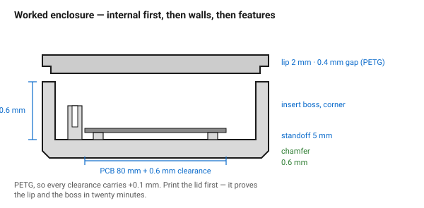

# Worked example — an electronics enclosure

A complete part with every number derived rather than assumed. The value of
this document is the **order of decisions** — orientation, material, walls,
features, fits — because reversing that order is what produces an enclosure
that prints badly and does not close.

Target: a box for an 80 × 55 mm PCB with a USB-C socket and two LEDs, in PETG,
opened occasionally with M3 screws.

## When this applies

As a template for enclosure work, and as a model for how the FDM documents
chain together.

## Good starting values

### Step 0 — the decisions everything derives from

| Decision | Value | Why |
|---|---|---|
| Orientation | shell open-side up, lid flat | no supports, flat floor, no bridged ceiling |
| Material | **PETG** | electronics warm their own box; PLA sags near 55 °C |
| Nozzle / layer | 0.4 / 0.2 mm | assumed default |
| Clearance adjustment | **+0.1 mm** on every fit | PETG |
| Fastening | M3 heat-set inserts | the lid is opened occasionally |

### Step 1 — internal size

| Quantity | Value | From |
|---|---|---|
| PCB | 80 × 55 mm | measured |
| PCB clearance | +0.3 mm each side | pocket fit |
| Standoff height | 5 mm | solder tails underneath |
| Component height above the board | 12 mm | measured, tallest part |
| Lid inner clearance | 2 mm | fingers, air |

```
internal length = 80 + 0.6 = 80.6 mm
internal width  = 55 + 0.6 = 55.6 mm
internal height = 5 + 1.6 (board) + 12 + 2 = 20.6 mm
```

### Step 2 — outside size

Walls at 5 lines = 2.1 mm, floor 6 layers = 1.2 mm:

```
outside length = 80.6 + 2 × 2.1 = 84.8 mm
outside width  = 55.6 + 2 × 2.1 = 59.8 mm
shell height   = 20.6 + 1.2     = 21.8 mm
```

### Step 3 — the features, and where each number comes from

| Feature | Value | Source |
|---|---|---|
| Bottom outside chamfer | 0.6 mm × 45° | [`chamfers-fillets-elephant-foot`](../03-geometry/chamfers-fillets-elephant-foot.md) |
| Internal corner fillet | 2 mm | [`enclosure-shell-and-lid`](../05-features/enclosure-shell-and-lid.md) |
| Lid lip | 2 mm tall, 0.3 + 0.1 = **0.4 mm** clearance | lid clearance + PETG adjustment |
| Insert boss hole | 4.0 mm ⌀, 7 mm deep | [`screw-boss-heat-set-insert`](../05-features/screw-boss-heat-set-insert.md) |
| Insert boss OD | 8 mm, merged into the corner fillet | so it is not a free-standing tower |
| PCB standoffs | ⌀ 6 mm, 5 mm tall, 2.4 mm pilot | [`self-tapping-boss`](../05-features/self-tapping-boss.md) |
| USB-C cutout | measured socket + 0.3 + 0.1 mm | measured, not from the datasheet |
| LED holes | 3.1 mm ⌀ for 3 mm LEDs, press | [`clearance-table`](../04-fits/clearance-table.md) + PETG |
| Lid screw holes | 3.6 mm ⌀ clearance | printed-hole allowance |

### Step 4 — the checks

| Check | Value | Limit | Verdict |
|---|---|---|---|
| Wall | 2.1 mm | multiple of 0.42 → 5 lines | ok |
| Largest overhang | lid lip underside, 90° but only 2 mm | small overhangs print | ok |
| USB cutout, side wall | no overhang in this orientation | | ok |
| Bridge over the cutout | 14 mm | ≤ 30 mm in PETG | ok |
| Material around insert | (8 − 4.6) / 2 = 1.7 mm | ≥ 1.6 mm | ok, just |

## How to build it

1. Fix the orientation and material first.
2. Work internal → external, not the other way. An enclosure designed from the
   outside in always ends up too small inside.
3. Place the PCB, then the standoffs, then the corner bosses — in that order,
   because the bosses have to dodge the board.
4. Cut the openings from **measured** components.
5. Add the lip, the chamfer and the fillets.
6. Print the **lid first**: it is fast, and it proves the lip clearance and the
   insert boss before the long print.
7. Run [`before-slicing`](../08-checklists/before-slicing.md).

## When to do it differently

- **A sealed enclosure** → gasket groove and an O-ring; FDM walls are porous.
- **A larger board** → check the shell against warping; PETG is forgiving, ABS
  would need corner discs.
- **Frequent access** → snap-fit lid instead of screws, or a print-in-place
  hinge on one edge.
- **PLA instead of PETG** → subtract the 0.1 mm adjustment from every fit, and
  keep the box away from anything warm.

## Images


*Internal first, then walls, then features. An enclosure designed from the
outside in always ends up too small inside.*

## Source & date

- Every number derived in this document from the linked documents; none is an
  independent measurement.
- `confidence: medium` — the arithmetic is exact, the inputs are an example.
