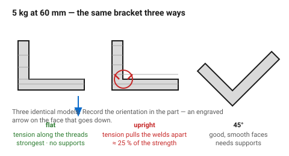
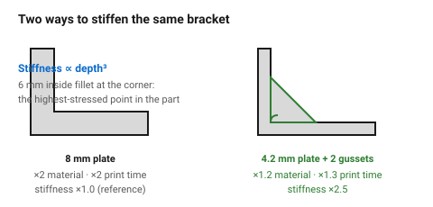

# Worked example — an L-bracket under load

The part that most clearly demonstrates why orientation is decided first. The
same geometry, printed three ways, differs in strength by a factor of four —
and the three models are identical on screen.

Target: a bracket carrying 5 kg at 60 mm from a wall, in PETG.

## When this applies

Any load-bearing printed part. The reasoning transfers to mounts, arms,
hooks and shelf supports.

## Good starting values

### Step 0 — the load path

The load hangs at the end of the horizontal arm. The bracket resists it by
**bending at the inside corner**, which means the material at that corner is
in tension on the outside face.

> Anything that puts that tension across layer welds is the wrong orientation.

### Step 1 — orientation, the whole decision

| Orientation | What the layers do | Strength | Supports |
|---|---|---|---|
| **Flat on the bed, L lying down** | layers run along both arms; tension is along the threads | **strongest** | none |
| Standing on the base, L upright | layers are horizontal; tension pulls them apart at the corner | **weakest — ~25 %** | none |
| On its corner at 45° | mixed | good | needed |

Flat on the bed. The whole rest of the design follows from that.

### Step 2 — section and features

| Feature | Value | Why |
|---|---|---|
| Wall / plate thickness | 4 mm | the load, and it is 10 lines at 0.42 — round to 4.2 mm |
| Inside corner fillet | 6 mm | the highest-stressed point in the part |
| Gussets | 2, 4.2 mm thick, 45° | [`ribs-and-gussets`](../05-features/ribs-and-gussets.md) |
| Gusset height | 25 mm | ~3 × plate thickness × 2 |
| Bolt holes | 5.7 mm ⌀ for M5 | clearance + print allowance |
| Edge distance | 10 mm | ≥ 2 × bolt ⌀ |
| Bottom chamfer | 0.6 mm | elephant foot |
| Walls / infill | 4 walls, 30 % | load-bearing |

### Step 3 — why not just make it thicker

| Option | Material | Print time | Stiffness |
|---|---|---|---|
| 8 mm plate, no gussets | ×2 | ×2 | ×1.0 (reference) |
| **4.2 mm plate + 2 gussets** | **×1.2** | **×1.3** | **×2.5** |

Stiffness goes with the cube of depth, so a gusset that adds 25 mm of section
depth beats doubling a 4 mm plate — at a fifth of the extra material.

## How to build it

1. Sketch the load path and mark where the tension is.
2. Choose the orientation that keeps that tension **in the layer plane**.
3. Size the section, then add the corner fillet — 6 mm here, roughly 1.5 × the
   plate thickness.
4. Add two gussets at 45° so they are self-supporting in the chosen
   orientation.
5. Place the bolt holes with ≥ 2 × bolt ⌀ of edge distance.
6. **Record the orientation in the model** — an engraved arrow on the face
   that goes down. A bracket printed upright looks identical and carries a
   quarter of the load.
7. Print one and load it to destruction before making ten.

## When to do it differently

- **The bracket must be strong in two directions** → this is where FDM runs
  out. Split it, or use a metal bracket.
- **PLA instead of PETG** → stiffer but brittle; it will carry the static load
  and fail on impact. Add 20 % to the section.
- **Space for gussets is not available** → a closed box section is the next
  best thing, and stiffer than either.
- **A cosmetic bracket** → the 45° gussets are visible. A boxed profile hides
  the reinforcement.

## Images

*The same model three ways. Standing up, the tension at the inside corner
pulls directly on the layer welds — about a quarter of the strength, and
identical on screen.*

*Stiffness goes with the cube of section depth. Two gussets beat doubling the
plate, at a fifth of the extra material.*

## Source & date

- Anisotropy figures: [Protolabs Network — part orientation](https://www.hubs.com/knowledge-base/how-does-part-orientation-affect-3d-print/),
  [MLC CAD — Z-axis anisotropy](https://www.mlc-cad.com/resources/3d-printing/why-fdm-3d-prints-are-weaker-on-the-z-axis-anisotropy-explained/).
- Rib and gusset proportions: [`ribs-and-gussets`](../05-features/ribs-and-gussets.md).
- `confidence: medium` — the ratios are illustrative; the ordering is reliable.
