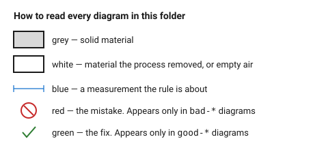

# Laser cutting — start here

A laser cutter is a machine that moves a focused beam across a flat sheet and
burns a narrow line through it. Everything it can make follows from that one
sentence: parts are **flat**, outlines are **closed 2D curves**, and every cut
is **slightly wider than the line you drew**.

## When this applies

Any part that will be cut from sheet material on a CO₂ laser: enclosures,
panels, brackets, stencils, inlays, signage, mechanism plates. Read this page
before the first cut of any project, then follow the pointers.

This does **not** cover fibre lasers cutting steel (different machine,
different rules), and it does not cover 3D shapes — for those see
[`fdm/start-here`](../fdm/00-start-here.md).

## Good starting values

The whole process rests on four numbers. If the assistant knows only these
four, it will already avoid most bad output.

| What | Start with | Works between | Why |
|---|---|---|---|
| Kerf (material the beam removes) | 0.20 mm | 0.08–0.35 mm | every slot comes out this much wider, every tab this much thinner — [`kerf-and-tolerance`](01-basics/kerf-and-tolerance.md) |
| Minimum hole ⌀ | = material thickness | 0.5× to 1× thickness | the beam has to pierce before it can travel; smaller holes char shut |
| Minimum web (material left between two cuts) | 1.5× material thickness | 1× to 3× | two nearby cuts cook the strip between them until it falls out |
| Part spacing when nesting | 2 mm | 1–3 mm | heat from one cut distorts its neighbour |

## How to build it

The order below is the order that avoids rework. It is also a good order for
the assistant to state as its plan, because each step names the documents that
should be loaded.

1. **Pick the material.** Thickness and species change every other number.
   → [`02-materials/material-table`](02-materials/material-table.md),
   and check [`never-cut-these`](02-materials/never-cut-these.md) first.
2. **Decide how the parts join.** The joint decides the outline, not the other
   way round. → [`04-joints/`](04-joints/)
3. **Draw the outlines** with the geometry limits in mind.
   → [`03-geometry/minimum-features`](03-geometry/minimum-features.md)
4. **Apply kerf compensation** — or deliberately decide not to, and say so.
   → [`01-basics/kerf-and-tolerance`](01-basics/kerf-and-tolerance.md)
5. **Add engraving and scoring** last, on their own layers.
   → [`05-engraving/`](05-engraving/)
6. **Lay out and export.** Layers, colours, line widths, units.
   → [`06-file-prep/layers-colours-linewidth`](06-file-prep/layers-colours-linewidth.md)
7. **Run the checklist** before handing the file over.
   → [`07-checklists/before-you-export`](07-checklists/before-you-export.md)

## When to do it differently

- **One-off, fit does not matter** (a sign, a stencil, a gasket) → skip kerf
  compensation entirely and say so. Compensating a part that mates with
  nothing is wasted precision.
- **The part must fit something that already exists** (a panel in an extrusion,
  a hole over a connector) → kerf compensation is the *first* decision, not
  the fourth. Measure the thing it has to fit before drawing anything.
- **Thick material, over ~8 mm** → the cut is visibly tapered and the rules in
  [`03-geometry/taper-and-focus`](03-geometry/taper-and-focus.md) start to
  dominate. Below 6 mm taper can be ignored.
- **The design needs to bend** → a laser cannot bend, but it can make material
  bendable. → [`04-joints/living-hinge`](04-joints/living-hinge.md)
- **The design wants thickness or 3D relief** → stack several flat layers.
  → [`04-joints/stacked-layer-construction`](04-joints/stacked-layer-construction.md)

## Images

*Grey is material, white is what the beam removed, blue is the measurement the
rule is about, red marks the mistake and green the fix.*

## Source & date

- Structure and pointers written for this repository, 2026-09-22.
- Individual numbers carry their own sources in the documents linked above.
- `confidence: high` for the process description; the four headline numbers
  are `starting-point` and are refined in their own documents.
