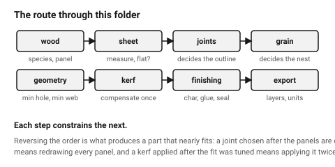

# Laser cutting wood — start here

A laser cutter moves a focused beam across a flat sheet and **burns** a narrow
line through it. Everything it can make follows from that: parts are **flat**,
outlines are **closed 2D curves**, every cut is **wider than the line you
drew**, and — because the material is wood — every cut edge is **charred**.

**This folder is wood-first.** Unless a project says otherwise, a part here is
birch plywood, solid hardwood, bamboo or MDF. Acrylic, card and leather are
covered in [`non-wood-materials`](02-materials/non-wood-materials.md) because
they turn up, not because they are the default.

## When this applies

Any part cut from sheet on a CO₂ laser: boxes, enclosures, panels, frames,
mechanism plates, signage, inlay, jigs. Read this before the first cut of a
project, then follow the pointers.

Not for fibre lasers cutting steel (different machine, different rules), and
not for 3D shapes — for those see [`fdm/start-here`](../fdm/00-start-here.md).

## Good starting values

Five numbers carry most of the process in wood. An assistant that knows only
these will already avoid most bad output.

| What | Start with | Works between | Why |
|---|---|---|---|
| **Kerf** (material the beam removes) | **0.28 mm** in 3 mm birch ply | 0.22–0.32 mm | every slot comes out this much wider, every tab this much thinner — [`kerf-and-tolerance`](01-basics/kerf-and-tolerance.md) |
| **Measured thickness** | **measure the sheet** | "3 mm" ply is 2.6–3.3 mm | a larger error than the kerf, and it changes sheet to sheet — [`plywood`](02-materials/plywood.md) |
| **Minimum hole ⌀** | = material thickness | 0.8×–1.5× | smaller holes char shut |
| **Minimum web** between two cuts | 1.5 × thickness | 1×–3× | two nearby cuts cook the strip between them |
| **Press-fit interference** | 0.08 mm | 0.05–0.10 mm | wood fibres crush and grip — the reason this folder is wood-first |

## How to build it

The order below is the order that avoids rework, and a good plan for the
assistant to state out loud — each step names the documents to load.

0. **Choose the object's design systems** — radius set, spacing scale,
   proportion family — before any of the below. Five minutes, and every
   number after it inherits from them.
   → [`design/start-here`](../design/00-start-here.md)
1. **Choose the wood.** Plywood for structure, solid or bamboo where it shows,
   MDF where it will be painted. Thickness and species change every number
   after this. → [`wood-overview`](02-materials/wood-overview.md),
   and check [`never-cut-these`](02-materials/never-cut-these.md) first.
2. **Measure the sheet**, and check it is flat.
   → [`wood-moisture-and-storage`](02-materials/wood-moisture-and-storage.md)
3. **Choose the joints.** The joint decides the outline, not the reverse.
   → [`wood-joint-selection`](04-joints/wood-joint-selection.md)
4. **Decide the grain direction** for every part.
   → [`grain-and-ply-direction`](03-geometry/grain-and-ply-direction.md)
5. **Draw the outlines** inside the geometry limits.
   → [`minimum-features`](03-geometry/minimum-features.md)
6. **Apply kerf compensation** — or deliberately decide not to, and say so.
   → [`kerf-and-tolerance`](01-basics/kerf-and-tolerance.md)
7. **Add engraving and scoring** last, on their own layers.
   → [`engraving-wood`](05-engraving/engraving-wood.md)
8. **Plan the finishing** — char removal, gluing, sealing all need access.
   → [`10-wood-finishing/`](10-wood-finishing/)
9. **Lay out and export.**
   → [`layers-colours-linewidth`](06-file-prep/layers-colours-linewidth.md)
10. **Run the checklist.**
    → [`before-you-export`](07-checklists/before-you-export.md)
11. **Run the design critique.** Making it correctly and making it well are
    two different passes over the same part.
    → [`design/design-critique`](../design/05-process/design-critique.md)

## When to do it differently

- **A one-off where fit does not matter** (a sign, a stencil) → skip kerf
  compensation and say so. Compensating a part that mates with nothing is
  wasted precision.
- **The part must fit something that already exists** → kerf compensation and
  a measured sheet are the *first* decisions, not the sixth.
- **Thick stock, over ~8 mm** → the cut is visibly tapered and charring
  dominates. → [`taper-and-focus`](03-geometry/taper-and-focus.md)
- **The design needs to bend** → a laser cannot bend wood, but it can make it
  bendable. → [`living-hinge`](04-joints/living-hinge.md)
- **The design wants thickness, an internal cavity or an undercut** → stack
  flat layers. → [`stacked-layer-construction`](04-joints/stacked-layer-construction.md)
- **Transparent, very fine, soft, or disposable** → leave wood.
  → [`non-wood-materials`](02-materials/non-wood-materials.md)
- **Outdoors, wet, or food contact** → none of these materials. Say so rather
  than designing around it.

## Images

*Grey is material, white is what the beam removed, blue is the measurement the
rule is about, red marks the mistake and green the fix.*

*Material, sheet, joints, grain, geometry, compensation, finishing. Each step
constrains the next, which is why reversing the order produces a part that
nearly fits.*

## Source & date

- Structure and pointers written for this repository, 2026-09-22.
- Headline numbers carry their own sources in the documents linked above.
- `confidence: high` for the process description; the five headline numbers
  are `starting-point` and are refined in their own documents.
