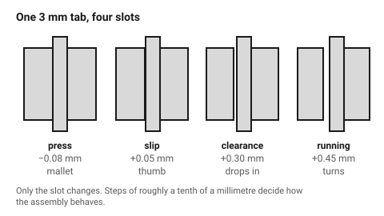

# Fits — press, slip, clearance and running

"It should fit" is four different requirements, and they need four different
numbers. Choosing the wrong one is the most common reason a laser-cut assembly
either will not go together or will not stay together.

## When this applies

Any time two things meet: two cut parts, a cut part and a screw, a cut part
and a shaft, a cut part and something bought. Kerf compensation comes first —
these numbers are applied **on top of** a kerf-compensated drawing. See
[`kerf-and-tolerance`](kerf-and-tolerance.md).

## Good starting values

### The four fits

| Fit | Target | Use for | Feel |
|---|---|---|---|
| **Press** | −0.05 to −0.10 mm (interference) | joints that must hold without glue | needs a mallet, will not come apart by hand |
| **Slip** | 0 to +0.10 mm | joints that will be glued, or taken apart often | pushes together with thumb pressure |
| **Clearance** | +0.20 to +0.40 mm | screws, brackets, anything with a fastener holding it | drops in, visible gap |
| **Running** | +0.30 to +0.50 mm | a shaft or axle that must turn | spins freely, small wobble |

Negative means interference — the male part is *larger* than the female.

Material changes the press-fit number, because a press fit works by
compressing something:

| Material | Press-fit interference | Note |
|---|---|---|
| Cast acrylic | 0.025–0.05 mm | brittle; above ~0.08 mm it crazes or cracks at the corners |
| Plywood | 0.05–0.10 mm | fibres crush and grip; the most forgiving |
| MDF | 0.05–0.10 mm | good grip, but edges crumble above ~0.15 mm |
| Cardboard | 0.10–0.20 mm | very forgiving, low holding force |

### Holes for metric screws

Drawn diameters, before kerf compensation. Compensate inward as usual.

| Screw | Clearance hole (free fit) | Close fit | Nut across flats (for a captive pocket) |
|---|---|---|---|
| M2 | 2.4 mm | 2.2 mm | 4.0 mm |
| M2.5 | 2.9 mm | 2.7 mm | 5.0 mm |
| M3 | 3.4 mm | 3.2 mm | 5.5 mm |
| M4 | 4.5 mm | 4.3 mm | 7.0 mm |
| M5 | 5.5 mm | 5.3 mm | 8.0 mm |
| M6 | 6.6 mm | 6.4 mm | 10.0 mm |

A captive hex pocket should be drawn **0.1–0.2 mm larger across the flats**
than the nut, and deep enough that the nut sits flush — see
[`t-slot-captive-nut`](../04-joints/t-slot-captive-nut.md).

### Holes for round things

| What | Drawn diameter | Why |
|---|---|---|
| Bearing, press fit (608 = ⌀22) | nominal − 0.05 mm | acrylic will crack at more; ply will not hold at less |
| Bearing, glued | nominal + 0.1 mm | leave room for the adhesive film |
| Shaft, rotating | nominal + 0.3 mm | wood and acrylic are not bushings; give it room |
| Dowel, glued | nominal + 0.1 mm | |
| LED 5 mm, push fit | 4.9 mm in acrylic, 4.8 mm in ply | ply compresses more |

## How to build it

1. Decide, for each mating pair, **which of the four fits it is** — and write
   it down. Most assembly problems are an undeclared fit.
2. Apply kerf compensation to the geometry.
3. Add the fit allowance on top, always to **one** of the two parts. Changing
   both makes the error impossible to trace when the test part comes out wrong.
4. On anything with more than three mating pairs, cut a **fit coupon** first:
   the same slot at five widths, 0.05 mm apart, labelled. Ten minutes, and it
   turns four guesses into one measurement. See
   [`kerf-test-comb`](kerf-test-comb.md).

## When to do it differently

- **Plywood with visible voids or a wandering grain** → move one step looser.
  A press fit into a void is a split, not a joint.
- **The assembly will be taken apart repeatedly** (a jig, a display stand) →
  never press fit. Wood fibres crush once and then the joint is loose forever.
- **The part will be painted or finished** → add 0.1–0.2 mm; two coats of
  paint is a real dimension on a 3 mm part.
- **Acrylic in a warm place** → acrylic moves about 0.07 mm per metre per °C.
  On parts under 200 mm this is noise; on a 1 m panel it is a jammed slide.
- **The mating part is bought, not cut** → measure the bought part first, with
  callipers, and design to the measurement rather than the catalogue number.

## Images

*The same 3 mm tab in four slots. Only the slot width changes, by a tenth of a
millimetre at a time — that is the whole difference between a joint that needs
a mallet and one that falls out.*

## Source & date

- Press-fit interference by material:
  [CMU 99-353 — kerf and joinery (PDF)](https://www.cs.cmu.edu/afs/cs/academic/class/99353-f16/day3/kerf.pdf),
  [Ponoko — snug joints in acrylic](https://www.ponoko.com/blog/how-to-make/how-to-make-snug-joints-in-acrylic/).
- Slot clearance for slip fits (≈0.25 mm / 0.010″ over the tab):
  [SendCutSend — designing laser cut tab and slot parts](https://sendcutsend.com/blog/designing-laser-cut-tab-and-slot-parts/).
- Metric clearance holes and nut dimensions: ISO 273 medium series and ISO
  4032 across-flats, rounded to values that are sensible to draw.
- `confidence: medium` — the fastener dimensions are standards and exact; the
  fit allowances are practice and vary with material batch.
