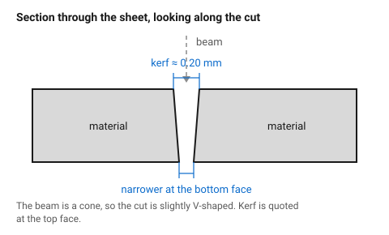
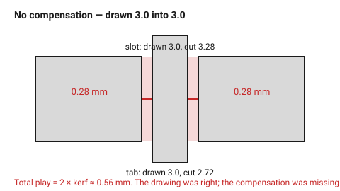
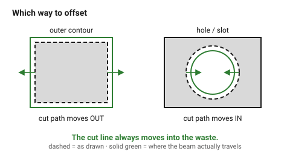

# Kerf and tolerance — the number everything else depends on

A laser does not cut along a line. It **burns away a strip of material
centred on that line**. The width of that strip is the kerf, and it is the
reason a box drawn with perfectly matching tabs and slots falls apart in your
hands.

Every slot comes out **one kerf wider** than drawn. Every tab comes out **one
kerf narrower** than drawn. Put them together and the joint is loose by **two
kerfs** — for 3 mm plywood that is about 0.6 mm of slop, which is the
difference between a box that snaps together and a box that needs glue and
clamps.

## When this applies

Every part that has to fit something: another laser-cut part, a screw, a
bearing, an extrusion, an existing hole. It does not apply to a silhouette
that mates with nothing — see *When to do it differently*.

## Good starting values

### Kerf by material and thickness

These are **starting points for a typical 40–80 W CO₂ machine**. Kerf is a
property of the machine, lens, power, speed and even the sheet, not of the
material alone. Measure before trusting — [`kerf-test-comb`](kerf-test-comb.md)
takes ten minutes and replaces every row in this table.

| Material | Thickness | Kerf | Why it differs |
|---|---|---|---|
| Boxboard / greyboard | 1.1 mm | 0.08 mm | low power, fast, almost no heat spread |
| Cast acrylic | 2–3 mm | 0.17–0.20 mm | vaporises cleanly, very repeatable |
| Cast acrylic | 5–8 mm | 0.21–0.25 mm | thicker section, more beam divergence |
| MDF (veneered) | 4 mm | 0.16 mm | dense and uniform, narrow burn |
| MDF | 3–6 mm | 0.20–0.30 mm | slow cut speed, wide heat-affected zone |
| Plywood | 3 mm | 0.25–0.30 mm | glue lines and grain burn unevenly |
| Plywood | 6 mm | 0.25 mm | needs more power but also more speed |
| Leather / felt | 2–4 mm | 0.15–0.25 mm | edge shrinks as it seals |

**Kerf is centred on the cut path.** Half of it comes off each side.

### Interference for a press fit

Once kerf is compensated, the joint is nominal — and a nominal joint is a
*slip* fit, not a press fit. For a joint that holds without glue, make the tab
deliberately larger than the slot by:

| Material | Interference (total) | Why |
|---|---|---|
| Cast acrylic | 0.025–0.05 mm | stiff and brittle; more than this and it cracks instead of gripping |
| Plywood | 0.05–0.10 mm | fibrous, crushes slightly and grips |
| MDF | 0.05–0.10 mm | compresses well, but the edge crumbles above ~0.15 mm |
| Cardboard | 0.10–0.20 mm | soft enough to swallow a large interference |

### Material thickness is not what the label says

| Nominal | Actually measures | Consequence |
|---|---|---|
| 3 mm plywood | 2.7–3.2 mm | a slot drawn at 3.0 mm is either loose or impossible |
| 3 mm acrylic | 2.8–3.0 mm | cast acrylic is often under, extruded closer to nominal |
| 6 mm plywood | 5.5–6.2 mm | |

**Measure the sheet with callipers and use the measured number.** For sheet
goods, thickness variance is a larger error than kerf, and unlike kerf it
changes from sheet to sheet.

## How to build it

There are two ways to compensate, and the assistant must know which one is in
play, because doing both doubles the correction and doing neither leaves the
joint loose by 2× kerf.

### Method A — the machine compensates (preferred)

LightBurn, RDWorks and most modern controllers offer a per-layer *kerf offset*
(sometimes "cut offset"). Set it to half the kerf and the machine shifts the
tool path itself.

1. Draw everything at **true nominal size**. A 3.0 mm slot for a 3.0 mm sheet.
2. Set the cut layer's kerf offset to **kerf ÷ 2**, direction *outward* for
   outlines and *inward* for holes (the controller usually infers this from
   the path direction — verify on a test part).
3. Add interference for press fits **in the geometry**, not in the offset.

The advantage: the drawing stays readable and dimensionally honest, and a
different machine only needs a different offset value.

### Method B — the geometry compensates

When the file goes to a cutting service or a controller with no offset
feature, bake the correction into the shapes. The direction rule is the part
people get backwards:

| Feature | Move the cut path | Result |
|---|---|---|
| Outer contour of a part | **outward** by kerf ÷ 2 | part keeps its drawn size |
| Hole, slot, internal cutout | **inward** by kerf ÷ 2 | hole keeps its drawn size |

In both cases the cut line moves **into the waste**. That is the single
sentence worth remembering.

### The slot formula

A slot that receives the *uncut edge* of another sheet is the most common
joint in laser work, and it has its own formula because the mating part is
raw sheet thickness — nothing was cut off it.

```
drawn slot width  =  measured material thickness  −  kerf  −  interference
```

Worked example, 3 mm plywood measuring 2.85 mm, kerf measured at 0.28 mm,
press fit wanted:

```
drawn slot width = 2.85 − 0.28 − 0.08  =  2.49 mm
```

The slot is drawn at 2.49 mm, cuts out at 2.77 mm, and receives a 2.85 mm
sheet with 0.08 mm of interference. It taps together with a mallet and stays.

If the machine is doing Method A compensation, drop the `− kerf` term:

```
drawn slot width = 2.85 − 0.08 = 2.77 mm
```

### Which parts of a drawing need which treatment

| Geometry | Treatment |
|---|---|
| Slot receiving a raw sheet edge | slot formula above |
| Tab that enters such a slot | none — it is raw sheet thickness |
| Finger joint (both sides cut) | compensate both; fingers grow by kerf ÷ 2 per side, slots shrink by the same |
| Hole for an M3 screw (clearance) | draw 3.2 mm, compensate inward; do not add interference |
| Hole for a press-fit bearing | draw ⌀ − interference, compensate inward |
| Outer silhouette that mates with nothing | leave it alone |

## When to do it differently

- **Decorative or single parts** → skip compensation. A 0.2 mm error on a
  coaster is invisible, and an uncompensated drawing is easier to edit later.
- **Cardboard and felt** → the material compresses more than the kerf
  matters. Use a nominal slot and let the material take up the slack.
- **The joint will be glued anyway** → aim for a *slip* fit (compensate kerf,
  add no interference). A press fit leaves no room for glue and squeezes it
  all out of the joint.
- **Acrylic thicker than 6 mm** → the cut is noticeably tapered, so "the"
  kerf depends on which face you measure. Use the *narrow* (bottom) face for
  parts that must slot together, and read
  [`taper-and-focus`](../03-geometry/taper-and-focus.md).
- **The machine's offset feature is already on** → do not also offset the
  geometry. This is the most common way to end up with a joint that is tight
  by exactly one kerf instead of loose by two.

## Images


*A section through the sheet. The beam removes a strip roughly 0.2 mm wide,
slightly wider at the top than the bottom because the beam is a cone. The blue
dimension is what "kerf" means — and it is the top face that gets measured.*


*Drawn correctly, cut wrongly: the slot grew by one kerf, the tab shrank by
one, and the joint rattles with 2× kerf of play. Nothing in the drawing was
wrong — the compensation was simply missing.*


*The same joint with each cut path moved half a kerf into the waste. The parts
come out at their drawn size and the fit is what the drawing said it was.*


*The rule that gets reversed most often: the cut line always moves into the
waste. Outward on an outline, inward on a hole.*

## Source & date

- Kerf values: [CutLaserCut — understanding laser kerf](https://cutlasercut.com/drawing-resources/expert-tips/laser-kerf/),
  [Ponoko — figuring out kerf for precision parts](https://www.ponoko.com/blog/ponoko/figuring-out-kerf-for-precision-parts/).
- Interference values and the compensation direction rule:
  [CMU 99-353 — SolidWorks, laser cutting kerf and joinery (PDF)](https://www.cs.cmu.edu/afs/cs/academic/class/99353-f16/day3/kerf.pdf).
- Joint slop of 2× kerf and the comb test:
  [Instructables — adjusting kerf settings for press-fit finger joints](https://www.instructables.com/Adjusting-Laser-Cutters-Kerf-Settings-for-Pre/).
- `confidence: starting-point` — every number here is machine-dependent. The
  *relationships* (slot grows, tab shrinks, joint loses 2×) are exact; the
  magnitudes are not. Measure with [`kerf-test-comb`](kerf-test-comb.md) and
  record the result in [`machine-assumptions`](machine-assumptions.md).
