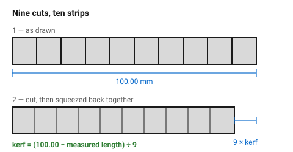
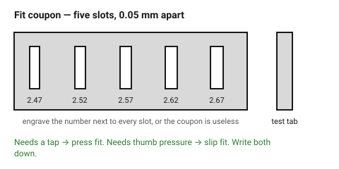

# Measuring your own kerf — the comb test

Every kerf number in this knowledge base is a guess about someone else's
machine. This test replaces all of them with a measurement of yours, in about
ten minutes and one A5 offcut. It is the highest-value thing anyone can do
before starting a project that has to fit together.

## When this applies

- First time on a new material, a new thickness, or a new supplier's sheet.
- After a lens change, a mirror clean, or a power-supply service.
- When a joint that used to fit stops fitting.

Not needed for decorative one-offs that mate with nothing.

## Good starting values

| What | Value | Why |
|---|---|---|
| Test strip length | 100 mm | long enough that nine kerfs are easy to measure |
| Number of cuts | 9 (making 10 strips) | division by 9 keeps the arithmetic honest |
| Callipers | digital, 0.01 mm | a ruler cannot see 0.2 mm |
| Fit coupon steps | 0.05 mm | one step is the smallest difference a hand can feel |

## How to build it

### Part 1 — the comb, for kerf

1. Draw a rectangle **100.00 mm** long and about 30 mm tall.
2. Cut it into ten equal strips with **nine** lines across its length, 10 mm
   apart.
3. Cut it at **exactly the settings you will use for the real job** — power,
   speed, focus, air assist, same sheet. Change any of these and the number
   changes with them.
4. Squeeze all ten strips back together, tight, against a straight edge.
5. Measure the total length, *L*.

```
kerf = (100.00 − L) ÷ 9
```

A measured 98.5 mm gives (100 − 98.5) ÷ 9 = **0.167 mm**.

### Part 2 — the coupon, for fit

Kerf tells you the geometry; the coupon tells you what your hands will feel.

1. Draw one tab 20 mm wide at the true measured sheet thickness.
2. Draw five slots next to it, labelled, at the thickness **minus** the kerf
   you just measured, then ±0.05 and ±0.10 mm around it.
3. Cut, then try the tab in each slot, in order.
4. The slot that needs firm thumb pressure is your **slip** fit; the next one
   down, needing a tap, is your **press** fit. Write both numbers down.

### Part 3 — record it

Put the result in [`machine-assumptions`](machine-assumptions.md). A
measurement nobody wrote down has to be taken again next month.

## When to do it differently

- **No callipers** → cut 20 strips from 200 mm instead of 10 from 100 mm. The
  error divides by 19 rather than 9, which makes a steel rule just about
  usable. Still buy callipers.
- **Very thick material (8 mm+)** → the cut is tapered, so measure the
  reassembled length at the *top* face and again at the *bottom*. The
  difference is the taper, and it is what decides whether a slot fits.
- **Cardboard, felt, foam** → the comb test is unreliable because the strips
  compress under the straight edge. Go straight to the fit coupon.

## Images


*Nine cuts, ten strips, pushed back together. The gap between 100 mm and what
the callipers read is nine kerfs — this is the whole measurement.*


*The same tab tried in five slots 0.05 mm apart. The one that needs a tap is
your press fit; the one that needs thumb pressure is your slip fit.*

## Source & date

- Method: [Instructables — adjusting your laser cutter's kerf settings for
  press-fit finger joints](https://www.instructables.com/Adjusting-Laser-Cutters-Kerf-Settings-for-Pre/),
  [Ponoko — figuring out kerf for precision parts](https://www.ponoko.com/blog/ponoko/figuring-out-kerf-for-precision-parts/).
- `confidence: high` — the procedure is arithmetic, not opinion. The numbers it
  produces are the only ones in this folder that are true for *your* machine.
