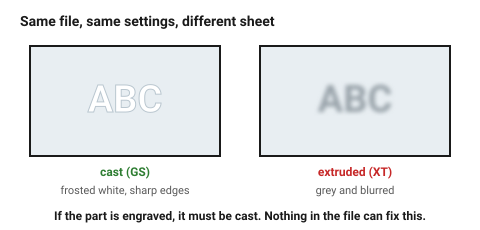

# Acrylic (PMMA) — cast vs extruded

> This folder is wood-first. Acrylic is here because it does two things wood
> cannot — it is transparent, and its cut edge needs no finishing at all.
> See [`non-wood-materials`](non-wood-materials.md) for when to leave wood.

Acrylic is the material a CO₂ laser was born to cut. It vaporises rather than
burns, so the edge comes out flame-polished and needs no finishing — the only
sheet material in this folder that looks *better* after the laser than before.

The one decision that matters is **cast or extruded**, and the two look
identical on the shelf.

## When this applies

Transparent or coloured parts, light guides, display work, front panels,
anything where the cut edge is visible. Not for structural parts that flex,
and not for press fits.

## Good starting values

| What | Start with | Works between | Why |
|---|---|---|---|
| Kerf, 3 mm | 0.18 mm | 0.15–0.22 mm | very repeatable — acrylic is the easiest material to calibrate |
| Kerf, 6 mm | 0.22 mm | 0.20–0.28 mm | thicker section, more divergence |
| Minimum hole ⌀ | 1.5 mm | 1.0–3 mm | acrylic tolerates smaller holes than wood; it does not char shut |
| Minimum web between cuts | 1.5 mm | 1–2 mm | below this the strip softens and bows |
| Press-fit interference | 0.03 mm | 0.025–0.05 mm | above this it crazes, then cracks weeks later |
| Bending / flexing | avoid | — | brittle; a cantilever snaps rather than bends |
| Comfortable cut thickness | ≤ 8 mm | up to 12 mm slowly | |

### Cast vs extruded

| | Cast (GS) | Extruded (XT) |
|---|---|---|
| Engraves | **frosted white, crisp** | grey, shallow, muddy |
| Cuts | slightly slower, very clean | faster, can leave a slight ripple |
| Edge | flame-polished | flame-polished but crazes more easily |
| Thickness tolerance | poor (±10%) | good (±5%) |
| Price | higher | lower |
| Use it for | anything engraved, anything visible | plain cut shapes, budget work |

**If the part is engraved, it must be cast.** This is the single most common
acrylic mistake: the design is right, the settings are right, and the engrave
comes out a dull grey smear because the sheet was extruded.

### Thickness tolerance is worse than you think

Cast acrylic is poured, so nominal 3 mm can measure 2.6–3.0 mm and can vary
*across one sheet*. Measure at the actual joint location, not at the corner.
Extruded is tighter but not perfect.

## How to build it

1. Identify cast vs extruded from the supplier's product code (GS = cast,
   XT = extruded) — not by eye, it is not possible by eye.
2. Measure the sheet with callipers at the place the joint will be.
3. Leave the protective masking **on** for cutting: it prevents the smoke
   residue and the small flame-lick marks around each pierce point.
4. Cut with air assist. Without it, acrylic edges pick up a milky haze.
5. For an engrave, run it **before** the cut, while the part is still held by
   the surrounding sheet.

## When to do it differently

- **The part flexes or takes a shock** → acrylic is the wrong material.
  Plywood, PETG or a printed part will survive; acrylic will not.
- **The joint must press fit** → use plywood, or design the acrylic joint with
  a clearance fit and glue it. Acrylic cement (dichloromethane) welds PMMA
  chemically and is far stronger than any press fit.
- **The part is large and will be handled warm** → acrylic expands about
  0.07 mm per metre per °C. On a 600 mm panel between 18 °C and 30 °C that is
  half a millimetre.
- **A truly clear edge is needed** (light pipe, edge-lit sign) → cut slightly
  slower with more power; a fast, low-power cut leaves microscopic ripples
  that scatter light.
- **Both faces must stay unmarked** → cut masked on both sides and support the
  sheet on pins rather than the honeycomb, which leaves back-reflection marks.

## Images

*The same engrave in cast and extruded acrylic at identical settings. Cast
frosts white and holds a sharp edge; extruded goes grey and blurs. Nothing in
the file can fix this — it is the sheet.*

## Source & date

- Cast vs extruded behaviour: [Xometry — cast and extruded acrylic](https://www.xometry.com/resources/sheet/cast-acrylic-cutting/),
  [OMTech — complete guide to laser engraving acrylic](https://omtech.com/blogs/news/complete-guide-to-laser-engraving-acrylic-cast-vs-extruded-acrylic).
- Kerf values: [CutLaserCut](https://cutlasercut.com/drawing-resources/expert-tips/laser-kerf/).
- Press-fit interference: [Ponoko — snug joints in acrylic](https://www.ponoko.com/blog/how-to-make/how-to-make-snug-joints-in-acrylic/).
- `confidence: medium` — cast/extruded behaviour is certain; the numbers are
  machine-dependent.
