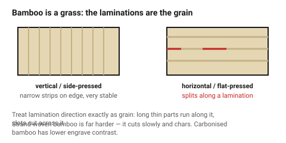
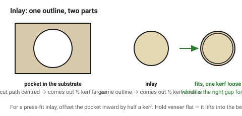

# Bamboo and veneer

Two materials that behave unlike either plywood or solid wood, and both earn a
place for the same reason: they are **uniform**. Bamboo has no grain direction
worth designing around; veneer is thin enough that grain stops mattering
structurally.

## When this applies

- **Bamboo**: visible parts that must repeat, high-contrast engraving, kitchen
  and desk objects, anything where plywood's glue lines would show.
- **Veneer**: inlay, marquetry, faced panels, decorative layers on a plywood
  substrate.

## Good starting values

### Laminated bamboo

| What | Start with | Works between | Why |
|---|---|---|---|
| Kerf, 3 mm | 0.25 mm | 0.22–0.30 mm | dense and uniform — behaves more like MDF than like wood |
| Engrave contrast | **excellent** | | pale, fine, even; among the best engraving surfaces |
| Minimum web | 1.5 × thickness | 1×–2× | better than plywood; the laminations are void-free |
| Press-fit interference | 0.05 mm | 0.04–0.08 mm | harder than birch, so less crush available |
| Comfortable thickness | ≤ 5 mm | 8 mm slowly | dense, so it cuts slower than birch at the same thickness |
| Adhesive | check it | | bamboo boards are laminated; the glue class matters as it does in plywood |

Bamboo is a **grass**, not a timber: the strips are glued in long parallel
laminations, so it splits readily *along* the laminations and hardly at all
across them. Treat the lamination direction the way you treat grain in solid
wood.

| Form | Behaviour |
|---|---|
| **Vertical / side-pressed** | narrow strips on edge; visible pinstripe, very stable |
| **Horizontal / flat-pressed** | wide strips flat; the classic "bamboo" look, slightly less stable |
| **Strand-woven** | compressed fibres, very hard | cuts slowly and chars; avoid for thick cuts |
| **Carbonised** | heat-darkened before pressing | lower engrave contrast, softer |

### Veneer

| What | Start with | Why |
|---|---|---|
| Thickness | 0.5–0.6 mm | standard sliced veneer |
| Kerf | 0.15 mm | very thin material, very little dwell |
| Cut | one fast pass, low power | a second pass burns straight through the backing |
| Hold-down | **essential** | veneer lifts into the beam on the air assist and ruins the cut |
| Backing | paper-backed veneer is far easier | unbacked veneer curls and splits |
| Minimum feature | 1 mm | it takes remarkably fine detail |

Veneer is where laser cutting genuinely beats hand tools: intricate inlay
shapes that would take hours with a fretsaw cut in seconds, and the sealed
edge does not fray.

### Inlay — the one dimension worth knowing

For an inlay to drop into its pocket, the **pocket must be cut larger by one
kerf** than the inlay, because both were cut with the beam centred on their
outlines. Cut the inlay and the pocket from the **same file** and the fit is
automatically one kerf loose — which is the right amount for glue.

For a press-fit inlay, offset the pocket inward by half a kerf.

## How to build it

1. For bamboo, identify the lamination direction and treat it as grain.
2. Check the adhesive class exactly as for plywood.
   → [`plywood`](plywood.md)
3. For veneer, hold it flat: a vacuum bed, a pin frame, or a sacrificial sheet
   of scrap over the waste area.
4. For inlay, cut the **pocket first** in the substrate, then the inlay, then
   dry-fit before glue.
5. Mask bamboo before engraving — it is pale, and smoke staining shows.
6. Sand bamboo with the laminations, never across.

## When to do it differently

- **Strand-woven bamboo** → very hard and slow to cut; use it only where its
  density is the point, and expect heavy charring.
- **Unbacked veneer** → iron it onto paper backing first, or accept curling.
- **Large bamboo panels** → they are more expensive than ply by a wide margin.
  Use bamboo for the faces and plywood for the structure.
- **A bamboo part that must take a screw** → it splits along the laminations.
  Use a threaded insert or a captive nut.
  → [`fasteners-in-wood`](../10-wood-finishing/fasteners-in-wood.md)

## Images

*Vertical and horizontal pressing. Bamboo splits along its laminations, so
they are treated exactly like grain in solid wood.*

*Both outlines cut with the beam centred, so the pocket comes out one kerf
larger than the inlay — which is the right gap for glue. For a press fit,
offset the pocket inward by half a kerf.*

## Source & date

- Bamboo cutting and engraving behaviour: [Thunder Laser — best wood for laser engraving](https://www.thunderlaser.com/laser-blogs/best-wood-for-laser-engraving.html),
  [Blade & Burnish — what wood is best for laser cutting](https://www.bladeandburnish.com/blog/what-wood-is-best-for-laser-cutting).
- Veneer and faced panel behaviour: [Ocooch Hardwoods — thin wood for laser](https://ocoochhardwoods.com/laser/).
- Kerf arithmetic for inlay derived from [`kerf-and-tolerance`](../01-basics/kerf-and-tolerance.md).
- `confidence: medium`.
