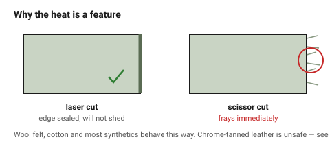

# Leather, felt and textile — soft goods

Soft materials are the one case where the laser's heat is a feature: it seals
the edge as it cuts, so woven fabric does not fray and felt does not shed.
The cost is that the tanning or the fibre blend decides whether the process is
safe at all.

## When this applies

Straps, covers, patches, gaskets, liners, appliqué, cork inlay. Not for
anything structural, and nothing here takes a tolerance better than ±0.5 mm —
the material moves.

## Good starting values

| What | Start with | Works between | Why |
|---|---|---|---|
| Kerf, 2 mm veg-tan leather | 0.20 mm | 0.15–0.25 mm | the edge shrinks as it seals, so the cut looks wider than it is |
| Kerf, 3 mm wool felt | 0.20 mm | 0.15–0.30 mm | |
| Minimum hole ⌀ | 2 mm | 1–3 mm | smaller holes close up again as the edge seals |
| Minimum web | 3 mm | 2–5 mm | soft materials tear at a narrow web under almost no load |
| Dimensional tolerance | ±0.5 mm | — | the material stretches under its own weight |
| Cork thickness | ≤ 3 mm | up to 6 mm slowly | thicker cork chars right through |

### What is safe to cut

| Material | Verdict |
|---|---|
| **Vegetable-tanned leather** | yes — the standard choice |
| **Chrome-tanned leather** | **no** — chromium compounds in the smoke. See [`never-cut-these`](never-cut-these.md) |
| **Wool felt** | yes — cuts and seals beautifully |
| **Acrylic / polyester felt** | yes, but it melts rather than seals; the edge goes hard and shiny |
| **Cotton, linen, denim** | yes — seals the edge, prevents fraying |
| **Polyester, nylon fabric** | yes, melts a bead at the edge — usually desirable |
| **Anything with a PVC or vinyl coating** | **no** — faux leather is usually PVC |
| **Cork** | yes — cuts cleanly, smells pleasant |
| **Foam rubber / neoprene** | check the composition; neoprene is chlorinated |

## How to build it

1. **Confirm the tanning or fibre content in writing.** "Leather" and
   "leatherette" are one letter and one poisoning apart.
2. Hold the material flat — magnets, a honeycomb with extraction, or a pin
   frame. Soft goods lift into the beam and ruin the cut.
3. Cut at **high speed, low power, multiple passes**. One slow pass burns a
   wide brown halo; three fast passes give a crisp sealed edge.
4. Expect and design around **shrinkage**: leather edges pull in by up to
   0.3 mm as they seal. For a part that must match a metal fitting, cut a test
   piece.
5. Engrave leather at low power for a rich dark tone; it darkens far more
   readily than it cuts.

## When to do it differently

- **Thick leather (>4 mm)** → the edge chars dark brown and smells strongly.
  Reduce power and add passes, or use a clicker die.
- **Light-coloured leather** → the halo around the cut is very visible. Mask,
  or accept it as part of the look.
- **A part that must not smell** → soft goods hold smoke odour for weeks.
  Ventilate the finished parts before shipping them.
- **Stretch fabric** → do not cut on tension. It will relax to a different
  shape than the one that was cut.

## Images

*The laser edge on the left is sealed and will not shed; the scissor-cut edge
on the right frays immediately. This is the reason to use the process on soft
goods at all.*

## Source & date

- Material safety for coated and chrome-tanned goods:
  [ATXHackerspace / CPL never-cut list (PDF)](https://cpl.org/wp-content/uploads/NEVER-CUT-THESE-MATERIALS.pdf).
- General soft-goods behaviour: [Xometry — 12 common laser cutting materials](https://www.xometry.com/resources/sheet/laser-cutting-materials/).
- `confidence: medium`; the chrome-tan and PVC warnings are `high`.
