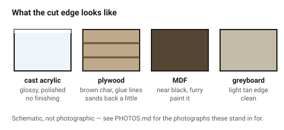

# Material comparison — what to cut and what it costs you

Material choice is made before geometry, because it changes every number that
follows: kerf, minimum feature size, how a joint grips, whether an engrave
looks crisp or muddy, and whether the edge needs sanding.

Check [`never-cut-these`](never-cut-these.md) first. It is short and it is not
negotiable.

## When this applies

At the start of every project, and again whenever a part will not work in the
chosen material — a press fit that keeps splitting is usually a material
problem, not a tolerance problem.

## Good starting values

### The comparison

| Material | Typical kerf @3 mm | Min hole ⌀ | Edge after cutting | Engraves | Press fit | Cost | Best for |
|---|---|---|---|---|---|---|---|
| **Cast acrylic (PMMA)** | 0.17–0.20 mm | 1.5 mm | flame-polished, glossy, needs no finishing | frosted white, crisp | poor — brittle, 0.025–0.05 mm max | mid | display parts, light guides, anything visible |
| **Extruded acrylic** | 0.18–0.22 mm | 1.5 mm | glossy but can craze | grey, muddy | poor | low | cutting only; avoid for engraving |
| **Birch plywood** | 0.25–0.30 mm | 3 mm | brown, smells, needs masking | good contrast | **good** — 0.05–0.10 mm | low | structures, boxes, prototypes |
| **MDF** | 0.20–0.30 mm | 3 mm | very dark, sooty | good, but fuzzy | good, edges crumble | lowest | jigs, templates, painted parts |
| **Solid hardwood** | 0.25–0.35 mm | 3 mm | varies with grain | beautiful, uneven | fair — splits along grain | high | visible one-off pieces |
| **Boxboard / greyboard** | 0.08 mm | 1 mm | clean, slightly brown | scores well | n/a | lowest | mock-ups, packaging |
| **Corrugated card** | 0.10–0.15 mm | 3 mm | brown, fluffy | poor | n/a | lowest | mock-ups only |
| **Veg-tanned leather** | 0.15–0.25 mm | 2 mm | sealed, dark | excellent | n/a | high | straps, covers |
| **Felt (wool)** | 0.20 mm | 3 mm | sealed, slightly melted | poor | n/a | low | liners, gaskets |
| **POM / Delrin** | 0.20 mm | 2 mm | clean, white | poor | fair | high | low-friction mechanism parts, with extraction |

### Standard thicknesses actually available

Designing to a thickness nobody stocks is the cheapest mistake to avoid.

| Material | Common sheet thicknesses |
|---|---|
| Acrylic | 2, 3, 4, 5, 6, 8, 10 mm |
| Birch ply | 3, 4, 6, 9, 12 mm (nominal — measure!) |
| MDF | 3, 4, 6, 9, 12 mm |
| Greyboard | 1.0, 1.5, 2.0 mm |
| Leather | 1.2–3.5 mm, sold in ounces |

### Practical cutting limits on a 60–80 W CO₂ machine

| Material | Comfortable | Possible, slowly | Do not |
|---|---|---|---|
| Cast acrylic | ≤ 8 mm | 10–12 mm | >15 mm |
| Plywood | ≤ 6 mm | 9 mm | 12 mm (burns before it cuts) |
| MDF | ≤ 6 mm | 9 mm | 12 mm |

## How to build it

1. Choose the material for the **edge you want to see**, because that is what
   the process gives you for free and what is hardest to change later: glossy
   (acrylic), warm and grainy (ply), or matte dark (MDF).
2. Check the part has a home in a stock thickness.
3. Read that material's own page — the general table is a shortlist, not a
   design brief.
4. Carry the material's kerf into
   [`kerf-and-tolerance`](../01-basics/kerf-and-tolerance.md) and its minimum
   feature size into
   [`minimum-features`](../03-geometry/minimum-features.md).

## When to do it differently

- **The part will be painted** → MDF, always. It is the cheapest, it is flat,
  and nobody will see the material.
- **The part must be transparent** → cast acrylic. Polycarbonate is the other
  clear sheet and it is on the never-cut list.
- **The part takes a press fit or a screw thread** → plywood or MDF, not
  acrylic. Acrylic cracks where wood compresses.
- **The part is structural and thin** → plywood: its cross-grain plies make it
  far stronger than MDF at the same thickness.
- **The design has fine filigree** → cast acrylic or greyboard; ply burns
  through its thin webs and MDF crumbles.
- **It has to be food-safe, outdoors, or UV-stable** → laser-cut sheet goods
  are mostly none of these. Say so rather than designing around it.

## Images

*What each material's cut edge looks like — the one property the process gives
you for free and the hardest to change afterwards.*

## Source & date

- Kerf and minimum-feature values: [CutLaserCut — laser kerf](https://cutlasercut.com/drawing-resources/expert-tips/laser-kerf/),
  [Xometry — 12 common laser cutting materials](https://www.xometry.com/resources/sheet/laser-cutting-materials/).
- Minimum hole ⌀ ≈ material thickness: [SendCutSend — understanding small geometry](https://sendcutsend.com/blog/understanding-small-geometry-in-laser-cutting/).
- `confidence: medium` — thicknesses and behaviours are stable; kerf and
  cutting limits depend on the machine and should be confirmed with
  [`kerf-test-comb`](../01-basics/kerf-test-comb.md).
