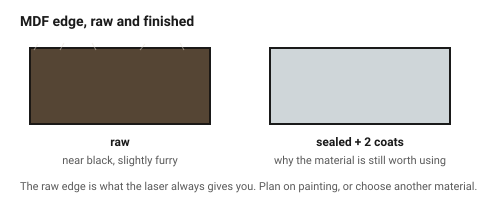

# MDF — cheap, flat, and always dark at the edge

MDF has no grain, no voids and no glue lines, which makes it the most
*predictable* sheet material a laser can cut. It is also the dirtiest: it is
wood fibre in a resin binder, it cuts slowly, and the edge comes out near
black and smells for days.

Use it where nobody will see the edge, or where it will be painted.

## When this applies

Jigs, templates, drilling guides, painted parts, internal structure,
prototypes where cost matters more than looks. Not for visible edges, not for
anything that gets damp, not for fine filigree.

## Good starting values

| What | Start with | Works between | Why |
|---|---|---|---|
| Kerf, 3 mm | 0.25 mm | 0.20–0.30 mm | dense material, slow cut, wide heat-affected zone |
| Kerf, 4 mm veneered | 0.16 mm | 0.14–0.20 mm | the veneer layer cuts cleanly and narrows the effective kerf |
| Measured thickness | measure it | ±0.2 mm of nominal | better than plywood, still not exact |
| Minimum hole ⌀ | = thickness | 1×–1.5× thickness | below this the bore chars shut |
| Minimum web between cuts | 2× thickness | 1.5×–3× | MDF holds heat; a thin web scorches through |
| Press-fit interference | 0.08 mm | 0.05–0.10 mm | compresses well, but crumbles above ~0.15 mm |
| Comfortable cut thickness | ≤ 6 mm | 9 mm slowly | |

### What MDF does that the others do not

- **It is genuinely flat.** For jigs and templates this beats plywood outright.
- **It soaks up finish.** Sealed cut edges need two or three coats of primer;
  the raw edge drinks paint.
- **It swells irreversibly when wet.** A splash raises the surface by a
  millimetre and it never goes back down.
- **The dust is a respiratory irritant.** Extraction is not optional, and the
  binder resin is part of what is being extracted.

## How to build it

1. Use it for the part nobody looks at. Pair it with acrylic or ply for the
   visible half of an assembly.
2. Allow more space between parts when nesting — 3 mm rather than 2 mm. MDF
   carries heat sideways further than the other sheet materials.
3. Cut slots slightly oversize and glue. MDF press fits work once; taking the
   joint apart crumbles the slot edge and it never grips again.
4. Seal the edges before painting, or accept a fuzzy, uneven finish.

## When to do it differently

- **The edge will be seen** → plywood or acrylic. No amount of sanding makes
  an MDF cut edge attractive; it is black and slightly furry.
- **The part is a thin web or fine tracery** → MDF crumbles. Use cast acrylic.
- **The part will be screwed into repeatedly** → MDF strips its own screw
  holes after a few cycles; use a captive nut
  ([`t-slot-captive-nut`](../04-joints/t-slot-captive-nut.md)) or a different
  material.
- **Humidity or outdoors** → never.

## Images

*Raw MDF edge versus the same edge sealed and painted. The raw edge is what
the laser always produces; the painted one is why the material is still worth
using.*

## Source & date

- Cutting behaviour and kerf: [Sculpteo — MDF material for laser cutting](https://www.sculpteo.com/en/lasercutting/laser-cutting-materials/mdf-material/),
  [Box Studio — best materials for laser-cut boxes](https://box-studio.cc/blog/2026-04-en-best-materials-laser-cut-boxes).
- `confidence: medium`.
