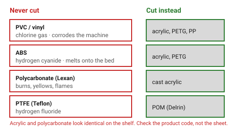

# Never cut these — the materials that hurt people and machines

**This is the one document in this knowledge base that is not advisory.**
Everything else here offers a starting value and a reason to deviate. This one
does not, because the failure mode is not a bad part — it is a poisoned room
and a destroyed machine, and neither is visible until afterwards.

If a requested material is on this list, say so, name the substitute, and do
not design the part in that material.

## When this applies

Before any cut, whenever the material is named, unknown, unlabelled, or
described only by appearance. "Clear plastic sheet" is not a material name:
acrylic and polycarbonate look identical and one of them catches fire.

## Good starting values

### Never — toxic

| Material | Also sold as | What happens | Cut this instead |
|---|---|---|---|
| **PVC / vinyl** | Sintra, Forex, Komatex, faux leather, most self-adhesive sign vinyl | Releases **chlorine gas**. It harms whoever is in the room, and it combines with moisture to form hydrochloric acid that corrodes the rails, the optics and the extraction from the inside out. The damage is cumulative and not repairable. | acrylic, PETG, polypropylene |
| **ABS** | Lego-type plastic, many enclosures | Releases **hydrogen cyanide**. Melts rather than vaporises, so it also welds itself to the honeycomb bed and reflows into the cut. | acrylic, PETG |
| **Polycarbonate** | Lexan, Makrolon, many machine guards | Absorbs the CO₂ wavelength strongly: it burns, yellows and flames instead of cutting. Produces toxic fumes and a scorched, unusable edge. | cast acrylic |
| **PTFE** | Teflon | Releases hydrogen fluoride. Attacks lungs and optics. | POM (Delrin), with strong extraction |
| **Polystyrene / styrofoam** | XPS, EPS foam board | Ignites readily; a flaming drip is how machines are lost. | corrugated card, foam-core only with a service that certifies it |
| **Any material of unknown composition** | "some black plastic" | You cannot tell PVC from acrylic by looking. | identify it first — see below |
| **Fibreglass, carbon fibre, epoxy laminate** | FR4, circuit board blank | Glass and carbon do not cut; the resin burns and releases fine abrasive dust and fumes. | pre-cut stock, or a mechanical process |
| **Anything coated or "chrome" / mirrored** | metallic laminates | Reflects the beam back into the machine and can damage the head or the tube. | mark the back face of clear acrylic instead |
| **Melamine-faced or "waterproof" board** | coated chipboard, kitchen panel | The facing is frequently PVC or a PVC-bearing laminate. You cannot tell by looking. | uncoated birch plywood |
| **Plywood of unknown adhesive** | builder's merchant construction ply | Interior urea-formaldehyde glue releases formaldehyde when cut; some cheap imports use worse. | E0 / CARB-2 or E1 birch plywood — see [`plywood`](plywood.md) |
| **Treated, painted or reclaimed timber** | old furniture, pallet wood | Preservatives, lead paint and unknown finishes all vaporise. Pallets in particular may be MB-fumigated. | new, untreated stock |
| **Leather that is chrome-tanned** | most cheap leather | Chromium-VI compounds in the smoke. | vegetable-tanned leather |

### How to identify unknown plastic

1. **Look for the resin code** stamped on the sheet — `3` or `PVC` means stop.
2. **Ask the supplier** in writing. "Clear plastic" is not an answer;
   "cast PMMA" is.
3. **For plywood and MDF, the question is the glue, not the wood.** Ask for
   the emission class: E0, CARB Phase 2 or E1 is fine, unlabelled is not.
4. **Copper wire (Beilstein) test**, outside, on a scrap: heat a copper wire,
   touch the plastic, return it to the flame. **A green flame means chlorine —
   it is PVC. Stop.** This is the only reliable field test, and it needs
   ventilation and eye protection.
5. If none of the above produced an answer, the material does not go in the
   machine. There is no fifth option.

### The smell is a warning, not a test

A sharp acrid smell during a cut means stop, extract, and leave the room. By
the time PVC smells noticeably, the exposure has already happened.

## How to build it

When a design calls for one of these materials:

1. **Say which material was requested and why it is on this list** — the
   specific hazard, not "it is unsafe". People override warnings they do not
   understand.
2. **Name the substitute** from the table and carry on designing in that.
3. If the requirement is genuinely specific to the banned material (PVC's
   chemical resistance, polycarbonate's impact strength), say that the part
   needs a different **process** — CNC routing, die cutting or waterjet all
   handle these materials safely.

## When to do it differently

There is no "differently" in this document. The nearest thing to an exception:

- **Polycarbonate can be laser *marked*** (surface only, low power, good
  extraction) by people who have decided to accept the fumes. This knowledge
  base does not design for it.
- **A fibre laser** cuts metals this list does not mention and is a different
  machine with different rules; nothing here transfers.

## Images

*The four that come up most often in a workshop, what each one releases, and
what to reach for instead. Acrylic and polycarbonate are the dangerous pair —
they look the same on the shelf.*

## Source & date

- [ATXHackerspace / Cleveland Public Library — "Never cut these materials" (PDF)](https://cpl.org/wp-content/uploads/NEVER-CUT-THESE-MATERIALS.pdf),
  the list most makerspaces post on the machine itself.
- [Snapmaker — what materials cannot be laser cut](https://www.snapmaker.com/blog/materials-cannot-be-laser-cut/).
- [Lensdigital — why PVC is dangerous for laser cutting](https://lensdigital.com/blogs/articles/dont-ever-do-this-with-your-laser-engraver-why-pvc-is-dangerous-for-laser-cutting).
- `confidence: high` — this is chemistry, not practice. It does not vary by
  machine, operator or opinion.
