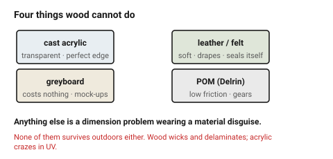

# Non-wood materials — when they are the right answer

This folder is wood-first, and most parts in it should be wood. Four other
materials earn a place because they do something wood cannot, and each has its
own document.

## When this applies

When a wooden part has failed at something structural to the material — it
must be transparent, it must be soft, it must be disposable, it must take a
bearing — rather than at a dimension.

## Good starting values

| Material | The one thing it does that wood cannot | Read |
|---|---|---|
| **Cast acrylic** | transparency, a flame-polished edge that needs no finishing, light-guiding | [`acrylic`](acrylic.md) |
| **Card / greyboard** | costs nothing, cuts in seconds — the fastest way to check a design's size | [`paper-card-corrugated`](paper-card-corrugated.md) |
| **Leather / felt** | soft, drapes, seals its own edge | [`leather-felt-textile`](leather-felt-textile.md) |
| **POM (Delrin)** | low friction — gears, cams, sliding parts | see below |

### When to leave wood

| Requirement | Material | Why wood fails |
|---|---|---|
| Transparent | cast acrylic | no wooden answer |
| Edge perfect with no sanding | cast acrylic | wood always chars |
| Very fine filigree | cast acrylic, greyboard | thin wooden webs burn through |
| Cheap disposable mock-up | greyboard | plywood costs 20× as much |
| Soft, flexible, sealing | felt, leather | wood does not bend |
| Low-friction moving surface | POM | wood binds and wears |
| Must survive outdoors | **none of these** | laser-cut wood wicks and delaminates; acrylic crazes in UV |

### POM (Delrin) in one paragraph

Cuts cleanly to a white, slightly waxy edge; kerf about 0.20 mm at 3 mm; takes
a press fit at around 0.05 mm; and is the only material here worth using for a
gear or a sliding surface. It needs **strong extraction** — the fumes contain
formaldehyde — and it melts rather than vaporises above about 5 mm, so keep it
thin. There is no separate document because those are all the rules.

### The mock-up habit worth keeping

The most useful non-wood material is the cheapest one. Cutting a design in
1.5 mm greyboard first — at the *plywood* slot dimensions, taped together —
costs twenty minutes and catches the geometry errors that are expensive in
plywood: a panel that fouls a connector, a lid that will not clear a hinge, an
enclosure nobody can get a hand into.

## How to build it

1. Name the requirement wood fails at. If it is a *dimension*, the answer is
   a tolerance change, not a material change.
2. Pick from the table and read that material's document — the rules differ
   substantially, especially the press-fit and minimum-feature numbers.
3. If the assembly mixes materials, remember the **kerf and press fit differ
   per material**: an acrylic panel in a plywood frame needs each part's own
   allowance.

## When to do it differently

- **Mixed-material assembly** → design the joints in the *softer* material.
  A plywood slot receiving an acrylic tab works; an acrylic slot receiving a
  plywood tab cracks.
- **Everything is acrylic** → this folder will still serve, but the wood
  documents will be the wrong default. Read
  [`acrylic`](acrylic.md) first and treat its numbers as primary.

## Images

*Four materials, four things wood cannot do. Anything not on this list is a
dimension problem wearing a material disguise.*

## Source & date

- Material behaviours: [Xometry — 12 common laser cutting materials](https://www.xometry.com/resources/sheet/laser-cutting-materials/).
- POM extraction requirement: [ATXHackerspace / CPL never-cut list (PDF)](https://cpl.org/wp-content/uploads/NEVER-CUT-THESE-MATERIALS.pdf).
- `confidence: medium`.
