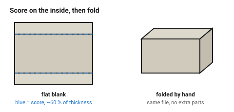

# Paper, card and corrugated — the mock-up materials

Card is the fastest way to find out whether a design is the right size. A
cardboard version of a box costs ten minutes and a few cents, and it catches
the errors that are expensive in acrylic: a panel that does not clear a
connector, a lid that fouls a hinge, an enclosure nobody can get a hand into.

Design in card first, then cut it in the real material.

## When this applies

Mock-ups, packaging, templates, stencils, model making, anything folded. Not
structural, not durable, and — because paper burns — never unattended.

## Good starting values

| What | Start with | Works between | Why |
|---|---|---|---|
| Kerf, 1.1 mm greyboard | 0.08 mm | 0.06–0.12 mm | very low power, almost no heat spread |
| Kerf, corrugated | 0.12 mm | 0.10–0.20 mm | the flutes burn wider than the liners |
| Minimum hole ⌀ | 1 mm | 0.5–2 mm | card takes far finer detail than wood |
| Minimum web | 1 mm | 0.8–2 mm | below this it tears while being handled |
| Score depth for folding | 50–70 % of thickness | — | deeper and the fold tears; shallower and it will not fold straight |
| Score line for a fold | one continuous line | — | see [`score-and-fold`](../05-engraving/score-and-fold.md) |

### Which card

| Material | Thickness | Behaviour |
|---|---|---|
| Copy paper | 0.1 mm | cuts instantly; lifts and flaps under the air assist — hold it down |
| Cardstock | 0.3 mm | clean cuts, good for stencils |
| Greyboard / boxboard | 1.0–2.0 mm | the standard model-making material; cuts and scores well |
| Corrugated (single wall) | 3–4 mm | cuts fine, edges fluff, flutes char inside |
| Foam-core | 3–5 mm | **check the core** — polystyrene foam cores are on the never-cut list |

## How to build it

1. Hold light stock down. A vacuum bed, a honeycomb with the extraction on,
   or a sheet of scrap acrylic on top of the waste area.
2. **Cut at the lowest power that goes through.** Card ignites; a smouldering
   edge on paper turns into a flame in seconds.
3. **Never leave the machine.** This is the one material where the fire risk
   is routine rather than theoretical.
4. For folded designs, score on the **inside** of the fold and cut the outline
   last.
5. For mock-ups of a 3 mm ply design, cut the card parts at the *ply* slot
   dimensions and tape the joints — you are testing geometry, not fit.

## When to do it differently

- **A mock-up that must hold its shape** → 2 mm greyboard, not corrugated.
  Corrugated is stiff one way and floppy the other.
- **A stencil that will be reused** → cardstock tears after a few uses; cut it
  in 0.5 mm polypropylene or 1 mm acrylic instead.
- **Anything with a plastic coating or laminate** → identify the coating
  first. Many "card" packaging materials are PE- or PVC-laminated.

## Images

*Scored on the inside of each fold at roughly 60 % of the thickness, then
folded by hand. The flat blank on the left is the same file.*

## Source & date

- Kerf for boxboard: [Box Studio — kerf reference table](https://box-studio.cc/blog/2026-05-en-kerf-reference-table-by-machine).
- Fold/score technique: [Trotec — cutting technique for bending applications](https://www.troteclaser.com/en-us/helpcenter/materials/application-techniques/bending-technique).
- `confidence: medium`; the fire warning is `high`.
