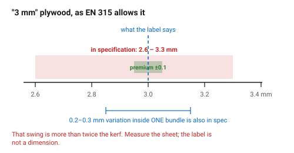
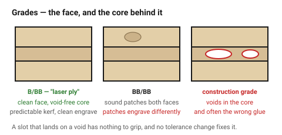

# Plywood — the default structural sheet

Ask ten laser operators what to cut and nine say **Baltic birch plywood**. It
is cheap, its cross-grain plies make it strong in both directions, and its
fibres compress — which is what makes a press-fit joint grip instead of
cracking. Almost everything structural in this knowledge base assumes it.

It is also the least consistent material here. Two sheets of "3 mm birch ply"
from the same bundle can differ by 0.3 mm, and one of them may have a void in
the core exactly where your slot goes.

## When this applies

Boxes, frames, enclosures, mechanism plates, prototypes — anything structural,
press-fitted, screwed or glued. Not for parts whose cut edge must look perfect
without sanding, and not for anything that will get wet.

## Good starting values

### Cutting numbers

| What | Start with | Works between | Why |
|---|---|---|---|
| Kerf, 3 mm | 0.28 mm | 0.25–0.32 mm | wood burns rather than vaporising, so the kerf is wider than in acrylic |
| Kerf, 4 mm | 0.28 mm | 0.25–0.32 mm | |
| Kerf, 6 mm | 0.25 mm | 0.22–0.30 mm | more power but also more speed, which narrows the burn |
| **Measured thickness, "3 mm"** | **measure it** | 2.6–3.3 mm | the single largest error source in plywood joinery — see below |
| Minimum hole ⌀ | = thickness | 0.8×–1.5× | smaller holes char closed and lose their shape |
| Minimum web between cuts | 1.5 × thickness | 1×–3× | two nearby cuts cook the strip between them |
| Press-fit interference | 0.08 mm | 0.05–0.10 mm | fibres crush and grip — plywood's best trick |
| Comfortable cut thickness | ≤ 6 mm | 9 mm slowly | |
| Passes | 2 fast rather than 1 slow | | less dwell time, less char, cleaner edge |

### Thickness is the real problem, and it is worse than most people assume

EN 315 allows **3 mm nominal plywood to measure 2.6–3.3 mm**, and
**sheet-to-sheet variation of 0.2–0.3 mm within one bundle is in
specification**. Premium mills hold ±0.1 mm on their best grades; ordinary
stock does not.

| Nominal | In specification | Premium grades |
|---|---|---|
| 3 mm | 2.6–3.3 mm | ±0.1 mm |
| 4 mm | 3.6–4.3 mm | ±0.1 mm |
| 6 mm | 5.5–6.4 mm | ±0.15 mm |

That 0.7 mm swing is more than twice the kerf. **Measure the sheet with
callipers, in three places, and use the smallest reading** — and measure again
for the next sheet, even from the same pack. A joint tuned to one sheet will
not fit the next one.

### Grades, and why they matter more than the numbers

Face grades are written as two letters: the good face first, the back second.

| Grade | Faces | Laser behaviour |
|---|---|---|
| **B/BB** | near-flawless front, sound back | the best general choice; what "laser ply" usually is |
| **BB/BB** | small sound patches both faces | fine for structure, patches show in an engrave |
| **BB/CP** | patched front, rough back | structure only |
| **C/C, construction grade** | knots, voids, patches | **do not** — voids, and often the wrong glue |

| Type | Core | Verdict |
|---|---|---|
| **Baltic birch (Latvian/Finnish)** | all-birch, uniform, very few voids | the default. Cuts predictably, engraves with clean contrast |
| **"Laser plywood"** | birch, selected, **less glue** | worth the premium: less adhesive means less burning at each glue line |
| **Poplar ply** | soft, light | cuts fast and cheap, crushes under a press fit, sands badly |
| **Far-eastern / hardwood ply** | mixed species, voids | unpredictable; expect one ruined part per sheet |
| **Exterior / marine ply** | phenolic glue | dark glue lines burn unevenly, smells strongly, cuts poorly |
| **Anything melamine-faced or "waterproof"** | unknown adhesive | **do not cut** — the coating may be PVC. See [`never-cut-these`](never-cut-these.md) |

### The glue is a safety question, not a quality one

Plywood is wood **and adhesive**, and the laser vaporises both.

| Adhesive | Emission class | Verdict |
|---|---|---|
| **E0 / CARB Phase 2 / ULEF** | ≤ 0.05 ppm | buy this |
| **E1** | ≤ 1.5 mg/L (desiccator) | acceptable with good extraction |
| **E2 and unclassified** | higher | avoid |
| **Urea-formaldehyde (UF), interior construction grade** | high | avoid — releases formaldehyde when cut |
| **Phenol-formaldehyde (PF), exterior/marine** | — | burns dark and smells strongly |

Cutting engineered wood releases formaldehyde and other resin breakdown
products, which is why extraction on a wood-cutting laser is not optional and
why a HEPA-plus-carbon filter is the right specification rather than a fan
pointed at a window. Buy E0/CARB-2 stock where possible, and never cut an
unlabelled sheet of unknown adhesive.

### Ply count

| Thickness | Plies | What it means |
|---|---|---|
| 3 mm | 3 | two glue lines; the face plies are most of the strength |
| 4 mm | 3 | thicker core |
| 6 mm | 5 | four glue lines; more even, cuts more predictably |
| 9 mm | 7 | |

More plies means more glue lines to burn through, but also a more uniform
material. 6 mm five-ply often cuts *better* than 4 mm three-ply for that
reason.

### Species-faced plywood

Birch ply with a walnut, sapele, oak or cherry face veneer gives the look of
solid hardwood at plywood prices and plywood stability. The face is typically
0.5 mm, so:

- the **engrave** behaves like the face species — dark walnut gives almost no
  contrast; see [`engraving-wood`](../05-engraving/engraving-wood.md);
- the **cut edge** still shows birch core and glue lines;
- **sanding through the face** is easy and unrecoverable — 320 grit, lightly.

## How to build it

1. **Measure this sheet**, three places, callipers, smallest reading. Not the
   label, not the last sheet.
2. Check the grade and the adhesive class before it goes in the machine.
3. Check the sheet is **flat** — a bowed sheet goes out of focus mid-cut and
   leaves parts half-attached.
   → [`wood-moisture-and-storage`](wood-moisture-and-storage.md)
4. **Mask the visible face**, or accept brown smoke staining around every cut.
   → [`char-and-cleanup`](../10-wood-finishing/char-and-cleanup.md)
5. Cut with **air assist** and **two fast passes** rather than one slow one.
   Dwell time is what makes char.
6. Cut slots and small features **before** the outer contour, so the part is
   still held while its detail is cut.
7. Plan joints for **face grain across the joint** where strength matters.
   → [`grain-and-ply-direction`](../03-geometry/grain-and-ply-direction.md)
8. Re-run the comb test on a new bundle.
   → [`kerf-test-comb`](../01-basics/kerf-test-comb.md)

## When to do it differently

- **A slot lands on a void** → the fit is loose and no tolerance change fixes
  it. Move the joint, or buy Baltic birch or laser ply.
- **A thin long part bows** (a 3 mm rail 300 mm long) → add a second ply at
  90°, a folded edge or a rib. Do not simply make it wider.
- **The edge must be pale** → poplar ply chars less, or reduce power and add
  passes. A dark edge is characteristic of plywood and cannot be removed
  entirely — only sanded back.
- **Outdoor use** → do not. Every cut exposes end grain, and end grain wicks.
- **Food contact** → do not.
- **The part must look like solid timber** → species-faced ply for the faces,
  solid wood for anything where the edge shows.

## Images

*The cut edge of 3-ply birch: two darker glue lines, char on the face plies,
and a kerf that is not perfectly straight through the thickness. All of this
is normal.*

*EN 315 allows 2.6–3.3 mm for nominal 3 mm, and 0.2–0.3 mm of variation inside
one bundle is in specification. That swing is more than twice the kerf, which
is why the sheet gets measured and the label does not.*

*B/BB, BB/BB and construction grade. The voids in the bottom one are the
reason a press fit sometimes has nothing to grip.*

## Source & date

- Grades, voids and adhesive selection: [OneLaser — laser cutting plywood](https://www.1laser.com/blogs/topic/laser-cutting-plywood),
  [Atomm — laser cut plywood guide](https://www.atomm.com/blog/2050-laser-cutting-plywood),
  [UDTECH — ultimate guide to laser cut plywood](https://ud-machine.com/blog/laser-cut-plywood/).
- Thickness tolerance (EN 315, 2.6–3.3 mm, sheet-to-sheet 0.2–0.3 mm):
  [Vinawood — birch plywood thickness chart](https://vinawoodltd.com/blog/birch-plywood-thickness),
  [Baltic birch panel specifications (PDF)](https://www.wolstenholme.com/pdf/Baltic%20Birch%20Plywood%20Specifications.pdf).
- Formaldehyde classes and fume safety: [Sumec — plywood formaldehyde emission standards](https://www.sumecbuildingmaterial.com/blog/plywood-formaldehyde-emission-standards/),
  [Snapmaker — laser fume safety](https://www.snapmaker.com/blog/ensure-laser-fume-safety-with-exhaust-system/),
  [Craft Closet — navigating formaldehyde in laser supplies](https://craftcloset.com/blogs/materials/crafting-confidently-navigating-formaldehyde-in-laser-supplies).
- Two fast passes over one slow pass: [TwoTrees — how to stop charring and burnt edges](https://twotrees3d.com/blogs/knowledge/how-to-stop-charring-and-burnt-edges-on-laser-cut-wood).
- `confidence: medium` — plywood varies more than any number here suggests.
  The instruction to measure the sheet is `high`.
