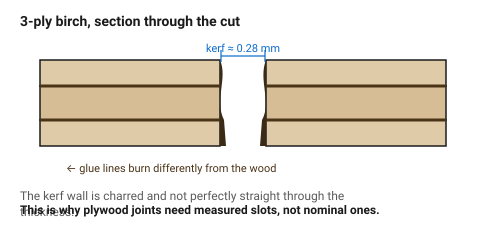

# Plywood — the default structural sheet

Plywood is the material most laser-cut structures are made of, for three
reasons: it is cheap, its cross-grain plies make it strong in both directions,
and its fibres **compress**, which is what makes a press-fit joint grip.

It is also the least consistent material in this folder. Two sheets of "3 mm
birch ply" from the same supplier can differ by 0.4 mm, and one of them may
have a void in the core exactly where your slot goes.

## When this applies

Boxes, frames, mechanism plates, enclosures, prototypes — anything structural
that will be press-fitted or glued. Not for parts that must look precise on a
cut edge without finishing, and not for anything that will get wet.

## Good starting values

| What | Start with | Works between | Why |
|---|---|---|---|
| Kerf, 3 mm | 0.28 mm | 0.25–0.32 mm | wider than acrylic: wood burns rather than vaporises |
| Kerf, 6 mm | 0.25 mm | 0.22–0.30 mm | needs more power but also more speed, which narrows the burn |
| Measured thickness, "3 mm" | measure it | 2.7–3.2 mm | the single largest error source in plywood joinery |
| Minimum hole ⌀ | = thickness | 0.8×–1.5× thickness | smaller holes char closed and lose their shape |
| Minimum web between cuts | 1.5× thickness | 1×–3× | two nearby cuts cook the strip between them |
| Press-fit interference | 0.08 mm | 0.05–0.10 mm | fibres crush and grip; this is plywood's best trick |
| Comfortable cut thickness | ≤ 6 mm | 9 mm slowly | |

### Grades, and why they matter more than the numbers

| Grade | Core | Laser behaviour |
|---|---|---|
| **Birch ply, laser grade / aircraft ply** | void-free, uniform glue | cuts predictably; worth the price for anything with joints |
| **Birch ply, construction grade** | occasional voids | a slot that lands on a void has no grip; expect one bad part per sheet |
| **Poplar ply** | soft, light | cuts fast and cheap, crushes under a press fit, sands badly |
| **Exterior / marine ply** | phenolic glue | dark glue lines burn unevenly, smells strongly, cuts poorly |
| **Anything with a "waterproof" or melamine coating** | unknown adhesive | do not cut — the glue may contain chlorides. See [`never-cut-these`](never-cut-these.md) |

### The glue lines

Every ply has 2–5 glue lines and they burn differently from the wood. That
shows up as:
- a slightly wavy kerf through the thickness — worse on cheap ply;
- darker banding on the cut edge;
- a cut that goes through the face plies but hangs on a glue line, so the part
  will not release from the sheet.

## How to build it

1. **Measure this sheet**, with callipers, in three places. Use the smallest
   reading for slot widths — a slot that is slightly loose is recoverable with
   glue; one that is too tight splits the part.
2. Mask the face that will be visible, or accept brown smoke staining.
3. Cut slots and small features **before** the outer contour, so the part is
   still held by the sheet while its detail is cut.
4. Plan the joints for **end-grain into face**: a tab entering a slot across
   the plies grips far better than one along a single ply.
5. Sand the visible face lightly after cutting; the smoke film comes off with
   240 grit or a damp cloth.

## When to do it differently

- **A slot lands on a void** → the fit will be loose and no tolerance change
  fixes it. Move the joint, or buy laser-grade ply.
- **The part is thin and long** (a 3 mm rail 300 mm long) → ply will bow. Add
  a second ply at 90° or a folded edge; do not simply make it wider.
- **The edge must be pale** → reduce power and increase passes, or switch to
  poplar ply, which chars less. A dark edge is characteristic of ply and
  cannot be entirely removed.
- **Outdoor use** → do not. Laser-cut ply wicks water at the exposed end grain
  of every cut and delaminates in one season.
- **Food contact** → do not. The smoke residue and the adhesives are not food
  safe.

## Images

*The cut edge of 3-ply birch: two darker glue lines, char on the face plies,
and a kerf that is not perfectly straight through the thickness. This is
normal and is why plywood joints need measured slots rather than nominal ones.*

## Source & date

- Kerf values and behaviour: [CutLaserCut](https://cutlasercut.com/drawing-resources/expert-tips/laser-kerf/),
  [Box Studio — kerf reference by machine and material](https://box-studio.cc/blog/2026-05-en-kerf-reference-table-by-machine).
- Press-fit interference for wood-based sheet:
  [CMU 99-353 (PDF)](https://www.cs.cmu.edu/afs/cs/academic/class/99353-f16/day3/kerf.pdf).
- `confidence: medium` — plywood varies more than any number here suggests.
  The instruction to measure the sheet is `high`.
