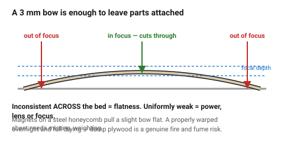
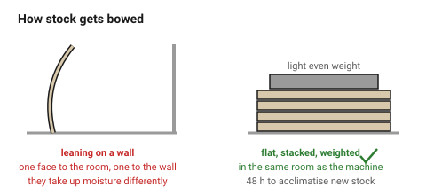

# Moisture, warping and storing sheet

A laser has a focal point a few millimetres deep. A sheet that bows by 3 mm
across the bed puts half the cut outside that focus, and the result is a job
that cuts through in some places and not in others — which looks exactly like
a power problem and is not.

Wood bows because it is hygroscopic. That makes storage a design input rather
than a housekeeping detail.

## When this applies

Before every job, as a physical check on the sheet. Also the first thing to
suspect when a cut is inconsistent **across the bed** rather than uniformly
weak.

## Good starting values

| What | Target | Why |
|---|---|---|
| Moisture content for cutting | **8–12 %** | above ~14 % the cut steams, chars and the part warps afterwards |
| Maximum bow across a 600 mm sheet | 2 mm | beyond this, focus varies enough to leave parts attached |
| Storage | **flat, stacked, weighted** | plywood stored leaning against a wall bows within weeks |
| Storage humidity | 40–60 % RH | the same range that keeps furniture stable |
| Acclimatisation for new stock | 48 hours in the workshop | before cutting anything that has to fit |
| Seasonal moisture swing indoors | 6–8 % MC | winter heating dries to 5–6 %, summer damp raises it to 12–14 % |

### Why a bowed sheet is a cutting problem

| Effect | Consequence |
|---|---|
| Focus varies across the sheet | some cuts go through, some do not |
| Effective kerf varies | joints fit in one corner of the sheet and not the other |
| The sheet lifts off the bed | air gap under the cut, more charring on the underside |
| Parts move as they are freed | anything cut afterwards is out of position |

### How wood gets bowed in the first place

| Cause | Fix |
|---|---|
| Stored on edge, leaning | store flat |
| One face exposed, one against a wall | one face takes up moisture faster — store flat and stacked |
| Damp workshop, dry storeroom (or the reverse) | acclimatise for 48 hours before cutting |
| Unsealed bag opened weeks ago | keep stock in its original wrapping until used |
| A single thin sheet on a shelf | weight the stack |

## How to build it

1. **Check flatness before the sheet goes in the machine.** Lay it on the bed
   and look along it, or press each corner — a sheet that rocks will not cut
   evenly.
2. For a slightly bowed sheet: **hold it down**. Magnets on a steel-topped
   honeycomb, or weights outside the cutting area. Keep anything metal well
   clear of the beam path.
3. For a properly warped sheet: mist the **concave** face lightly, press it
   flat under even weight overnight, and **let it dry fully** before cutting.
   Damp plywood cuts badly and is a genuine fire and fume risk.
4. Store stock **flat, stacked, with light even weight on top**, in the same
   room the machine is in.
5. Acclimatise new stock 48 hours before cutting anything that has to fit.
6. Cut a sheet **soon after opening its wrapping**. The first sheet from a
   fresh pack is the flattest one you will get.

## When to do it differently

- **A decorative part, fit irrelevant** → a mild bow is cosmetic; cut it and
  move on.
- **A long thin part from a bowed sheet** → it will keep the bow. Cut it from
  the flattest region, or expect to flatten it afterwards.
- **A severely warped sheet** → use it for test cuts and jigs. Flattening a
  badly cupped sheet rarely holds.
- **Solid wood** → moisture content matters more, not less: it moves ~8 %
  tangentially across its life and will keep moving after the part is made.
  → [`solid-wood`](solid-wood.md)

## Images

*The beam has a focal depth of a few millimetres. A 3 mm bow across the bed is
enough to put part of the cut outside it — which looks like a power problem
and is not.*

*Leaning a sheet against a wall exposes one face to the room and one to the
wall; they take up moisture at different rates and the sheet bows within
weeks.*

## Source & date

- Moisture content and warping behaviour: [xTool support — common issues of plywood warping](https://support.xtool.com/article/2487),
  [Lasersheets — birch wood warping](https://lasersheets.eu/blogs/news/birch-wood-warping-help),
  [lasermaterials.ie — help, my plywood is warped](https://lasermaterials.ie/help-my-plywood-is-warped/).
- Seasonal indoor EMC swing of 6–8 %: [Workshop Companion — wood movement](https://workshopcompanion.com/know-how/design/nature-of-wood/wood-movement.html).
- `confidence: medium`.
