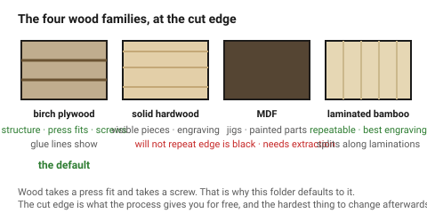
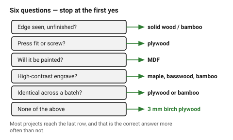

# Wood — the default material, and how to choose within it

**This knowledge base is wood-first.** Unless a project says otherwise, a
laser-cut part here is made of wood: plywood for structure, solid wood or
bamboo where it will be seen, MDF where it will be painted or thrown away.

Everything downstream follows from that. Wood burns rather than vaporises, so
the kerf is wide and the edge is dark. Wood is fibrous, so it *compresses* —
which is what makes a press fit grip. Wood is hygroscopic, so its thickness
and flatness change with the weather. And engineered wood is held together
with adhesives, which is a fume question before it is a cutting question.

Acrylic, card and leather are covered in
[`non-wood-materials`](non-wood-materials.md) because they turn up, not
because they are the default.

## When this applies

At the start of every project, before any geometry. Also whenever a part
keeps failing in a way that a tolerance change does not fix — a press fit that
splits, an engrave with no contrast, a panel that will not lie flat — because
those are usually material choices wearing a geometry disguise.

## Good starting values

### The four wood families

| Family | Use it for | Avoid it for | Cost |
|---|---|---|---|
| **Birch plywood** | structure, boxes, mechanisms, anything press-fitted | visible fine edges without sanding, anything damp | low–mid |
| **Solid hardwood** | visible one-off pieces, signage, lids and faces | batches, anything needing repeatability | high |
| **MDF** | jigs, templates, painted parts, internal structure | visible edges, damp, fine filigree | lowest |
| **Laminated bamboo** | visible parts that must repeat, high-contrast engraving | anything structural across the laminations | mid–high |

### Choosing, in order

| Ask | If yes | Then |
|---|---|---|
| Will the **edge be seen** unfinished? | | solid wood or bamboo — plywood edges show glue lines, MDF edges are black |
| Does it need to **press fit or take a screw**? | | plywood — the cross-plies grip and resist splitting |
| Will it be **painted**? | | MDF, always. Cheapest, flattest, no grain to telegraph |
| Does it need a **high-contrast engrave**? | | maple, basswood, birch or bamboo — pale and even-grained |
| Must the parts be **identical across a batch**? | | plywood or bamboo. Solid wood will not repeat |
| Is it **structural and thin**? | | plywood — cross-plies make it far stronger than MDF at the same thickness |
| None of the above | | 3 mm birch plywood. It is the default for a reason |

### What wood costs you, compared with acrylic

| | Wood | Acrylic |
|---|---|---|
| Kerf | **0.25–0.30 mm**, and variable | 0.17–0.20 mm, very repeatable |
| Edge | brown to black char, needs cleanup | flame-polished, needs nothing |
| Thickness tolerance | **±0.3 mm and sheet to sheet** | ±0.15 mm |
| Press fit | **excellent** — fibres crush and grip | poor — it cracks |
| Screws | **holds well** | strips and cracks |
| Engraving | good contrast, grain interferes | crisp, no grain |
| Flatness | **changes with humidity** | stable |
| Fumes | resin and adhesive dependent | acrylic monomer, unpleasant but predictable |

Two of those rows are why this folder is wood-first: wood takes a press fit
and it takes a screw. Most laser-cut objects are assemblies, and assemblies
need joints that hold.

## How to build it

1. **Pick the family** from the table above, then read that family's own
   document — the general table is a shortlist, not a design brief.
2. **Check the glue**, not just the wood. Interior-grade urea-formaldehyde
   plywood is common, cheap and the worst thing in the room when it is cut.
   → [`plywood`](plywood.md)
3. **Measure the actual sheet.** Wood thickness is nominal in the catalogue
   and real on the bench, and the difference is larger than the kerf.
   → [`wood-moisture-and-storage`](wood-moisture-and-storage.md)
4. **Decide the grain direction** before laying out parts, not after.
   → [`grain-and-ply-direction`](../03-geometry/grain-and-ply-direction.md)
5. **Plan the finishing** at design time: char removal, sanding, sealing and
   gluing all need access, and a part designed without them is a part that
   cannot be cleaned up. → [`10-wood-finishing/`](../10-wood-finishing/)

## When to do it differently

- **The part must be transparent** → cast acrylic. Wood has no answer to this.
  → [`acrylic`](acrylic.md)
- **The part lives outdoors or gets wet** → none of these. Laser-cut wood
  wicks water at the exposed end grain of every cut and delaminates within a
  season. Say so rather than designing around it.
- **The part must be food-safe** → no. Smoke residue and the adhesives are not
  food contact materials.
- **Very fine filigree** → cast acrylic or greyboard. Thin wooden webs burn
  through before they are cut out.
- **A fast mock-up of a wooden design** → greyboard at the same nominal
  thickness. Twenty minutes, and it catches every geometry error before the
  plywood is touched.
  → [`paper-card-corrugated`](paper-card-corrugated.md)

## Images

*Birch ply, solid hardwood, MDF and laminated bamboo. The cut edge is the one
property the process gives you for free and the hardest to change afterwards.*

*Six questions, in order. Most projects stop at the last row — 3 mm birch
plywood — and that is the correct answer more often than not.*

## Source & date

- Species and panel behaviour: [Blade & Burnish — what wood is best for laser cutting](https://www.bladeandburnish.com/blog/what-wood-is-best-for-laser-cutting),
  [xTool — best wood for laser cutting and engraving](https://www.xtool.com/blogs/xtool-academy/best-wood-for-laser-cutting-and-engraving),
  [Thunder Laser — choosing the right wood](https://www.thunderlaserusa.com/blog/best-wood-for-laser-cutting-engraving-project).
- Kerf and edge behaviour: [CutLaserCut — laser kerf](https://cutlasercut.com/drawing-resources/expert-tips/laser-kerf/).
- `confidence: medium` — the ordering of the families is reliable; the numbers
  are machine- and sheet-dependent.
