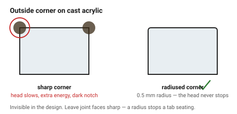
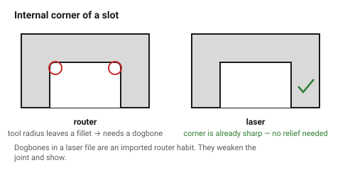

# Corners and overburn — where the beam lingers

A laser cuts by delivering energy over time. Where the head slows down — at a
corner, at the start of a contour, at the end of a tight curve — it delivers
more energy into less distance, and the material there gets a wider kerf, a
darker edge, or a visible notch.

This is the one process artefact that is invisible in the drawing and obvious
in the part.

## When this applies

Any part with sharp corners, small closed shapes, or a visible edge. It
matters most on acrylic (where burn marks are permanent and glossy) and on
small parts (where the corners are a large fraction of the perimeter).

## Good starting values

| What | Start with | Works between | Why |
|---|---|---|---|
| Fillet on an outside corner | 0.5 mm | 0–2 mm | a tiny radius lets the head keep moving; it removes almost all corner burn |
| Fillet on an inside corner of a slot | 0.3 mm | 0–1 mm | also relieves the corner for a mating part |
| Relief hole at a slot corner | ⌀ 1 mm | 0.8–1.5 mm | gives glue and dust somewhere to go |
| Lead-in placement | on a straight edge, never a corner | — | the pierce point is always the ugliest point on the contour |
| Minimum closed shape before overburn dominates | 5 × 5 mm | — | below this, every corner is a lingering corner |

### What laser does *not* need

- **No dogbones.** A CNC router cannot cut a sharp internal corner, so router
  files need dogbone or T-bone relief. A laser beam has no diameter to speak
  of, so internal corners come out sharp. Adding dogbones to a laser file is a
  common import mistake from router workflows: it leaves visible lobes and
  weakens the joint.
- **No tool compensation offsets** beyond kerf. See
  [`kerf-and-tolerance`](../01-basics/kerf-and-tolerance.md).

## How to build it

1. **Put the lead-in on a straight run.** Most controllers let you choose the
   start point of a closed contour. The pierce leaves a small blob; put it
   where a hand will not touch it, or on the waste side.
2. **Round outside corners by 0.5 mm** on anything visible. It is invisible in
   the design and removes the dark corner mark completely.
3. **Leave internal corners sharp** unless a mating part needs relief.
4. On acrylic where the corner mark must not appear at all, **reduce corner
   power** if the controller supports it (LightBurn's corner-power setting is
   made for this).
5. For small parts, cut **inside features first, outline last** — the part
   stays clamped by its own sheet while the precise work happens.

## When to do it differently

- **The corner is a joint face** → leave it sharp. A radius on a tab corner
  stops the tab from seating fully.
- **Cardboard and felt** → overburn is not visible; skip the fillets.
- **Deliberate charred aesthetic** → some designs want it. Say so, rather than
  fighting it.
- **Very thick acrylic** → corner marks are unavoidable and are usually
  removed with a flame-polish pass afterwards, not in the file.

## Images

*Left: the head decelerates into the corner and delivers extra energy, leaving
a dark notch. Right: a 0.5 mm radius keeps it moving. Same file otherwise.*

*A router leaves a rounded internal corner, which is why router files carry
dogbone relief. A laser cuts the corner sharp — dogbones in a laser file are
an imported habit, not a requirement.*

## Source & date

- Corner behaviour and lead-in placement: [Komacut — designing laser cut parts](https://www.komacut.com/blog/guide-to-designing-laser-cut-parts/),
  [Serra Laser — design tips](https://www.serralaser.com/about/design-tips/).
- `confidence: medium`.
