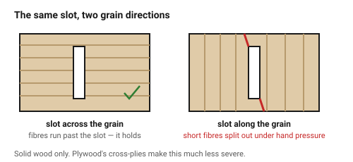
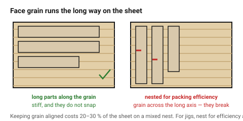

# Grain and ply direction

Wood is not one material, it is a bundle of fibres glued together by nature.
Along the fibres it is strong; across them it splits. A laser does not care
which way it cuts, but the finished part does — and the direction is invisible
in the drawing.

This is the wood equivalent of print orientation in FDM: a decision taken
during layout, free to make, and expensive to get wrong.

## When this applies

Every wooden part, at nesting time. Especially long thin parts, slots near an
edge, and anything that will be handled before it is assembled.

## Good starting values

### Solid wood

| Feature | Rule | What happens otherwise |
|---|---|---|
| Long thin part | grain runs **along** its length | it snaps in handling |
| Slot | cut **across** the grain | the strip between slot and edge splits out |
| Tab | grain along the tab | the tab shears at its root |
| Web between cutouts | ≥ 3 × thickness if it runs across the grain | it breaks under almost no load |
| Press fit | across the grain | with the grain, it splits instead of gripping |
| Small hole near an edge | ≥ 3 × thickness of material to the edge | short grain blows out |

Solid wood is roughly **ten times weaker across the grain than along it**.
There is no tolerance adjustment that compensates for this.

### Plywood

Plywood exists to solve exactly this problem: alternating plies at 90° mean it
is strong in both directions. But not equally.

| What | Rule |
|---|---|
| **Face grain** runs the long way on a standard sheet | and it is the strongest direction |
| Bending stiffness | higher **along** the face grain |
| Tabs and thin parts | orient along the face grain where it matters |
| Splitting | plywood barely splits — this is its advantage over solid wood |
| Edge appearance | the ply stripe runs across the cut edge, which reads as deliberate on some designs and cheap on others |

In 3 mm three-ply, the two face plies are most of the strength and they run
the same way. So a 3 mm ply part still has a weak direction — just a much less
dramatic one than solid wood.

### Laminated bamboo

Treat the **lamination direction** exactly as grain. Bamboo splits readily
along its laminations and hardly at all across them.
→ [`bamboo-and-veneer`](../02-materials/bamboo-and-veneer.md)

### What it costs in material

Keeping every part's grain aligned wastes sheet — sometimes 20–30 % on a
mixed nest. That is a real trade:

| Priority | Nest by |
|---|---|
| Strength or appearance matters | **grain direction**, and pay for the waste |
| Jigs, internal parts, prototypes | packing efficiency |
| Parts seen side by side in the finished piece | grain direction, for consistency of look |

## How to build it

1. Decide the grain direction for each part **before** nesting, and mark it in
   the drawing — an arrow on a construction layer costs nothing.
2. Orient long thin parts along the grain.
3. Orient slots across it.
4. On visible assemblies, keep the grain running the same way across adjacent
   parts; a box whose four sides have random grain looks like the output of a
   nesting algorithm, because it is.
5. For plywood, note that the face grain is usually the **long** direction of
   the sheet, and lay out accordingly.
6. Accept the waste, or explicitly decide that this part does not care.

## When to do it differently

- **Plywood, non-structural** → grain direction barely matters. Nest for
  efficiency.
- **MDF** → no grain at all. Nest freely; this is one of MDF's genuine
  advantages.
- **Very small parts** → too short for grain to matter mechanically, though it
  may still matter visually.
- **A part that must be strong in both directions** → plywood, not solid wood.
  That is precisely what plywood is for.

## Images

*Along the grain the short fibres between the slot and the edge split out under
hand pressure; across it they hold.*

*Face grain usually runs the long way on the sheet. Long thin parts want to
run with it; keeping the grain consistent across a visible assembly costs
material and looks deliberate.*

## Source & date

- Grain strength and species behaviour: [Workshop Companion — the nature of wood](https://workshopcompanion.com/know-how/design/nature-of-wood/wood-movement.html),
  [Ocooch Hardwoods — thin wood for laser](https://ocoochhardwoods.com/laser/).
- Plywood cross-ply construction and face grain: [Plywood Logistics — guide to Baltic birch plywood](https://plywoodlogistics.com/guide-to-baltic-birch-plywood-main-specifications-and-usages/).
- `confidence: medium`.
