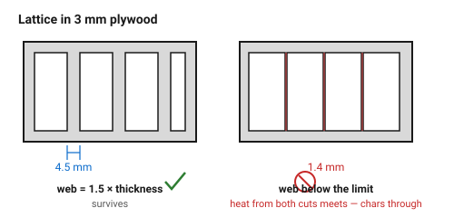
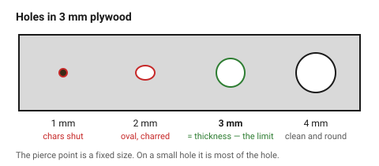

# Minimum features — how small is too small

A laser has no tool diameter, so it is tempting to believe it can cut anything.
The limit is not geometric, it is **thermal**: a narrow strip of material with
a hot cut on each side does not survive being cut twice. It chars, softens,
and either falls out or comes out as a black crumb.

Two numbers cover almost all of it, and both scale with material thickness.

## When this applies

Any part with fine detail: perforations, text cut through, lattice, comb
teeth, narrow frames, small holes. Also worth a look whenever a part comes out
of the machine with a piece missing.

## Good starting values

| Feature | Start with | Absolute floor | Why |
|---|---|---|---|
| **Minimum hole ⌀** | = material thickness | 0.5 × thickness | the beam must pierce before it can travel; below this the hole chars shut or comes out oval |
| **Minimum web** (material left between two cuts) | 1.5 × thickness | 1 × thickness | heat from both cuts meets in the middle |
| **Minimum gap between separate cuts** | 0.5 mm | 0.3 mm | closer than this and the strip between them burns away entirely |
| **Minimum slot width** | = kerf + 0.1 mm | kerf | a slot narrower than the kerf is not a slot, it is one cut line |
| **Minimum internal corner radius** | 0 (sharp) | — | unlike a router, a laser does sharp internal corners; see [`corners-and-overburn`](corners-and-overburn.md) |
| **Minimum cut-through text height** | 8 mm | 6 mm | counters (the holes in a, e, o) close up below this |
| **Minimum engraved text height** | 5 mm | 3 mm bold sans | see [`text-and-fonts`](../05-engraving/text-and-fonts.md) |

### By material, for 3 mm stock

| Material | Min hole ⌀ | Min web | Note |
|---|---|---|---|
| Cast acrylic | 1.5 mm | 1.5 mm | the best material for fine detail; it vaporises rather than burns |
| Plywood | 3 mm | 4.5 mm | thin webs ignite; the smaller ply voids make it unpredictable |
| MDF | 3 mm | 6 mm | holds heat the longest of any sheet here |
| Greyboard | 1 mm | 1 mm | takes remarkably fine detail |
| Leather / felt | 2 mm | 3 mm | the hole closes as the edge seals |

## How to build it

1. Take the material thickness and write down the two derived numbers before
   drawing anything: min hole = *t*, min web = 1.5 *t*.
2. Design the fine detail at those limits, then check the **worst** place, not
   the average — a lattice is only as good as its narrowest strut.
3. Where a web must be thinner than the limit, break the cut: leave a small
   bridge of uncut material, and snap it afterwards.
4. When the design is dense (perforation grids, lattice panels), add
   *cooling distance*: alternate the cut order so consecutive cuts are not
   neighbours. Most controllers can do this; if not, split into two layers.

## When to do it differently

- **One-off, and a broken web is acceptable** → go below the limit knowingly
  and cut two spares.
- **Cast acrylic** → halve the web numbers. It is in a class of its own for
  filigree.
- **Thick material** → the limits scale with thickness and get harsh fast: in
  9 mm ply a minimum web is 13 mm. Fine detail belongs in thin stock.
- **The detail is decorative, not structural** → engrave it instead of cutting
  it. An engraved lattice cannot fall out.

## Images

*The same lattice at two web widths in 3 mm plywood. At 1.5 × thickness the
strips survive; at half that the heat from the two cuts meets in the middle
and the strip chars through.*

*Holes below the material thickness lose their shape: the pierce point is a
significant fraction of the hole, so the result is oval, charred, or closed.*

## Source & date

- Minimum hole ⌀ ≈ material thickness and the 0.5 mm gap rule:
  [SendCutSend — understanding small geometry](https://sendcutsend.com/blog/understanding-small-geometry-in-laser-cutting/),
  [Xometry — laser cutting rules](https://www.xometry.com/resources/sheet/laser-cutting-rules/).
- Minimum cut width ≈ material thickness: Sculpteo laser cutting design
  guidelines.
- `confidence: medium` — the relationships are reliable; the exact multiples
  depend on power and speed.
