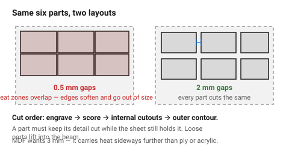
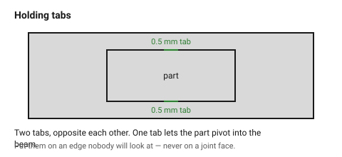

# Nesting and spacing — laying parts out on the sheet

Nesting decides three things at once: how much material a job uses, how long
it takes, and whether the parts come out the size they were drawn. The third
one is the surprise — parts packed too tightly distort, because each cut heats
the material its neighbour is about to be cut from.

## When this applies

Any job with more than one part on a sheet. Especially any job that will be
repeated, where material cost compounds.

## Good starting values

| What | Start with | Works between | Why |
|---|---|---|---|
| Gap between parts | 2 mm | 1–3 mm | below 1 mm the heat-affected zones overlap and edges distort |
| Gap between parts, MDF | 3 mm | 2–4 mm | MDF carries heat sideways further than ply or acrylic |
| Margin from sheet edge | 5 mm | 3–10 mm | the sheet edge is rarely straight and rarely square |
| Margin from the clamp / magnet | 15 mm | — | a magnet in the beam path is a damaged lens |
| Holding tab width | 0.5 mm | 0.3–1 mm | enough to hold a part, small enough to snap by hand |
| Holding tabs per part | 2 | 1–4 | one tab lets the part pivot into the beam |

### Common-line cutting

Two parts can share a single cut line, which halves the cutting time on that
edge and removes the gap entirely.

| | Use it | Avoid it |
|---|---|---|
| **Straight shared edges, decorative parts** | ✔ saves time and material | |
| **Parts that must fit each other** | | ✘ the shared line gives each part half a kerf of error, in opposite directions |
| **Thin or floppy material** | | ✘ the first part lifts as it is freed and spoils the second |

The rule of thumb: **common-line only what does not need to fit.**

### Where parts move

A part that has been fully cut out is loose. Loose parts:
- lift into the beam on the air assist, ruining the next cut and sometimes the
  lens;
- drop between honeycomb cells and are lost;
- shift, so any *later* cut in that part lands in the wrong place.

Which is why cut order matters as much as spacing.

## How to build it

1. **Order the cuts: engrave → score → internal cutouts → outer contour.**
   A part must keep its detail cut while the surrounding sheet still holds it.
2. Group identical parts together so that an interrupted job can be restarted
   at a part boundary.
3. Leave the **grain direction** consistent for wood parts that will be
   visible together, even though it costs material.
4. For small or thin parts, add **holding tabs** — a 0.5 mm break in the outer
   contour, two per part, placed on edges nobody will see.
5. Place large parts at the back of the bed and small ones at the front. If a
   job fails halfway, the expensive parts are already done.

## When to do it differently

- **A single one-off part** → put it anywhere flat; none of this matters.
- **Production runs** → invest in a real nest. A 15 % improvement in sheet
  utilisation is a 15 % material saving on every future run.
- **Very thin acrylic (2 mm) or card** → increase spacing to 3–4 mm; these
  materials distort with heat more than thicker stock.
- **The machine has a pass-through** → keep the layout inside one bed height
  anyway unless the job genuinely needs the length; realignment after a
  pass-through move costs more accuracy than the material saves.

## Images

*Left: 0.5 mm gaps. Every part is inside its neighbour's heat-affected zone
and the edges come out soft and out of size. Right: 2 mm gaps, and the whole
sheet cuts identically.*

*Two 0.5 mm breaks in the outer contour keep the part in the sheet until the
job finishes. Put them on an edge nobody will look at, never on a joint face.*

## Source & date

- Part spacing and bridge/tab practice: [SendCutSend — nesting guidelines](https://sendcutsend.com/guidelines/nesting/),
  [SendCutSend — creating bridges for nested shapes](https://sendcutsend.com/blog/creating-bridges-for-nested-shapes/).
- Common-line cutting trade-off: same sources, and
  [Komacut](https://www.komacut.com/blog/guide-to-designing-laser-cut-parts/).
- `confidence: medium`.
