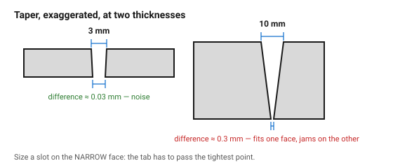

# Taper and focus — why a thick cut is not square

The beam is a cone, not a cylinder. It converges to a waist at the focus and
diverges again below it, so the cut it makes is slightly V-shaped: wider at
the focused face, narrower further away.

Below about 5 mm nobody notices. Above it, the taper decides whether a slot
fits, whether two stacked parts sit flush, and which face a dimension refers
to.

## When this applies

Material thicker than roughly 5–6 mm, precision joints in any thickness, and
any part where both faces are visible. Ignore it entirely on 3 mm stock.

## Good starting values

| Thickness | Typical taper (top ⌀ − bottom ⌀) | Consequence |
|---|---|---|
| 3 mm | 0.02–0.05 mm | below measurement noise; ignore |
| 6 mm | 0.05–0.15 mm | visible on a mating edge, still usually fine |
| 10 mm | 0.15–0.35 mm | a slot fits on one face and not the other |
| 15 mm+ | 0.3 mm and up | the edge is visibly bevelled; plan around it |

| Focus setting | Effect | Use when |
|---|---|---|
| On the **top** surface | narrowest kerf at the top, most taper | thin material, best top-face detail |
| At **1/3 depth** | balanced | the usual compromise for 4–8 mm |
| At **mid-thickness** | least taper overall, slightly wider kerf | thick material, joints that must fit on both faces |

## How to build it

1. For material over 6 mm, decide **which face is the reference face** and say
   so. Every measured dimension belongs to that face.
2. Cut the comb test at the intended thickness and measure the reassembled
   strip at both faces. The difference is your taper.
3. For a slot that receives a thick tab, size it on the **narrow** face — the
   tab has to pass through the tightest point.
4. For stacked layers that must sit flush, cut all layers with the same focus
   and orient them all the same way up. Flipping one layer doubles the taper
   mismatch at the joint.
5. Mark the reference face on the physical part if the assembly is not
   symmetric — the taper makes parts handed, and a part assembled upside down
   will not fit.

## When to do it differently

- **Thin material** → ignore this document entirely.
- **A visible bevelled edge is wanted** (an edge-lit sign, a chamfered look)
  → defocus deliberately; the taper becomes the design.
- **Both faces must be square** → the laser is the wrong process above ~10 mm.
  A router or waterjet gives a square edge in thick stock.

## Images

*The same cut in 3 mm and 10 mm material. At 3 mm the taper is smaller than
the measurement error; at 10 mm the slot fits on one face and jams on the
other.*

## Source & date

- Taper behaviour in thick stock: [KAD3D — laser cutting tolerances](https://kad3d.com.au/laser-cutting-tolerances/),
  [LaserBoost — laser cutting design guideline](https://www.laserboost.com/laser-cutting-design-guideline/).
- `confidence: medium` — strongly machine- and lens-dependent.
