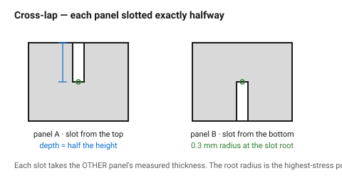
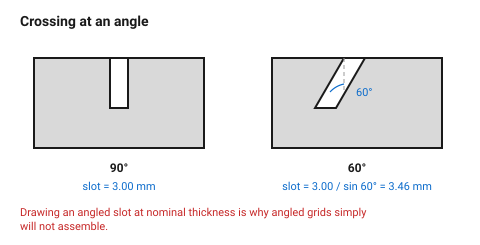

# Cross-lap joint (egg-crate)

Two panels each get a slot cut halfway through, and they slide into each other
at the crossing. No fasteners, no glue required, and the result is
dramatically stiffer than either panel alone — which is why every shelf
divider, every model aeroplane rib set and every display stand uses it.

## When this applies

Two panels crossing at an angle (usually 90°), dividers inside a box, internal
stiffening ribs, display and storage grids. Works in any sheet material that
holds a press fit.

## Good starting values

| What | Start with | Works between | Why |
|---|---|---|---|
| Slot depth | exactly half the panel height at the crossing | — | unequal depths leave one panel standing proud |
| Slot width | measured thickness − kerf − fit allowance | — | see [`kerf-and-tolerance`](../01-basics/kerf-and-tolerance.md) |
| Fit | slip, or light press | 0 to −0.05 mm | a hard press fit splits the panel at the slot root |
| Radius at the slot root | 0.3 mm | 0–0.5 mm | this is the single highest-stress point in the joint |
| Distance from slot root to panel edge | ≥ 3 × thickness | 2×–5× | too little material and the panel snaps at the slot |
| Slot entry chamfer | 0.5 mm × 45° | — | guides assembly; without it the two slots fight each other |

### Non-perpendicular crossings

For panels crossing at an angle θ other than 90°, the slot is no longer
rectangular:

```
slot width (measured along the panel) = thickness / sin θ
```

At 60° a 3 mm panel needs a 3.46 mm slot. Getting this wrong is the most
common failure of angled egg-crate structures: the slots are drawn at nominal
thickness and the panels simply will not cross.

## How to build it

1. Set out the grid on both panels from the **same origin**, so the crossings
   line up. An egg-crate with a 0.5 mm accumulated offset will not assemble at
   all — the errors compound across the grid.
2. Slot depth = half the local panel height, measured at the crossing, not
   half the panel's maximum height. On a shaped panel these differ.
3. Draw slot width from the measured mating thickness.
4. Add the root radius and the entry chamfer.
5. **Assemble the whole grid dry.** An egg-crate has exactly one assembly
   order, and with more than about nine crossings there will be one that has
   to go in last and will not flex enough to do so — find that out in the dry
   fit, not after glue.
6. If the grid will be glued, use a slip fit and glue only the outer
   crossings; the interior ones are held by geometry.

## When to do it differently

- **A grid larger than ~4 × 4** → split it into sub-assemblies, or make every
  second slot a through-slot so the panel can be dropped in from above
  rather than threaded through.
- **Acrylic** → slip fit only, and always add the root radius. A press-fit
  acrylic cross-lap cracks at the slot root, often days later.
- **The joint must resist pulling apart** → add a small barb or a keyhole to
  one slot, or pin the crossing. A plain cross-lap resists shear well and
  tension not at all.
- **Panels of different thickness** → each slot takes the *other* panel's
  thickness. This is obvious and is still one of the most common mistakes.

## Images


*Each panel is slotted exactly halfway. The slot in panel A is the width of
panel B's measured thickness, and vice versa.*


*At any angle other than 90° the slot must be wider: thickness divided by the
sine of the crossing angle. Drawing it at nominal thickness is why angled
grids will not assemble.*

## Source & date

- Joint pattern and practice: [CMU IDeATe — flat-pack joinery](https://courses.ideate.cmu.edu/16-223/f2020/text/reference/joinery.html).
- Fit and kerf treatment: [CMU 99-353 (PDF)](https://www.cs.cmu.edu/afs/cs/academic/class/99353-f16/day3/kerf.pdf).
- `confidence: medium`; the `thickness / sin θ` relation is geometry and exact.
