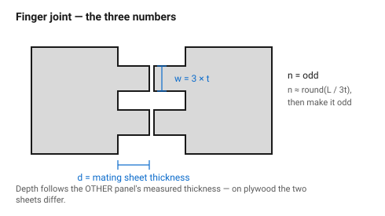
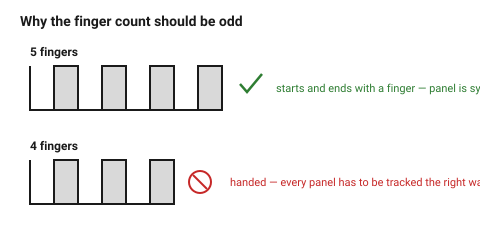
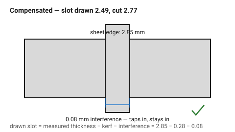

# Finger joint (box joint)

The default corner for a laser-cut box: interlocking square fingers along both
mating edges. It is strong, it self-aligns, it looks deliberate, and it gives
a large glue area. Every laser-cut box generator in existence produces this
joint, and it is the first thing worth getting right.

## When this applies

Two flat panels meeting at 90°, in a material 3 mm or thicker. It is the
right joint for boxes, enclosures, frames and drawers.

Not for material under 2.5 mm (the fingers become fragile), not for acrylic
that will be stressed (the corners crack), and not where the joint must be
taken apart repeatedly.

## Good starting values

| What | Start with | Works between | Why |
|---|---|---|---|
| Finger width | 3 × material thickness | 2×–5× | narrower fingers snap off; wider ones look clumsy and glue poorly |
| Finger depth | = material thickness, exactly | — | shallower leaves a step; deeper leaves a protruding tongue |
| Number of fingers | odd, ≥ 3 per edge | — | odd means the joint is symmetrical and the panel is not handed |
| Fit | slip + glue | — | press fit leaves no room for adhesive and squeezes it all out |
| Kerf compensation | required | — | uncompensated, the joint is loose by 2 × kerf |
| Corner of each finger | sharp | — | a radius stops the finger seating fully |

### The arithmetic

For a panel edge of length *L*, material thickness *t*, and *n* fingers
(odd):

```
finger width  w = L / n          with w between 2t and 5t
finger depth  d = t              (the mating panel's thickness)
```

Choose *n* so that *w* lands near 3 *t*:

```
n ≈ round(L / (3t))              then make it odd
```

Worked example: a 120 mm edge in 3 mm ply.
`n ≈ 120 / 9 = 13.3` → use **13 fingers**, `w = 120 / 13 = 9.23 mm` (= 3.1 t).

### Kerf compensation for this joint

Both mating parts are cut, so both are affected:

| Feature | Adjust by | Result |
|---|---|---|
| Finger (male) | grow by kerf ÷ 2 per side | comes out at nominal |
| Notch (female) | shrink by kerf ÷ 2 per side | comes out at nominal |
| Finger **depth** | = measured thickness of the *mating* sheet | flush face |

Note the last row: the depth follows the **other** panel's measured thickness,
not this one's. On plywood the two sheets may differ by 0.3 mm.

## How to build it

1. Measure the sheet. Both sheets, if they came from different boards.
2. Compute *n* from the edge length and round to an odd number.
3. Lay out the fingers **starting and ending with a finger**, not a notch —
   that is what makes the count odd and the panel symmetric.
4. Cut the mating panel with the complementary pattern: its first feature is a
   notch.
5. Apply kerf compensation (see the table above).
6. Aim for a **slip** fit, not a press fit. Wood glue needs a film to work; a
   press fit scrapes it off on the way in.
7. Dry-fit the whole box before any glue. A finger joint box assembles in one
   order and will not go together in another.

## When to do it differently

- **Acrylic** → use fewer, wider fingers (4–5 t) and glue with acrylic cement.
  Narrow acrylic fingers snap during assembly.
- **The box must be taken apart** → use
  [`t-slot-captive-nut`](t-slot-captive-nut.md) instead. Finger joints are a
  glue joint pretending to be a mechanical one.
- **A visible box in a nice material** → consider a mitred corner with a
  hidden spline. Finger joints announce how the box was made; sometimes that
  is not wanted.
- **Very thin material (≤ 2 mm)** → fingers become too fragile to assemble.
  Use tab-and-slot with a larger tab, or fold a scored single piece.
- **Edges of very different lengths** → keep the finger *width* constant
  across the box rather than the finger *count*. A box whose fingers are all
  the same size looks designed; one whose fingers vary panel to panel looks
  like the output of a generator.

## Images


*The three dimensions that define the joint. Depth always equals the mating
panel's measured thickness — not the nominal number on the label.*


*Odd counts start and end with a finger, so the panel is symmetric and not
handed. Even counts force you to track which way round every panel goes.*


*Kerf compensation applied. Without it this joint is loose by two kerfs — see
[`kerf-and-tolerance`](../01-basics/kerf-and-tolerance.md).*

## Source & date

- Joint proportions and the 2 × kerf slop:
  [CMU 99-353 — kerf and joinery (PDF)](https://www.cs.cmu.edu/afs/cs/academic/class/99353-f16/day3/kerf.pdf),
  [Instructables — press-fit finger joints](https://www.instructables.com/Adjusting-Laser-Cutters-Kerf-Settings-for-Pre/).
- Finger sizing practice: [Rice ENGI 210 — laser cut finger jointed box](https://engi210.blogs.rice.edu/2024/02/11/laser-cut-finger-jointed-box/).
- `confidence: medium`.
