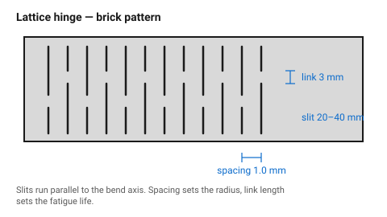
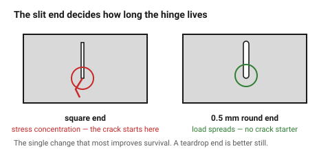
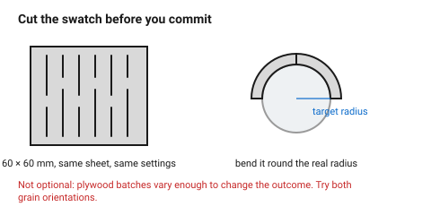

# Living hinge (lattice hinge)

A pattern of staggered slits that turns rigid sheet into something that bends.
The material is not softened and nothing is removed but the kerf — the slits
simply leave a chain of thin twisting links, and the sheet flexes by twisting
each of them a little.

It is the only way a laser makes a curve out of a flat sheet, and it is the
technique most likely to be attempted once, snap, and be abandoned. The
numbers below are what makes the difference.

## When this applies

Wrap-around enclosures, curved lids, book-style covers, boxes with a rolled
corner, anything where a single sheet has to follow a curve.

Not for a hinge that must open and close thousands of times (it is a spring
with a fatigue life, not a bearing), not for solid wood, and not for anything
structural.

## Good starting values

| What | Start with | Works between | Why |
|---|---|---|---|
| Slit spacing (row to row) | 1.0 mm | 0.5–2.0 mm | closer = tighter bend radius, weaker; wider = stronger, stiffer |
| Link length (uncut gap at the slit ends) | 3 mm | 2–6 mm | this is the piece that twists; shorter links break, longer ones make the hinge floppy |
| Slit length | 20–40 mm | 15–60 mm | longer slits bend more easily and weaken the panel across its width |
| Overlap between rows | 50 % of slit length | 40–60 % | a brick pattern; less overlap leaves a straight weak line |
| Minimum bend radius | 12 mm | 8–25 mm | below this, even a good pattern cracks |
| Number of rows for 90° | 20–25 | — | for 3 mm ply with 3 mm links; each link contributes roughly 4° |
| Slit end | 0.5–1 mm round end or teardrop | — | a square slit end is a crack starter |

### The relationship worth understanding

The hinge bends because each link **twists**. So:

- **More rows** → more total bend, for a given twist per link.
- **Closer spacing** → tighter radius, because more rows fit into the same arc.
- **Shorter links** → more twist per link, so fewer rows needed — and a
  shorter fatigue life.

A rough working rule for the arc:

```
rows needed ≈ bend angle (°) ÷ 4      for 3 mm ply, 1 mm spacing, 3 mm links
hinge length ≈ rows × spacing         and must be ≥ the arc length of the bend
```

Worked example: a 90° corner at 15 mm radius.
Arc length = π × 15 × 90/180 ≈ **23.6 mm**.
Rows ≈ 90 / 4 ≈ **23**. At 1 mm spacing that is 23 mm of hinge — just enough,
so use 1.1 mm spacing over 26 mm to give some margin.

### Material behaviour

| Material | Living hinge | Note |
|---|---|---|
| **Birch plywood, 3 mm** | good | the standard choice; cross-plies resist splitting |
| **Plywood, 4 mm+** | poor | links are too stiff; they break rather than twist |
| **Cast acrylic** | fair | flexes, but crazes; warms and deforms if the slits are under 1 mm apart |
| **MDF** | poor | no fibre structure to hold the links together; crumbles |
| **Solid wood** | no | splits along the grain at the first link |
| **Greyboard, leather** | excellent | but these hardly need a hinge — just score them |

## How to build it

1. **Orient the slits parallel to the bend axis.** The links then twist about
   an axis across the bend, which is the whole mechanism. Slits at 90° to this
   do nothing except weaken the panel.
2. Lay out the rows in a **brick pattern**, each row offset by half a slit
   length from its neighbours.
3. **Round or teardrop every slit end.** This is the single change that most
   improves survival: a square end is a stress concentration and cracks
   propagate from it.
4. Extend the pattern **past the bend** by 2–3 rows at each end, so the
   transition from hinge to rigid panel is gradual. A hinge that stops
   abruptly cracks at the last link.
5. **Cut a test swatch first** — 60 × 60 mm of the same sheet, same settings.
   Bend it around something of the target radius. This is not optional;
   plywood batches vary enough to change the outcome.
6. For plywood, cut the swatch in **both grain orientations** and keep the one
   that survives. Which way is better depends on the veneer, and the
   difference is large.

## When to do it differently

- **A tighter radius than 8 mm** → do not use a living hinge. Use a real
  hinge, a fabric spine, or a mitred and folded corner.
- **The hinge must last** → a living hinge in plywood will eventually fail.
  For a lid that opens daily, fit a piano hinge or a pin.
- **The panel must stay stiff across the hinge line** → a living hinge is weak
  in every direction, not just the bending one. Add a stiffening rib behind
  it or accept a floppy panel.
- **Card or leather** → do not slit. Score a single line at 50–70 % of
  thickness; see [`score-and-fold`](../05-engraving/score-and-fold.md).
- **Appearance matters and the slits should not show** → the pattern is
  visible from both faces by definition. Consider a fabric-hinged two-part
  design.

## Images


*The brick pattern and its three numbers. Spacing sets the radius, link length
sets the fatigue life, slit length sets how easily it bends.*


*The same hinge with square and rounded slit ends. Cracks start at a square
corner; a 0.5 mm round end removes the stress concentration.*


*Cut a 60 mm swatch and bend it around the target radius before committing.
Plywood batches vary enough that this step decides the design.*

## Source & date

- Spacing, link and bend-radius figures:
  [DefProc — lattice hinge design, minimum bend radius](https://www.defproc.co.uk/analysis/lattice-hinge-design-minimum-bend-radius/),
  [RS DesignSpark — laser cut living hinges](https://www.rs-online.com/designspark/laser-cut-living-hinges),
  [What Make Art — living hinges, minimum bend radius](https://whatmakeart.com/digital-fabrication/laser-cutting/living-hinges-minimum-bend-radius-for-laser-cutting/).
- `confidence: starting-point` — living hinges vary more with material batch
  and machine than anything else in this folder. The test swatch is the real
  specification; these numbers only tell you where to start.
