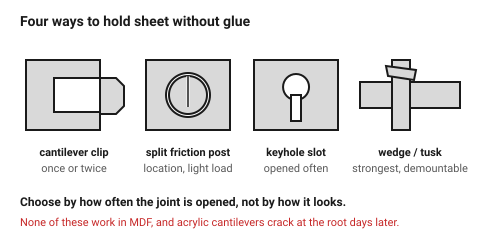
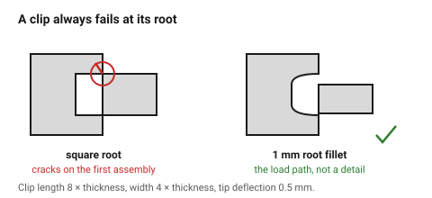

# Snap and friction fits in sheet

Four ways to hold flat parts together without glue and without hardware. All
of them work by flexing something, which in sheet material means designing a
deliberate thin section — and sheet material has a very short flexing career.

## When this applies

Demountable assemblies, packaging, display work, prototypes that must be
opened, and anything shipped flat and assembled by hand. In plywood and
acrylic. In MDF, none of these last more than a few cycles.

## Good starting values

### 1 — Cantilever clip

A finger of material that deflects as a mating part passes, then springs back
over a lip.

| What | Start with | Works between | Why |
|---|---|---|---|
| Clip length | 8 × sheet thickness | 6×–12× | shorter clips are too stiff and snap instead of bending |
| Clip width | 4 × sheet thickness | 3×–8× | narrower clips break; wider ones do not deflect |
| Deflection at the tip | 0.5 mm | 0.3–1.0 mm | this is the actual engagement; more than 1 mm exceeds what sheet will take |
| Root fillet | 1 mm | 0.5–2 mm | the clip breaks at the root, always. This fillet is the design |
| Lead-in angle | 30° | 20°–45° | the ramp the mating part slides up |
| Retention angle | 60°–90° | | steeper = harder to remove |
| Cycles before failure | ~20 in ply, ~10 in acrylic | | design accordingly |

### 2 — Friction post

A round or slotted post that grips a hole by being slightly oversize.

| What | Start with | Why |
|---|---|---|
| Interference | 0.10 mm | more than in a straight press fit, because the split post flexes |
| Slot in the post | 1 × kerf wide, 60 % of post length | turns a rigid post into two springs |
| Post ⌀ | ≥ 3 × sheet thickness | below this the two halves snap off |

### 3 — Keyhole slot

A round hole opening into a narrow slot. A screw head or a pin enters the
round end and slides into the slot, where it is trapped.

| What | Start with | Why |
|---|---|---|
| Round end ⌀ | screw head ⌀ + 0.5 mm | the head has to pass |
| Slot width | screw shank ⌀ + 0.3 mm | the shank slides, the head does not |
| Slot length | 8–15 mm | enough travel to be deliberate |
| Material each side of the slot | ≥ 3 × thickness | this is what carries the load |

### 4 — Wedge / tusk tenon

A through tab with a slot in it; a tapered wedge is driven into the slot and
clamps the joint. The strongest of the four, and fully demountable.

| What | Start with | Why |
|---|---|---|
| Wedge taper | 1:8 | steeper wedges back out under vibration |
| Wedge slot position | starts 0.5 mm *inside* the host panel face | so the wedge pulls the joint tight as it is driven |
| Wedge thickness | = sheet thickness | cut from the same sheet |
| Wedge width | ≥ 6 mm at the thick end | thin wedges split |

## How to build it

1. **Pick by how often it will be opened.**
   Once or twice → cantilever clip. Regularly → keyhole or wedge. Never →
   glue it and use a finger joint.
2. Put the flexing part in the **cheaper, replaceable** panel where possible.
3. Every clip gets a root fillet. Every time. This is the difference between
   a clip that survives assembly and one that arrives broken.
4. Orient a clip so it flexes **in the plane of the sheet**, not across it.
   Plywood flexes in-plane and delaminates out-of-plane.
5. Dry-cycle the clip five times before committing the design. If it feels
   loose on the fifth, it will be useless on the twentieth.

## When to do it differently

- **MDF** → use none of these. MDF has no fibre structure to spring back with.
  Use [`t-slot-captive-nut`](t-slot-captive-nut.md).
- **Acrylic** → wedges and keyholes only. Acrylic cantilever clips crack at
  the root, often days after assembly, and often without being touched.
- **The joint carries real load** → a screw. All four of these are location
  and retention, not structure.
- **Hundreds of cycles** → a metal fastener or a printed part. Sheet material
  fatigues quickly; see [`fdm/features/snap-fit-cantilever`](../../fdm/05-features/snap-fit-cantilever.md)
  for the version of this that survives.

## Images

*Cantilever clip, split friction post, keyhole slot and wedge. Each is chosen
by how often the joint has to be opened, not by how it looks.*

*A clip fails at its root, without exception. The fillet is not a detail —
it is the load path.*

## Source & date

- Sheet snap and wedge patterns: [CMU IDeATe — flat-pack joinery](https://courses.ideate.cmu.edu/16-223/f2020/text/reference/joinery.html).
- Cantilever proportions adapted from plastics practice
  ([Protolabs Network — snap-fit joints](https://www.hubs.com/knowledge-base/how-design-snap-fit-joints-3d-printing/))
  and derated for the low strain sheet material tolerates.
- `confidence: medium`; the cycle-life figures are `starting-point`.
