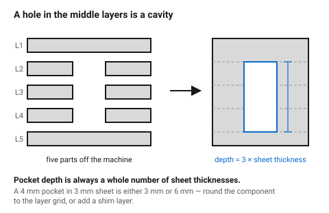
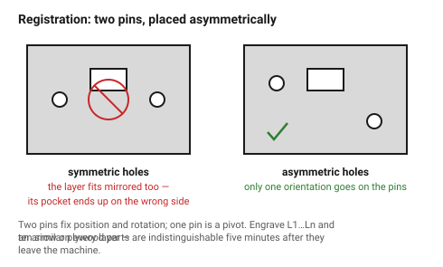
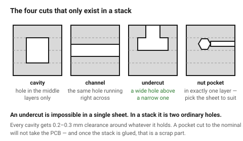
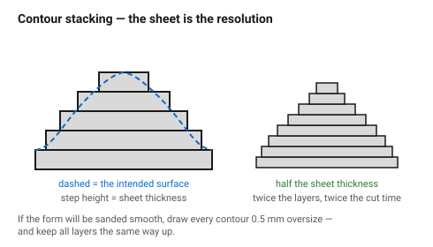

# Stacked-layer construction — 3D out of a 2D machine

A laser cuts flat parts. Stack those parts and glue or bolt them, and the
machine makes solid objects with internal cavities, undercuts, channels and
curved surfaces — shapes that no single sheet can produce.

The technique is worth thinking of as a **different process**, not a
decoration on top of flat work. It has its own design order (decide the layer
count first), its own dominant failure (registration), and its own vocabulary
of "special cuts": a hole in one layer of a stack is not a hole, it is a
**cavity**; a slot in two adjacent layers is a **channel**; a notch cut in
alternate layers is an **undercut** that no single cut could make.

## When this applies

- A part that needs more thickness than the stock provides.
- An enclosure with a pocket for a PCB, a battery, a magnet or a nut.
- Channels for cables, air, light or liquid inside a solid block.
- Curved or organic form built from terraced contours.
- Layered graphic work: shadow boxes, inlay, signage with depth, edge-lit
  panels.
- Anything requiring an undercut, which a laser cannot cut in a single sheet.

Not the right approach when: the part must be watertight under pressure, the
part must be strong across the glue lines (the stack delaminates before the
material fails), or the required thickness is available in solid stock and
none of the internal features are needed.

## Good starting values

### The stack itself

| What | Start with | Works between | Why |
|---|---|---|---|
| Layer count | target thickness ÷ measured sheet thickness, rounded | — | design the *count* first; the exact thickness is whatever the count gives |
| Thickness tolerance of the stack | n × sheet tolerance | — | ten layers of 3 mm ply (±0.25) is 30 mm ±2.5 mm. Plan for it or machine the stack afterwards |
| Glue line thickness | 0.05–0.1 mm per joint | — | adds up: nine joints is up to 0.9 mm of extra height |
| Alignment features | 2 minimum, 3 preferred | 2–4 | two pins fix position and rotation; one pin is a pivot |
| Alignment pin ⌀ | 3 mm | 2–6 mm | 3 mm dowel or an M3 screw is the common choice |
| Alignment hole in inner layers | pin ⌀ + 0.15 mm | +0.1 to +0.3 | slip fit; a press fit in every layer makes the stack impossible to close |
| Alignment hole in the two outer layers | pin ⌀ + 0.05 mm | — | the outer layers locate; the inner ones follow |
| Clamping pressure | even, overnight | — | PVA needs pressure; a stack glued under a book is a stack with gaps |

### Cavity and channel dimensions

| Feature | How it is made | Design note |
|---|---|---|
| **Blind pocket** | hole in layers 2…n−1, solid layer 1 and n | depth = (number of cut layers) × sheet thickness. You cannot get a fractional depth — round the *component* to the layer grid, or add a shim layer |
| **Through channel** | aligned slots in adjacent layers | keep the channel ≥ 2 × sheet thickness wide or the inner walls are fragile |
| **Undercut / T-slot cavity** | a wide hole in one layer, a narrow one in the layer below | the only way a laser makes an undercut |
| **Captive nut or magnet pocket** | hex or round hole in exactly one layer | pocket thickness = sheet thickness; choose the sheet to match the component |
| **Bearing seat** | press-fit ⌀ in two layers, clearance ⌀ in the rest | spreads the press fit over more material and stops the bearing tipping |
| **Light chamber** | aperture in each layer, growing outward | for edge-lit and shadow-box work |

### Contour stacking (curved forms)

| What | Start with | Why |
|---|---|---|
| Step height | = sheet thickness | this *is* the resolution of the surface |
| Visible terracing | expect it at ≥ 3 mm steps | either sand it out, or design so the terracing reads as deliberate |
| Sanding allowance | +0.5 mm on every contour | if the form will be sanded smooth, the contours must start oversize |
| Layer orientation | all layers the same way up | kerf taper is directional; flipping alternate layers doubles the mismatch at every joint — see [`taper-and-focus`](../03-geometry/taper-and-focus.md) |

## How to build it

1. **Decide the layer count before anything else.** Take the target thickness,
   divide by the *measured* sheet thickness, and round. Every internal feature
   then has to live on that layer grid — a 4 mm pocket in 3 mm sheet is either
   3 mm or 6 mm, and pretending otherwise wastes a redesign later.

2. **Draw the stack as a section first**, not as layers. Sketch the part in
   side view with the layer boundaries drawn in, and mark which layer each
   internal feature belongs to. Every cavity, channel and pocket is then a
   simple question: "which layers is this hole in?"

3. **Add the registration before the detail.** Two 3 mm holes, placed as far
   apart as the part allows, on every layer. Then make the pattern
   **asymmetric** — offset one hole, or add a third — so a layer cannot be
   assembled rotated or mirrored. A symmetric registration pattern guarantees
   that someone will eventually build the stack wrong, and in a glued stack
   that is unrecoverable.

4. **Number and orient every layer.** Engrave `L1`…`Ln` and an orientation
   arrow on a face that will be hidden or on the waste side of a cut. Ten
   nearly-identical plywood rings on a bench are indistinguishable five
   minutes after they come off the machine.

5. **Place the special cuts.**
   - a *cavity* is a hole present in some layers and absent in the layers
     above and below;
   - a *channel* is the same hole running across layers;
   - an *undercut* is a hole that is wider in one layer than in its neighbour.
   Give every cavity a **0.2–0.3 mm clearance** around whatever it holds; a
   pocket cut to the nominal size of a PCB will not take the PCB.

6. **Decide glued or bolted, and design for it.**

   | | Glued | Bolted |
   |---|---|---|
   | Thickness | grows by the glue lines | exact |
   | Serviceable | no | yes |
   | Needs | clamps, flat surface, time | clearance holes in all but the last layer |
   | Best for | contour forms, solid blocks | enclosures, anything with electronics inside |

   For a bolted stack: clearance holes in every layer, a captive nut in the
   last layer or a nut on the outside, and **at least four bolts** — two bolts
   let the stack shear sideways under load.

7. **Dry-stack and check before glue.** Slide a component into every cavity.
   Once the glue is on, a pocket that is 0.2 mm tight is a scrap part.

8. **Glue with even pressure**, in one go if possible. Glue each joint,
   assemble the whole stack on the alignment pins, then clamp the lot. Glueing
   in stages builds up a cumulative lean.

## When to do it differently

- **The internal cavity is complex or the walls are thin** → consider FDM
  printing instead. Stacked layers are excellent for orthogonal cavities and
  poor at anything that needs a smooth curved internal wall.
  See [`fdm/start-here`](../../fdm/00-start-here.md).
- **The part must be strong in the stacking direction** → do not stack. The
  glue lines are the weak plane, and a stacked part fails by delamination
  long before the material yields. Orient the stack so loads run *across*
  the layers, not pulling them apart.
- **A smooth curved surface is essential** → stack oversize and sand, or use
  a thinner sheet for a finer step, or accept terracing as the aesthetic.
  Going from 3 mm to 1.5 mm sheet doubles the layer count and doubles the cut
  time, so this is a real cost decision.
- **Only one or two features need the extra depth** → a single stacked doubler
  glued onto a flat panel is much cheaper than stacking the whole part.
- **Very tall stacks (>15 layers)** → registration errors accumulate. Use
  through-bolts rather than pins, and split the stack into sub-assemblies that
  are individually faced flat.
- **Acrylic stacks that must look solid** → use acrylic cement, not PVA, and
  cut the layers from the same sheet: batch-to-batch colour and thickness
  differences are visible in a laminated edge.

## Images

*Five layers. The hole exists only in layers 2–4, so the assembled block has a
sealed pocket — a shape a single sheet cannot produce. Pocket depth is always
a whole number of sheet thicknesses.*

*Two pins fix position and rotation. Making the pattern asymmetric is what
stops a layer going in mirrored — in a glued stack that mistake cannot be
undone.*

*The four cuts that only exist in stacked work. An undercut in particular is
impossible in a single sheet: it is simply a wide hole above a narrow one.*

*Contour stacking. The step height equals the sheet thickness, so the sheet
choice is the surface resolution — and if the form will be sanded, every
contour must be drawn oversize first.*

## Source & date

- Stacked/laminated construction practice and registration:
  [CMU IDeATe — flat-pack joinery](https://courses.ideate.cmu.edu/16-223/f2020/text/reference/joinery.html).
- Kerf taper behaviour that makes layer orientation matter:
  [KAD3D — laser cutting tolerances](https://kad3d.com.au/laser-cutting-tolerances/).
- Thickness variance driving the layer-count-first rule: measured sheet
  tolerances in [`plywood`](../02-materials/plywood.md) and
  [`acrylic`](../02-materials/acrylic.md).
- `confidence: medium` — the geometry rules are exact; clearances and glue
  allowances are practice.
