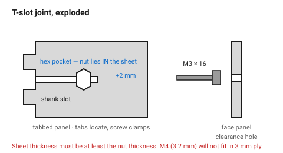
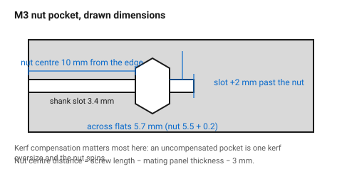

# T-slot joint with a captive nut

The joint that makes a laser-cut assembly **demountable**. A tab locates the
panel, a hex nut drops into a pocket cut through the panel's face, and a screw
passes through the mating panel and into that nut. It clamps hard, it comes
apart, and it forgives the thickness variation that ruins press fits.

If a box has to be opened, serviced, or shipped flat and assembled by someone
else, this is the joint.

## When this applies

Enclosures, machine frames, furniture, anything that must be taken apart
again. Material 3 mm and up — see the thickness rule below.

Not for thin sheet, not for decorative work (the hardware is visible), and not
where the joint must be invisible.

## Good starting values

### The rule that governs everything

> **Sheet thickness ≥ nut thickness.** The nut lies *in* the sheet.

| Screw | Nut across flats | Nut thickness | Minimum sheet |
|---|---|---|---|
| M3 | 5.5 mm | 2.4 mm | 3 mm |
| M4 | 7.0 mm | 3.2 mm | 4 mm |
| M5 | 8.0 mm | 4.0 mm | 5 mm |
| M6 | 10.0 mm | 5.0 mm | 6 mm |

For thinner sheet, use a **square nut** (thinner for the same thread) or move
to a different joint.

### Drawn dimensions (before kerf compensation)

| Feature | Value for M3 | Rule | Why |
|---|---|---|---|
| Hex pocket across flats | 5.7 mm | nut AF + 0.2 mm | the nut must drop in but not rattle |
| Shank slot width | 3.4 mm | screw ⌀ + 0.4 mm | clearance, and the screw must slide along it |
| Slot length beyond the nut | 2 mm | 1.5–3 mm | lets the screw fully engage all the nut's threads |
| Nut centre from the panel edge | 10 mm for an M3×16 | screw length − mating panel thickness − 3 mm | the screw must reach, with a little to spare |
| Clearance hole in the mating panel | 3.4 mm | screw ⌀ + 0.4 mm | |
| Edge distance around the pocket | ≥ 2 × thickness | | a pocket near an edge blows out under clamping load |
| Locating tabs per joint | 2 | | the screw clamps; the tabs stop rotation |

### Hardware to specify

| | Choice | Why |
|---|---|---|
| Screw | M3 socket cap or button head | a flat head needs a countersink this joint has no room for |
| Length | mating panel + 12–14 mm | enough to pass the nut |
| Nut | standard ISO 4032 hex, or square nut | square nuts self-locate against the pocket walls |
| Washer | none | it would sit on a laser-cut edge and mar it |

## How to build it

1. **Check the thickness rule first.** An M4 joint in 3 mm ply is not
   possible — the nut is thicker than the sheet.
2. On the **tabbed panel** (the one whose edge meets a face):
   - draw the locating tabs as in [`tab-and-slot`](tab-and-slot.md);
   - draw the shank slot running inward from the edge, on the panel's
     centreline, between the tabs;
   - draw the hex pocket at the inner end of the slot, opening into it;
   - extend the slot 2 mm past the far side of the pocket.
3. On the **face panel**: draw the tab slots and a clearance hole on the same
   axis as the shank slot.
4. Apply kerf compensation. The hex pocket in particular: an uncompensated
   pocket comes out one kerf oversize and the nut spins.
5. Dry-assemble with the nut before gluing anything else — a pocket that is
   0.2 mm tight can be opened with a file, one that is loose cannot.

## When to do it differently

- **Thin sheet** → use a square nut (thinner for a given thread), or stack two
  layers and cut the pocket only in one — see
  [`stacked-layer-construction`](stacked-layer-construction.md).
- **The joint must be invisible** → use a threaded insert into the panel edge,
  or a different joint entirely. This one shows its hardware.
- **Repeated disassembly (hundreds of cycles)** → replace the plain nut with a
  nyloc, or the whole joint with a threaded metal insert. The hex pocket in
  MDF will eventually round out.
- **High clamping force** → add a washer-sized pad of material, or move to
  through-bolts. Wood crushes under a socket head.

## Images

*The nut lies in the plane of the tabbed panel; the screw enters along that
plane from the mating panel. This is why sheet thickness must be at least the
nut thickness.*

*Across flats +0.2 mm, shank slot at screw ⌀ +0.4 mm, and 2 mm of slot beyond
the nut so the screw engages every thread.*

## Source & date

- Joint principle and tolerance for variable material thickness:
  [Simon Arthur — tab and slot with T-nut](https://planiverse.wordpress.com/2014/04/07/construction-technique-tab-and-slot-with-t-nut/),
  [Make: — captive square nut CNC panel joint](https://makezine.com/2011/10/06/clever-captive-square-nut-cnc-panel-joint/).
- Flat-pack joinery context: [CMU IDeATe — joinery](https://courses.ideate.cmu.edu/16-223/f2020/text/reference/joinery.html).
- Nut dimensions: ISO 4032.
- `confidence: medium` — nut dimensions are exact; clearances are practice.
