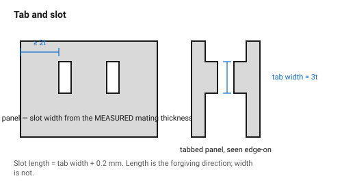
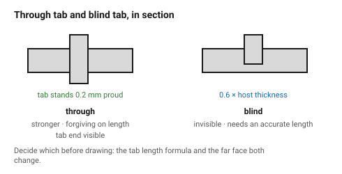
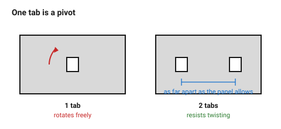

# Tab and slot

One panel grows a tab; another panel has a matching slot cut into its face.
It is the joint for a panel meeting another panel **anywhere except a corner**
— a divider in a box, a rib under a shelf, a bracket against a back plate.

Unlike a finger joint it does not self-align in two axes, so it is usually
paired with a second tab, a fold, or a screw.

## When this applies

- A panel meeting the *face* of another panel (a T joint).
- A part that must locate precisely before being glued or screwed.
- Flat-pack assemblies that need to be shipped flat and assembled once.

## Good starting values

| What | Start with | Works between | Why |
|---|---|---|---|
| Tab width | 3 × material thickness | 2×–6× | narrow tabs shear off; wide ones stop the panel flexing into place |
| Tab length (through) | = host thickness + 0.2 mm | +0 to +0.5 mm | proud by a hair so it can be sanded flush; flush-drawn always comes out shy |
| Tab length (blind) | 0.6 × host thickness | 0.5×–0.8× | deep enough to locate, not so deep it breaks through |
| Slot width | measured thickness − kerf − fit allowance | — | see [`kerf-and-tolerance`](../01-basics/kerf-and-tolerance.md) |
| Slot length | tab width + 0.2 mm | +0.1 to +0.4 mm | length is the forgiving direction; leave a little |
| Tabs per joint | 2 minimum | 2–5 | one tab is a hinge, not a joint |
| Spacing between tabs | ≥ 4 × thickness | — | closer and the material between the slots is a weak web |
| Distance from slot to panel edge | ≥ 2 × thickness | 1.5×–3× | closer and the slot blows out through the edge |

### Through tab or blind tab

| | Through | Blind |
|---|---|---|
| **Strength** | higher — the tab is supported through the full thickness | lower |
| **Look** | tab end visible on the far face, which can be a feature | invisible |
| **Tolerance** | forgiving; extra length is absorbed | needs an accurate tab length |
| **Use for** | structure, jigs, anything load-bearing | visible furniture-like work |

## How to build it

1. Decide through or blind before drawing anything — it changes the tab length
   formula and the look of the far face.
2. Place at least **two** tabs per joint, spaced as far apart as the panel
   allows. Two tabs 80 mm apart resist twisting; two tabs 10 mm apart do not.
3. Draw the slot in the host panel from the **measured** thickness of the
   tabbed panel, not the nominal.
4. Keep the slot ends **square**, not radiused — a radius leaves a gap at the
   shoulder of the tab.
5. Add a 0.5 mm chamfer or radius to the *leading corners of the tab* only.
   This is the one place a radius helps: it guides the tab into the slot.
6. If the joint will be glued, use a **slip** fit. If it will be wedged or
   pinned, use a press fit.

## When to do it differently

- **The joint must resist being pulled apart** → add a cross-pin or a wedge
  through the protruding tab end (a "tusk tenon"), or use
  [`t-slot-captive-nut`](t-slot-captive-nut.md).
- **The panel is thin and the tab would be fragile** → widen the tab to 6 × t
  and use only two.
- **Assembly order is a problem** → a through tab with a wedge can be
  assembled and disassembled from outside; a glued blind tab cannot.
- **Acrylic** → keep tabs wide and few; acrylic tabs snap at the shoulder,
  which is a stress riser. A 0.5 mm fillet at the tab root helps.

## Images

*Tab width, tab length and edge distance. The slot is always drawn from the
measured thickness of the mating sheet.*

*Through tabs are stronger and forgiving on length; blind tabs are invisible
and need the tab length to be right.*

*A single tab is a pivot. Two tabs, as far apart as the panel allows, are a
joint.*

## Source & date

- Slot clearance practice (~0.25 mm over the tab for a slip fit):
  [SendCutSend — designing laser cut tab and slot parts](https://sendcutsend.com/blog/designing-laser-cut-tab-and-slot-parts/).
- Flat-pack joinery patterns: [CMU IDeATe — flat-pack joinery](https://courses.ideate.cmu.edu/16-223/f2020/text/reference/joinery.html).
- `confidence: medium`.
