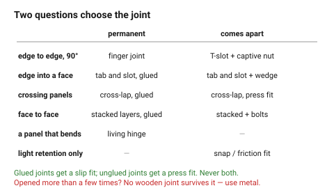

# Choosing a joint for wood

The joint decides the outline, not the other way round — so this is the second
decision in any project, immediately after the material. Choosing it late
means redrawing every panel.

Seven joints cover essentially everything laser-cut wood needs. This document
picks between them; each one's own recipe has the numbers.

## When this applies

As soon as the material is chosen and before any panel is drawn.

## Good starting values

### Pick by the two questions that matter

**1 — Does it come apart again?**
**2 — Which surfaces meet: edge-to-edge, edge-to-face, or face-to-face?**

| Surfaces meet | Permanent | Demountable |
|---|---|---|
| **Edge to edge, at 90°** (a box corner) | [`finger-joint`](finger-joint.md) | [`t-slot-captive-nut`](t-slot-captive-nut.md) |
| **Edge into a face** (a divider, a rib) | [`tab-and-slot`](tab-and-slot.md), glued | [`tab-and-slot`](tab-and-slot.md) + wedge |
| **Crossing panels** (an egg-crate) | [`cross-lap`](cross-lap.md), glued | [`cross-lap`](cross-lap.md), press fit |
| **Face to face** (building thickness) | [`stacked-layer-construction`](stacked-layer-construction.md), glued | stacked + bolts |
| **A panel that must bend** | [`living-hinge`](living-hinge.md) | — |
| **Light retention only** | — | [`snap-and-friction-fits`](snap-and-friction-fits.md) |

### The full comparison

| Joint | Strength | Demountable | Self-aligning | Visible | Best material |
|---|---|---|---|---|---|
| **Finger joint** | high (glued) | no | **yes, in two axes** | yes — announces itself | birch ply, bamboo |
| **Tab and slot** | medium | with a wedge | one axis | tab end shows if through | ply, solid |
| **T-slot + captive nut** | **high** | **yes** | yes | hardware visible | ply ≥ 3 mm |
| **Cross-lap** | high in shear, none in tension | yes (press fit) | yes | edges show | ply, solid, MDF |
| **Stacked layers** | high in shear, weak in peel | with bolts | with pins | layer lines show | ply, bamboo |
| **Living hinge** | low | n/a | n/a | very | 3 mm birch ply only |
| **Snap / friction** | low | yes | yes | can be hidden | ply, never MDF |

### What the material does to the choice

| Material | Favours | Avoid |
|---|---|---|
| **Birch plywood** | everything — it is the reference | — |
| **Poplar ply** | glued joints | press fits (it crushes and stays crushed) |
| **MDF** | glued joints, captive nuts | press fits that come apart, snap fits, living hinges |
| **Solid wood** | tab and slot, cross-lap, with grain respected | finger joints across the grain on narrow stock |
| **Bamboo** | finger joints, stacked | anything relying on splitting resistance along the laminations |

### Two rules that save most of the trouble

- **Glued joints get a slip fit; unglued joints get a press fit.** Never both.
  A press fit scrapes the glue off on the way in.
  → [`gluing-wood`](../10-wood-finishing/gluing-wood.md)
- **If it will be opened more than a few times, no wooden joint survives it.**
  Use metal: a captive nut, a cross dowel, an insert.
  → [`fasteners-in-wood`](../10-wood-finishing/fasteners-in-wood.md)

## How to build it

1. Answer the two questions: does it come apart, and which surfaces meet.
2. Take the joint from the table and read its recipe for the numbers.
3. Check the material row — a joint that is right in birch ply may be wrong in
   MDF.
4. Check the grain direction the joint implies.
   → [`grain-and-ply-direction`](../03-geometry/grain-and-ply-direction.md)
5. Decide glued or not, and set the fit accordingly.
6. Dry-fit before committing. Most wooden assemblies have exactly one
   assembly order.

## When to do it differently

- **Mixed materials** → design the joint in the softer material. A ply slot
  receiving an acrylic tab works; the reverse cracks.
- **A very large assembly** → break it into sub-assemblies with demountable
  joints between them, so each one can be finished flat and transported.
- **Appearance is the whole point** → finger joints announce how the box was
  made. A mitre with a hidden spline, or a stacked construction, says
  something quieter.
- **Load in tension** → most of these joints resist shear and not tension.
  Add a mechanical feature: a wedge, a pin, a captive nut.

## Images

*Two questions choose the joint: does it come apart, and which surfaces meet.
Everything else is the recipe.*

## Source & date

- Joint taxonomy for sheet goods: [CMU IDeATe — flat-pack joinery](https://courses.ideate.cmu.edu/16-223/f2020/text/reference/joinery.html),
  [What Make Art — laser cut joints](https://whatmakeart.com/digital-fabrication/laser-cutting/laser-cut-joints/).
- Traditional joint names and behaviour: [ToolsToday — 18 woodworking joints](https://toolstoday.com/learn/18-woodworking-joints).
- `confidence: medium`.
