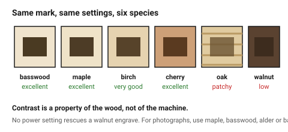
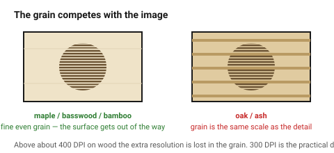

# Engraving on wood

Engraving on wood is **burning**, not removing. The mark is dark because the
surface has been carbonised, which means the contrast you get is a property of
the **species**, not of the machine — and no power setting rescues a badly
chosen board.

## When this applies

Any mark on a wooden surface: labels, branding, decoration, photographs, part
numbers. For the general engraving mechanics see
[`raster-engraving`](raster-engraving.md); this document is what changes when
the material is wood.

## Good starting values

### Contrast by species

| Species | Contrast | Why |
|---|---|---|
| **Basswood / lime, alder** | excellent | pale, even, fine-grained, no resin |
| **Maple** | excellent | hard and pale; the usual choice for photo engraving |
| **Birch, birch ply** | very good | cream surface, clean dark mark |
| **Bamboo** | excellent | pale and completely uniform |
| **Cherry** | excellent | warm mid-tone, fine grain, needs more power |
| **Beech** | good | plain but slightly blotchy |
| **Walnut** | **low** | dark surface, dark mark — tone on tone |
| **Oak, ash** | **patchy** | hard and soft bands burn at different rates; pores trap soot |
| **Pine, fir** | poor | resin flares, and the growth rings burn very unevenly |
| **MDF** | good and very even | no grain to interfere |

### The grain problem

On an open-grained or strongly figured wood, the **grain is the same scale as
the detail**, so a photograph competes with the wood. Two consequences:

- On oak and ash, fine engraving reads as mud.
- On plywood, the face veneer's figure shows through the engrave — and a patch
  in a BB-grade face will engrave differently from the wood around it.

For photographic work, choose a species with the finest and most even grain
available: maple, basswood, alder or bamboo.

### Settings behaviour

| What | Guidance |
|---|---|
| DPI | 300 for most work; **above ~400 the grain is coarser than the dots** and the extra resolution is wasted |
| Depth | 0.1–0.3 mm. Deeper is not darker — it is just slower and wider |
| Darker mark | more power **or** slower speed, but both increase the burnt halo |
| Lighter mark | defocus slightly, or raise the speed |
| Photographs | 600 DPI, greyscale, Jarvis or Stucki dithering on wood — a plain threshold looks harsh |
| Direction | engrave **before** cutting, while the sheet is still whole |

### Masking and smoke

Smoke residue settles around every engraved area and soaks into bare wood.

| Approach | Result |
|---|---|
| Mask before engraving | no halo at all — the standard answer |
| Seal with shellac or sanding sealer first | smoke wipes off; test the contrast change first |
| Nothing | a brown halo that has to be sanded out |

→ [`char-and-cleanup`](../10-wood-finishing/char-and-cleanup.md)

### Engraving a surface that will be finished

An engraved recess is porous burnt wood: it drinks oil and darkens further,
which usually *improves* the result. Spray a lacquer rather than brushing —
brushed finish pools in the engraving.
→ [`sealing-and-finishing`](../10-wood-finishing/sealing-and-finishing.md)

## How to build it

1. **Choose the species for the engrave** if the engrave is the point. This is
   the decision; everything else is tuning.
2. Mask the surface before the job.
3. Engrave first, cut last.
4. Run a small greyscale ramp on scrap from the same board — ten squares from
   10 % to 100 % power — and pick from it. Species varies board to board.
5. Keep DPI at 300 unless the species is fine-grained enough to justify 600.
6. Peel, wipe, and finish.

## When to do it differently

- **Dark species, engrave must read** → engrave and paint-fill, or inlay a
  pale wood. A walnut engrave is nearly invisible on its own.
- **A logo rather than a photograph** → outline or fill at 300 DPI; the extra
  resolution buys nothing on wood.
- **Large filled areas** → consider inverting figure and ground; engraving is
  the slowest thing a laser does.
  → [`raster-engraving`](raster-engraving.md)
- **Plywood with a patched face** → patches engrave differently. Use B/BB
  grade or better, or place the artwork away from the patch.
- **Very fine text** → the grain is the limit, not the beam. 5 mm cap height
  on birch; less only on maple, bamboo or MDF.
  → [`text-and-fonts`](text-and-fonts.md)

## Images

*The same mark, same settings, six species. Contrast is a property of the wood
— no power setting rescues a walnut engrave.*

*On oak and ash the grain is the same scale as the detail, so the image and
the wood compete. On maple, basswood or bamboo the surface gets out of the
way.*

## Source & date

- Species contrast: [Thunder Laser — best types of wood for laser engraving](https://www.thunderlaser.com/laser-blogs/best-wood-for-laser-engraving.html),
  [LaserBeamForge — best wood for laser engraving, 9 species tested](https://laserbeamforge.com/best-wood-for-laser-engraving/),
  [Creality Falcon — best woods for laser engraving and cutting](https://www.crealityfalcon.com/blogs/laser-academy/choosing-the-best-woods-for-laser-engraving-cutting-a-tutorial).
- DPI above 400 being wasted on wood: [FreeFall Laser — lower that resolution](https://www.freefall-laser.com/lasercuttingblog/2019/11/27/lower-that-resolution).
- Sealing before engraving: [Maker Industry — how to seal laser engraved wood](https://makerindustry.com/how-to-seal-laser-engraved-wood/).
- `confidence: medium`.
