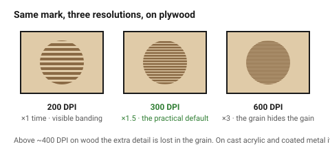
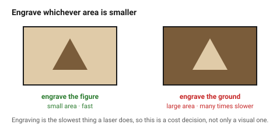

# Raster engraving — filled areas and images

Engraving is the laser sweeping back and forth like an inkjet head, firing to
remove a shallow layer. It produces areas, not lines: logos, photographs,
filled shapes, texture.

It is also, by a wide margin, the **slowest** thing a laser does. A 100 × 100
mm filled area can take longer than cutting out twenty parts, which makes
engraving a design decision with a cost attached.

## When this applies

Any filled mark on a surface: branding, labels, decoration, part numbers,
texture, photographic work. For single-line marks see
[`score-and-fold`](score-and-fold.md); for lettering see
[`text-and-fonts`](text-and-fonts.md).

## Good starting values

| What | Start with | Works between | Why |
|---|---|---|---|
| Resolution | 300 DPI | 200–600 | 300 is invisible from reading distance on wood; 600 doubles the time |
| Resolution for photographs | 600 DPI | 400–1000 | detail lives in the dot spacing |
| Resolution on card or leather | 200 DPI | 150–300 | the material cannot hold more detail than this |
| Engrave depth | 0.1–0.3 mm | — | depth is a power/speed setting, not a drawing dimension |
| Minimum detail in a raster | 0.3 mm | 0.2–0.5 mm | finer detail dissolves into the beam spot |
| Source image resolution | ≥ 300 DPI **at final size** | — | a 300 DPI image scaled up 4× is a 75 DPI image |
| Scan gap / line interval | matched to DPI | — | leave to the controller unless there is banding |

### Higher DPI is not better

| DPI | Time | Appearance |
|---|---|---|
| 200 | ×1 | visible line texture; fine on card, rough on acrylic |
| 300 | ×1.5 | the practical default for wood and acrylic |
| 600 | ×3 | photographic; on wood the extra detail is lost in the grain |
| 1000 | ×5 | only worth it on anodised metal and coated materials |

On wood, DPI above about 400 is usually **wasted**: the grain is coarser than
the dots. On cast acrylic and coated metal the extra resolution shows.

### What engraves well

| Material | Result | Note |
|---|---|---|
| Cast acrylic | frosted white, high contrast | the best engraving material here |
| Extruded acrylic | grey, muddy | see [`acrylic`](../02-materials/acrylic.md) |
| Birch ply, maple | brown on pale, good contrast | grain shows through |
| MDF | dark brown, uniform | no grain, very even |
| Walnut, dark woods | low contrast | the engrave barely shows |
| Leather | rich dark brown | excellent |
| Anodised aluminium | white, very crisp | marking, not engraving |
| Card | pale brown | shallow and easy to overcook |

## How to build it

1. **Decide what is engraved and what is cut** before drawing. They are
   different layers and different operations; a shape cannot be both.
2. Convert photographs to greyscale and apply dithering appropriate to the
   material. Most controllers do this on import — check which algorithm; for
   wood, Jarvis or Stucki dithering reads better than a threshold.
3. Put the engrave on its **own layer**, named `Engrave`, filled, no stroke.
   See [`layers-colours-linewidth`](../06-file-prep/layers-colours-linewidth.md).
4. **Engrave first, cut last.** Once a part is cut free it can shift, and an
   engrave on a shifted part is scrap.
5. Mask the surface for wood and card, or expect a brown halo of smoke
   residue around every engraved area.
6. For large solid fills, consider whether an **outline** would do. A 2 mm
   outlined letter takes seconds; the same letter filled takes minutes.

## When to do it differently

- **Large area, time matters** → invert the design. Engraving the *background*
  of a small logo is slower than engraving the logo; engraving the logo and
  leaving the background is faster. Pick whichever has less area.
- **Fine detail that will not resolve** → cut it instead, or increase the
  size. Below 0.3 mm the beam spot is the limit and no DPI setting helps.
- **Photograph on wood** → expect the grain to compete with the image. Use a
  pale, even species — maple or basswood — or engrave on coated MDF.
- **Deep engraving (over 0.5 mm)** → multiple passes with the focus lowered
  between them, not one slow pass. One slow pass burns a wide, tapered crater.
- **Both sides of clear acrylic** → engrave the *back* face and view through
  the front. The mark is protected and looks like it is floating.

## Images

*The same mark at three resolutions. Between 300 and 600 DPI the visible
difference on wood is small and the time doubles.*

*Identical result, very different job time. Engrave whichever of the two areas
is smaller.*

## Source & date

- DPI guidance: [Trotec — choosing the right resolution for laser engraving](https://www.troteclaser.com/en-us/helpcenter/software/graphics-software/resolution-laser-engraving),
  [FreeFall Laser — lower that resolution](https://www.freefall-laser.com/lasercuttingblog/2019/11/27/lower-that-resolution),
  [Epilog — how image resolution affects engraving quality](https://support.epiloglaser.com/laser-machine/fusion-pro/getting-started/how-image-resolution-affects-engraving-quality/).
- `confidence: medium`.
