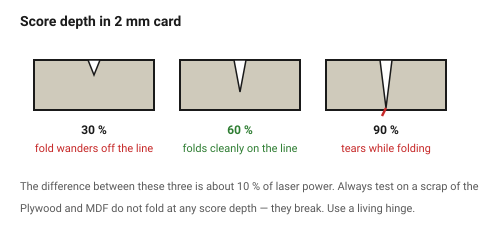
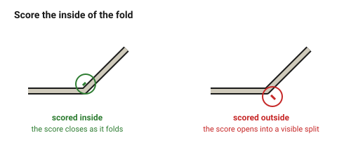

# Scoring and folding

A score is a **vector** pass at low power: the head follows a line without
cutting through. Two quite different uses share the name — marking a surface,
and weakening a line so the material folds along it.

For card and leather, scoring is what a living hinge is for plywood, and it is
far simpler.

## When this applies

- Fold lines in card, leather and thin plastic.
- Assembly guide lines, registration marks, alignment marks.
- Outlined decoration, where a filled engrave would be too slow.

Not for folding plywood or MDF — these do not fold, they break. Use
[`living-hinge`](../04-joints/living-hinge.md).

## Good starting values

| What | Start with | Works between | Why |
|---|---|---|---|
| Score depth for a fold, card | 50–70 % of thickness | 40–80 % | shallower and the fold wanders; deeper and it tears |
| Score depth for a fold, leather | 40–50 % | 30–60 % | leather is tough; it folds with less help than card |
| Score depth for a surface mark | 0.05–0.1 mm | — | just enough to see |
| Score line | one continuous line | — | a dashed score folds unevenly |
| Fold allowance (thickness of the fold) | 1 × material thickness | — | a folded box is one thickness larger than the flat drawing suggests |
| Distance between parallel folds | ≥ 5 × thickness | 3×–10× | closer and the panel between them collapses |

### Which side to score

| Fold direction | Score on | Why |
|---|---|---|
| Valley (material folds toward you) | the **inside** face | the score closes as it folds |
| Mountain (folds away) | the **inside** of the fold, i.e. the far face | same rule, stated from the fold's point of view |

The rule in one sentence: **score the face that ends up on the inside of the
fold.** Scoring the outside face opens the score into a visible split.

### Scoring thicker material

For 3 mm ply or acrylic, a "fold" is not possible, but a **V-groove** is: two
angled passes that remove a wedge so the panel can be folded and glued into a
crisp corner. This needs an angled head or a rotary attachment and is outside
what a standard flat-bed machine does. The flat-bed alternative is a mitre cut
on a saw, or [`stacked-layer-construction`](../04-joints/stacked-layer-construction.md).

## How to build it

1. Put score lines on their **own layer**, named `Score`, with their own
   power setting — typically 15–25 % of the cut power at the same speed.
2. Draw a score as a single unbroken line. Two overlapping lines score twice
   and cut through.
3. **Test on a scrap** of the same stock. The difference between a good fold
   and a torn one is about 10 % of laser power.
4. Order the operations: engrave → **score** → cut. Scoring a part that is
   already free from the sheet moves it.
5. Add the fold allowance to the flat pattern: a 100 mm tall box in 2 mm card
   with two folds is drawn 100 mm, but the finished height is about 102 mm.

## When to do it differently

- **A fold that must be crisp and repeatable** (packaging) → use a wider,
  shallower *crease* — a low-power engraved band 1–2 mm wide — rather than a
  single deep line. It folds more predictably and does not tear.
- **Leather that must not show the score** → score the flesh side.
- **Corrugated card** → score across the flutes, never along them. Along the
  flutes the fold collapses into the corrugation.
- **Clear acrylic** → a score line on acrylic is permanent, visible and
  usually a mistake. Use an engraved band or cut the part in two.

## Images

*A score at roughly 60 % of thickness folds cleanly. Shallower and the fold
wanders off the line; deeper and it tears while folding.*

*Score the face that ends up on the inside of the fold. Scoring the outside
opens the line into a visible split.*

## Source & date

- Fold and bend technique: [Trotec — cutting technique for bending applications](https://www.troteclaser.com/en-us/helpcenter/materials/application-techniques/bending-technique).
- Score layer conventions: [Harvard GSD FabLab — file preparation](https://fablab.gsd.harvard.edu/places/laser-cutter/laser-tutorial/laser-file-preparation/).
- `confidence: medium`.
