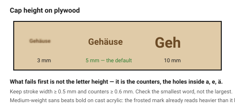
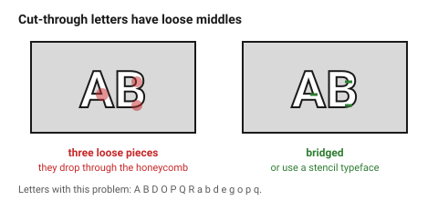

# Text and fonts

Text is where a laser job most often disappoints: the design looks right on
screen at 400 % zoom and comes out as a brown smudge. Two numbers prevent
almost all of it — **stroke width** and **cap height** — and one file habit
prevents the rest: convert text to outlines.

## When this applies

Any lettering: labels, part numbers, branding, signage, instructions on a
panel. Engraved, scored, or cut through.

## Good starting values

### Engraved text

| What | Start with | Floor | Why |
|---|---|---|---|
| Cap height | 5 mm | 3 mm bold sans | below this, counters fill in |
| Stroke width | 0.5 mm | 0.3 mm | thinner strokes vanish into the beam spot |
| Point size equivalent | 12 pt | 10 pt | 10 pt is the usual published minimum for engraving |
| Letter spacing | +5 % of normal | — | the beam widens every stroke; tight tracking closes the gaps |
| Counter size (holes in a, e, o) | ≥ 0.6 mm | 0.4 mm | this is what actually fails first |

### Cut-through text

| What | Start with | Floor | Why |
|---|---|---|---|
| Cap height | 10 mm | 6 mm | the counters have to survive as physical holes |
| Stroke width | 2 mm | = material thickness | a cut letter is a structure; see [`minimum-features`](../03-geometry/minimum-features.md) |
| Counters | ⌀ ≥ material thickness | — | or they char shut |
| Islands (the centre of an O, A, D, P, R) | need bridges | — | otherwise they fall out |

### Choosing a typeface

| Use | Avoid |
|---|---|
| Medium-weight sans (Inter, Helvetica, Roboto, DIN) | hairline and thin weights |
| Open counters | tightly closed counters (some geometric sans) |
| Consistent stroke width | high-contrast serifs (Didot, Bodoni) — the thin strokes disappear |
| Single-line ("stick") fonts for fast marking | script fonts at small sizes |

On **cast acrylic**, engraved text looks visually *heavier* than on screen
because the frosted mark catches the light. Medium weights beat bold there;
a heavy weight overfills.

### Islands and bridges in cut-through text

Letters with enclosed counters — A B D O P Q R a b d e g o p q — lose their
middles when cut through. Two solutions:

1. **Bridges**: leave 1–2 small uncut links holding each island. Visible, but
   structural and honest.
2. **A stencil typeface**, which has the bridges built into the letterforms.
   Always the better answer when the design allows it.

## How to build it

1. **Convert all text to outlines/paths before export.** A font that is not
   installed on the machine's computer is silently substituted, and the job
   comes out in Arial at the wrong width. This is the single most common
   cause of a wrong laser job.
2. Check the smallest counter in the smallest word, not the letter height.
   That is what fails.
3. For cut-through text, check every letter for islands and add bridges or
   switch to a stencil face.
4. Keep engraved text on the `Engrave` layer and cut-through text on the `Cut`
   layer; a file where some text is filled and some is stroked will do
   unexpected things on import.
5. When the text must be *readable from a distance*, the rule is roughly
   1 mm of cap height per 0.3 m of viewing distance.

## When to do it differently

- **Very small text is unavoidable** (a part number) → engrave at 600 DPI on
  a fine-grained material, use a bold sans, and accept 3 mm as the floor.
  On plywood it will still be marginal because the grain is the same size as
  the strokes.
- **Text on dark wood** → contrast comes from the char, and dark wood has
  none. Engrave and paint-fill, or use an inlaid pale material.
- **A long body of text** → engraving is slow and text is mostly empty space.
  Consider a printed label. This is a legitimate answer.
- **Mirror text** (engraving the back face of clear acrylic) → remember to
  flip it. This is easy to say and easy to forget.

## Images

*The same word engraved at three cap heights. At 3 mm the counters are already
closing; the letter height is not what fails, the holes inside the letters are.*

*Cut-through lettering: the middle of every closed counter is a separate piece
of material. Add bridges, or use a stencil typeface that has them built in.*

## Source & date

- Minimum stroke width and font choice:
  [Laser Tinkerer — engraving fonts and text](https://lasertinkerer.com/guides/laser-engraving-fonts-text/),
  [Thunder Laser — best fonts and text styles for engraving](https://www.thunderlaserusa.com/blog/best-fonts-and-text-styles-for-laser-engraving),
  [The Laser Co — how small is too small](https://thelaserco.com/laser-engraving-font-sizes/).
- Cast acrylic appearing visually heavier: [OMTech — engraving acrylic](https://omtech.com/blogs/news/complete-guide-to-laser-engraving-acrylic-cast-vs-extruded-acrylic).
- `confidence: medium`.
