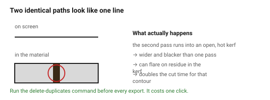
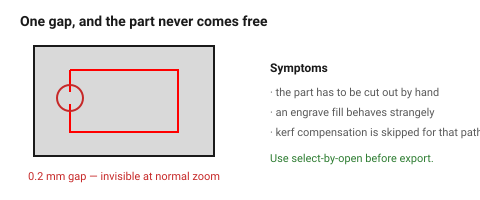

# Common file errors

Six faults account for nearly every rejected or ruined laser job. All six are
invisible on screen at normal zoom, and all six are cheap to check for.

## When this applies

Before every export, and first thing when a job behaves strangely.

## Good starting values

### The six

| # | Fault | What happens on the machine | How to find it |
|---|---|---|---|
| 1 | **Duplicate lines** — two identical paths on top of each other | the line is cut twice: a charred, oversize kerf, or the strip between the two cuts falls out | most CAD tools have a *delete duplicates* command. Run it |
| 2 | **Open paths** — a contour that does not close | the part is not cut free; one uncut segment holds it | select-by-open, or look for the gap at high zoom |
| 3 | **Self-intersecting or overlapping shapes** | the overlap region is cut twice and the fill logic for engraves inverts | union the shapes before export |
| 4 | **Stroked lines with a width** on a cut layer | some controllers engrave the outline of the stroke instead of cutting its centre | set hairline on every cut and score layer |
| 5 | **Live text** | the font is substituted on the machine's computer and the job comes out in the wrong typeface and width | convert to outlines |
| 6 | **Construction geometry left in** | guides, centrelines and dimension leaders are all cut | delete or exclude the `Guide` layer |

### Two more that are less common and more expensive

| Fault | Consequence |
|---|---|
| **Geometry outside the bed** | the head slams into the end stop, or the job silently clips |
| **Nested shapes with unclear inside/outside** | engrave fills invert — the logo comes out as a solid block with letter-shaped holes |

### Why duplicate lines matter more than they look

Two coincident cut paths do not simply cut the same line twice. The second
pass runs on material that is already hot and has an open kerf, so it burns
wider, chars the edges and can set fire to residue in the kerf. On plywood it
produces a visibly black, tapered edge. It also doubles the cut time for that
contour — on a dense file that can be an extra half hour.

## How to build it

A pre-export routine, in this order:

1. **Delete duplicates.**
2. **Close all paths** — check for open contours.
3. **Union overlapping shapes** that are meant to be one outline.
4. **Set hairline** on `Cut` and `Score`; set fills on `Engrave`.
5. **Convert text to outlines.**
6. **Delete guides and construction geometry.**
7. **Check the bounding box** fits the bed with the margin from
   [`nesting-and-spacing`](../03-geometry/nesting-and-spacing.md).
8. Export and re-open the exported file to verify.

## When to do it differently

- **Deliberate double-cutting** (thick material, two passes) → this belongs in
  the machine settings as a pass count, never as duplicated geometry.
- **Deliberately open paths** (a score that should not close, a pen-plotter
  style mark) → legitimate, but put them on a clearly named layer so they are
  not "fixed" by someone later.

## Images

*Two identical paths look like one line on screen. The second pass runs into
an open, hot kerf: wider, blacker, and at risk of flaring.*

*One 0.2 mm gap in a contour, invisible at normal zoom, and the part never
comes free of the sheet.*

## Source & date

- Fault list: [Cut By Beam — preparing your artwork](https://cutbybeam.co.uk/pages/preparing-your-artwork-for-laser-cutting),
  [American Laser — how to prepare files and avoid rejections](https://www.americanlaserco.com/laser101/how-to-prepare-files-for-laser-cutting-and-avoid-rejections/),
  [Harvard GSD FabLab](https://fablab.gsd.harvard.edu/places/laser-cutter/laser-tutorial/laser-file-preparation/).
- `confidence: high`.
