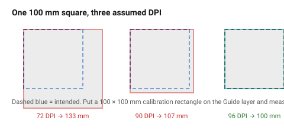
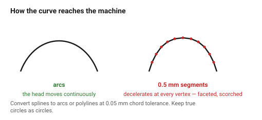

# Exporting — DXF, SVG and the traps in between

The geometry is right, the layers are right, and the part still comes out at
96/25.4 of its intended size. Export is where laser jobs are lost, and almost
every failure is one of three things: **units, curves, or text**.

## When this applies

Every time a file leaves the CAD application for a laser controller or a
cutting service.

## Good starting values

### Which format

| Format | Use it | Watch out for |
|---|---|---|
| **SVG** | the best default for LightBurn and most modern controllers | the 96 vs 72 DPI unit trap, below |
| **DXF** (R12 or 2000) | universal, understood by every controller | no colour fidelity in R12; splines may need flattening |
| **AI / PDF** | services that ask for it | fonts and effects must be flattened first |
| **DWG** | avoid | version-dependent and unnecessary |

For a CAD application exporting to a laser: **DXF 2000 with millimetre units**
is the safest single choice, with SVG as the modern alternative.

### The three traps

**1 — Units.** SVG has no intrinsic unit. Different applications assume 72,
90 or 96 DPI, which is why a part arrives at 75 %, 96 % or 133 % of its size.

| Check | Do this |
|---|---|
| Set the SVG viewport explicitly in mm | `width="200mm" height="150mm"` with a matching `viewBox` |
| Include a known-size calibration rectangle | a 100 × 100 mm square on the `Guide` layer, measured after import |
| For DXF | set `$INSUNITS` to 4 (millimetres) |

**2 — Curves.** Splines, NURBS and some ellipse types are not understood by
every controller. Where they are not, they are either dropped or approximated
badly.

| Do | Tolerance |
|---|---|
| Convert splines to polylines or arcs on export | chord tolerance 0.05 mm |
| Keep true circles as circles | controllers handle these natively and cut them more smoothly |
| Never export a curve as a 0.5 mm-segment polyline | the machine decelerates at every vertex, and the edge comes out faceted and scorched |

**3 — Text.** Convert every piece of text to outlines. A font not installed on
the machine's computer is silently substituted. See
[`text-and-fonts`](../05-engraving/text-and-fonts.md).

### Export checklist values

| What | Value |
|---|---|
| Units | millimetres |
| DXF version | R2000 (or R12 if the controller is old) |
| Spline handling | convert to polyline, 0.05 mm tolerance |
| Text | outlines |
| Layers | preserved, named `Cut` / `Score` / `Engrave` |
| Guide geometry | excluded |
| Origin | bottom-left of the material, or as the workshop specifies |

## How to build it

1. Export.
2. **Re-open the exported file** in a viewer — not the application that made
   it. Half of all export bugs are invisible from inside the originating
   application.
3. Measure the calibration rectangle. If it is not 100 mm, the units are
   wrong; fix the export, do not scale in the controller (scaling propagates
   into kerf compensation and fit allowances).
4. Check the layer list survived.
5. Check curves look like curves, not polygons.

## When to do it differently

- **The service specifies a format** → theirs, exactly. Do not send DXF when
  they ask for AI.
- **The controller cannot read the layers** → export one file per operation:
  `part-cut.dxf`, `part-engrave.dxf`. Tedious, reliable.
- **Very large files** (dense engravings) → send the raster separately as a
  PNG at final size and DPI, rather than embedding it.

## Images

*One 100 mm square, interpreted at 72, 90 and 96 DPI. This is why a
calibration rectangle belongs in every export.*

*Left, arcs: the head moves continuously. Right, a 0.5 mm-segment polyline:
the machine decelerates at every vertex, and the edge comes out faceted and
over-burnt.*

## Source & date

- Format guidance: [American Laser — design file formats for laser cutting](https://www.americanlaserco.com/laser101/design-file-formats-for-laser-cutting/),
  [Harvard GSD FabLab](https://fablab.gsd.harvard.edu/places/laser-cutter/laser-tutorial/laser-file-preparation/).
- `confidence: high` — these are mechanical facts about the file formats.
