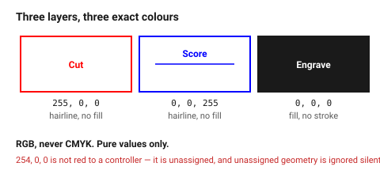
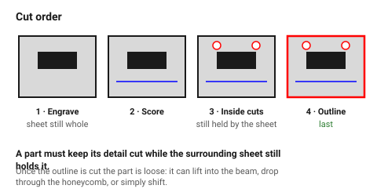

# Layers, colours and line widths

A laser file is not a drawing, it is a **list of instructions sorted by
operation**. The machine needs to know, for every piece of geometry, whether
to cut through it, score it lightly, or sweep across it removing a layer —
and the only channel most controllers have for that is **colour and layer
name**.

Getting this wrong is not a subtle error. A cut line that arrives as an
engrave will be scrubbed over for twenty minutes and never cut through.

## When this applies

Every export. This is the document to check before any file leaves the CAD
application.

## Good starting values

### The three operations

| Operation | Layer name | RGB | What the machine does |
|---|---|---|---|
| **Cut** | `Cut` | `255, 0, 0` (pure red) | full power, cuts through |
| **Score** | `Score` | `0, 0, 255` (pure blue) | low power vector pass, marks or weakens |
| **Engrave** | `Engrave` | `0, 0, 0` (black) | raster sweep over an area |

Extra operations, if the job needs them:

| Operation | Layer | RGB |
|---|---|---|
| Second engrave pass / lighter etch | `Engrave2` | `0, 255, 0` green |
| Reference / non-cutting guides | `Guide` | `128, 128, 128` grey, and **excluded from export** |
| Outer contour cut last | `Cut-Outline` | `255, 0, 255` magenta |

### Rules that are not negotiable

| Rule | Why |
|---|---|
| **RGB, never CMYK** | the driver matches exact RGB values. `254, 0, 0` is not red to a laser controller, it is an unassigned colour |
| **Pure values only** | 255/0/0 — not "a nice red" |
| **Cut and score lines: hairline stroke, no fill** | 0.001 pt / 0.025 mm / "hairline". A stroked line with width is interpreted by some controllers as a thin filled shape, and engraved |
| **Engrave elements: fill, no stroke** | the opposite rule, and the one most often broken |
| **One operation per layer** | mixed layers cannot be reordered or re-powered on the machine |
| **Units in millimetres** | see [`export-dxf-svg`](export-dxf-svg.md) |

### Cut order

Most controllers cut in layer order. The order that does not ruin parts:

1. `Engrave` — while the sheet is whole and rigid
2. `Score`
3. `Cut` — internal holes and slots
4. `Cut-Outline` — outer contours, last

The principle: **a part must keep its detail cut while the surrounding sheet
still holds it.** Once the outline is cut, the part is loose and anything cut
afterwards will be out of position.

## How to build it

1. Create the three layers at the start of the drawing, not at export time.
2. Assign every entity as it is drawn. Retro-fitting layers to a finished
   drawing is where entities get missed.
3. Set stroke to hairline on `Cut` and `Score`; set `Engrave` items to filled
   with no stroke.
4. Delete or exclude `Guide` geometry before export. Construction lines that
   reach the machine get cut.
5. Check the layer list one final time: **three layers, three colours, nothing
   on layer 0 / Default**.

## When to do it differently

- **The workshop has its own convention** → theirs wins, always. Many
  makerspaces use blue for cut. Ask, and follow.
- **A cutting service** → they publish a spec. Follow it exactly; a job
  rejected for colours is a week lost.
- **More than three power levels** (multi-depth engraving) → use the extended
  colour list above; most controllers support 8–16 layers.
- **The controller imports by layer name rather than colour** (some do) →
  set both. Colour and name costs nothing and covers either behaviour.

## Images

*Pure RGB values, one operation per layer. "Nearly red" is an unassigned
colour to a laser controller, and unassigned geometry is usually ignored —
silently.*

*The outline goes last. Once a part is free of the sheet it can shift, and
anything cut after that is out of position.*

## Source & date

- Colour and layer conventions: [Harvard GSD FabLab — laser file preparation](https://fablab.gsd.harvard.edu/places/laser-cutter/laser-tutorial/laser-file-preparation/),
  [Custom Made Better — Illustrator file setup for laser cutting](https://www.custommadebetter.com/blogs/adobe-tutorials/how-to-set-up-an-illustrator-file-for-laser-cutting).
- Hairline stroke requirement: same sources.
- `confidence: high` — these are conventions, and following them is what makes
  a file work; the specific colour assignments vary by workshop, which the
  document says.
