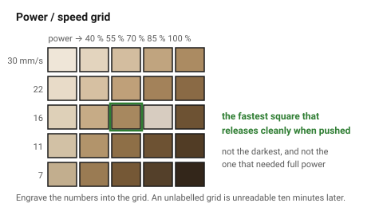

# First time with a new material

Twenty minutes spent here replaces a ruined sheet and an afternoon. The
sequence is always the same, and each step gates the next.

## When this applies

A material, thickness, supplier or batch nobody has cut on this machine
before. A "batch" counts: plywood from the same supplier can behave
differently two months later.

## Good starting values

| Step | Time | Produces |
|---|---|---|
| 1. Identify | 5 min | certainty that it is safe to cut |
| 2. Measure | 1 min | the real thickness |
| 3. Power/speed grid | 10 min | settings that cut through cleanly |
| 4. Comb test | 5 min | the kerf |
| 5. Fit coupon | 5 min | press and slip slot widths |
| 6. Record | 2 min | a row in `machine-assumptions` |

## How to build it

1. **Identify the material.** Supplier product code, resin code, or a copper
   wire test. If the answer is "some clear plastic", it does not go in the
   machine. → [`never-cut-these`](../02-materials/never-cut-these.md)

2. **Measure the thickness** with callipers in three places on the sheet.
   Record the smallest.

3. **Cut a power/speed grid.** A 5 × 5 array of 10 mm squares, power stepping
   across, speed stepping down, labelled by engraving. Look for the fastest
   square that releases cleanly when pushed — not the darkest, not the one
   that cut in one pass at full power.

4. **Run the comb test** at those settings.
   → [`kerf-test-comb`](../01-basics/kerf-test-comb.md)

5. **Cut the fit coupon** and find the press and slip widths by hand.

6. **Write it down** in [`machine-assumptions`](../01-basics/machine-assumptions.md).
   An unrecorded measurement has to be taken again next month.

7. If the material will be **engraved**, add a small greyscale ramp to the
   grid: ten squares from 10 % to 100 % power at engraving speed. This is the
   only way to find out whether it engraves with contrast.

## When to do it differently

- **A known material from a new batch** → steps 2, 4 and 6 only. The settings
  will be close; the thickness and kerf may not be.
- **A decorative one-off** → step 1, step 3, and cut it. The rest only matters
  if something has to fit.
- **A cutting service rather than your own machine** → steps 1 and 2 only;
  ask the service for their kerf.

## Images

*Power across, speed down, each square labelled by an engraved number. The
target is the fastest square that releases cleanly — not the darkest one.*

## Source & date

- Test-grid practice: [CoMakingSpace wiki — laser cutter material settings](https://wiki.comakingspace.de/Laser_Cutter_Material_Settings).
- `confidence: high` — this is procedure, not measurement.
