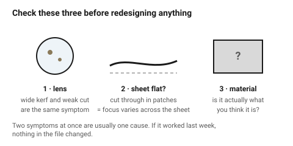

# Failure catalogue — symptom, cause, fix

What went wrong, why, and which of the two fixes it needs: a change in the
**file**, or a change on the **machine**. Telling those apart is most of
troubleshooting, and the column exists for that reason.

## When this applies

After a job that did not come out right, and — more usefully — while designing
something similar to a job that did not come out right last time.

## Good starting values

### Cutting

| Symptom | Likely cause | Fix | Where |
|---|---|---|---|
| Not cut through, in patches | **sheet not flat** (the usual answer in wood), or bed not level | weigh the sheet down; check bed level | machine |
| Not cut through, uniformly | power too low, speed too high, dirty lens, failing tube | clean the lens first — it is the usual answer | machine |
| Not cut through along one edge only | focus off, or the bed is not parallel to the gantry | re-level the bed | machine |
| Cuts through but the part will not release | a glue line in plywood, or an open contour | check for open paths; otherwise expect it in cheap ply | both |
| Wide, black, tapered kerf | duplicate cut lines | delete duplicates | **file** |
| Kerf wider than it used to be | dirty lens or mirrors, tired tube | clean, then measure again | machine |
| Edge visibly bevelled | normal above ~6 mm; focus at mid-thickness | — | machine |

### Burning and marking

| Symptom | Likely cause | Fix | Where |
|---|---|---|---|
| Dark halo around every cut | no masking, no air assist | mask the sheet; check air assist | machine |
| Scorch marks on the **underside** | back-reflection from the honeycomb | raise the sheet on pins | machine |
| Flare or flame during the cut | too slow, resin pocket, or card | speed up, add passes, never leave the machine | machine |
| A brown blob at one point on every contour | the lead-in / pierce point | move the start point to a straight run or the waste side | **file** |
| Dark notches at every corner | overburn — the head decelerating | add a 0.5 mm radius; lower corner power | **file** |
| Smoke film over the whole sheet | extraction insufficient | check the fan and the duct | machine |

### Wood specifically

| Symptom | Likely cause | Fix | Where |
|---|---|---|---|
| Cuts through in some places, not others | the sheet is **bowed** — focus varies across the bed | flatten or weight the sheet | machine |
| A glued box came apart along a joint | **char left on the glue face** | sand every glue face to bare wood | **workshop** |
| A press-fit joint is loose in one spot only | the slot landed on a **void** in the ply core | move the joint, or buy Baltic birch / laser ply | **file** |
| Joints fit from one sheet and not the next | sheet-to-sheet thickness variation (0.2–0.3 mm is in spec) | measure every sheet | **file** |
| A slot split out to the edge | cut **along** the grain in solid wood | reorient the part | **file** |
| The engrave has almost no contrast | dark species — walnut, or a dark-faced ply | change species, or paint-fill | material |
| Engrave is blotchy and uneven | open-grained species (oak, ash) or a patched ply face | pale even-grained species, or B/BB grade | material |
| Brown halo around every cut | no masking | mask both faces | **workshop** |
| Heavy black char on the edge | one slow pass, or weak air assist | two fast passes, 30–40 PSI air | machine |
| The sheet smells acrid and the extraction is on | wrong adhesive — interior UF or an unlabelled sheet | stop; identify the sheet | material |
| A screw split the plywood | driven into the **edge** rather than the face | captive nut or cross dowel | **file** |
| Part warped after cutting | damp stock, or a long part cut across the grain | acclimatise 48 h; reorient | material |

### Fit and assembly

| Symptom | Likely cause | Fix | Where |
|---|---|---|---|
| Joint loose by roughly 0.5 mm | kerf compensation missing | apply it — exactly once | **file** |
| Joint tight by roughly 0.25 mm | kerf compensated twice (geometry *and* machine) | remove one | **file** |
| Some joints fit, some do not | sheet thickness varies across the sheet | measure at the joint, not the corner | **file** |
| Fit changed between two identical jobs | new sheet, or lens drift | re-run the comb test | both |
| Acrylic cracked at a slot, days later | press fit too tight; stress crazing | slip fit + acrylic cement | **file** |
| Plywood split at a slot | slot fell on a void, or it ran along the grain | move the joint; use laser-grade ply | **file** |
| Egg-crate grid will not assemble | accumulated layout error, or an angled slot drawn at nominal thickness | set out from one origin; `thickness / sin θ` | **file** |

### Parts and layout

| Symptom | Likely cause | Fix | Where |
|---|---|---|---|
| Small parts lost in the machine | dropped through the honeycomb | add holding tabs | **file** |
| A part shifted mid-job and everything after is misaligned | outline cut before the internal detail | fix the cut order | **file** |
| Edges of adjacent parts soft or out of size | nested too tightly | 2 mm spacing (3 mm in MDF) | **file** |
| The whole job is 133 % or 75 % of its intended size | SVG unit assumption | set explicit mm units; check the calibration rectangle | **file** |
| The job came out mirrored | exported from the wrong side, or engraving intended for a back face | flip it | **file** |

### Engraving

| Symptom | Likely cause | Fix | Where |
|---|---|---|---|
| Engrave grey and muddy on clear acrylic | it is extruded, not cast | change material — nothing in the file fixes this | material |
| Small text illegible | stroke width or counters below the limit | ≥ 0.5 mm strokes, ≥ 5 mm cap height | **file** |
| Text in the wrong font | live text, font substituted on the machine | convert to outlines | **file** |
| Engraving took an hour | large filled area | invert figure and ground, or outline instead of fill | **file** |
| Banding across an engrave | scan gap mismatched to DPI | adjust the interval | machine |
| Logo came out inverted — solid block with letter-shaped holes | nested paths, unclear inside/outside | fix the even-odd / non-zero fill rule | **file** |

## How to build it

When something has gone wrong:

1. **Look at the column.** If the fix is "machine", changing the drawing will
   not help, and vice versa. A surprising number of hours are lost to
   redesigning around a dirty lens.
2. Check the cheap things first, in this order: is the lens clean, is the
   sheet flat, is the material what you think it is.
3. Change **one** thing and re-cut a small test, not the whole job.
4. When the fix turns out to be a design rule, add it to the relevant document
   in this folder rather than only to your memory.

## When to do it differently

- **Two symptoms at once** → they are usually one cause. A wide kerf *and* an
  incomplete cut is almost always a dirty lens, not two problems.
- **It worked last week and not today** → nothing in the file changed, so it
  is the machine or the material. Start at the lens.

## Images

*Before redesigning anything, check these three. Most "the file must be wrong"
problems are one of them.*

## Source & date

- Assembled from the documents in this folder plus
  [CoMakingSpace wiki](https://wiki.comakingspace.de/Laser_Cutter_Material_Settings)
  and [Cut By Beam](https://cutbybeam.co.uk/pages/preparing-your-artwork-for-laser-cutting).
- `confidence: medium` — symptoms map to causes reliably; the ranking of
  "likely" is experience, not measurement.
- **Photographs wanted** for this document — see [`PHOTOS.md`](../../PHOTOS.md).
  A diagram cannot show what charring, crazing or a smoke halo really look
  like, and those are exactly the failures a vision model needs to recognise.
