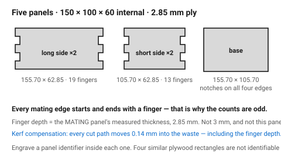
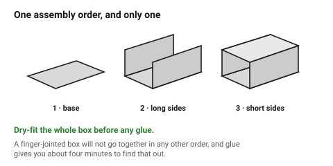

# Worked example — a finger-jointed box

A complete part, start to finish, with every number derived rather than
assumed. The point of this document is the **order of decisions**: material,
then joint, then geometry, then compensation, then layout. Reversing that
order is what produces a box that nearly fits.

Target: an open-top box, **150 × 100 × 60 mm internal**, 3 mm birch plywood.

## When this applies

As a template for any box-like assembly, and as a model for how the other
documents in this folder chain together.

## Good starting values

### Step 0 — the measurements everything derives from

| Quantity | Value | Where it came from |
|---|---|---|
| Nominal material | 3 mm birch ply | chosen |
| **Measured thickness, t** | **2.85 mm** | callipers, three places, smallest reading |
| **Measured kerf, k** | **0.28 mm** | [`kerf-test-comb`](../01-basics/kerf-test-comb.md) |
| Fit | slip + PVA glue | a press fit would squeeze the glue out |
| Compensation method | geometry (Method B) | the controller has no kerf offset |

### Step 1 — outside dimensions

Internal 150 × 100 × 60, walls of *t* on each side:

```
outside length = 150 + 2t = 150 + 5.70 = 155.70 mm
outside width  = 100 + 2t = 100 + 5.70 = 105.70 mm
outside height =  60 +  t =  60 + 2.85 =  62.85 mm    (base only, open top)
```

### Step 2 — panel sizes

| Panel | Qty | Size | Note |
|---|---|---|---|
| Long side | 2 | 155.70 × 62.85 | fingers on both ends and the bottom edge |
| Short side | 2 | 105.70 × 62.85 | notches on both ends, fingers on the bottom |
| Base | 1 | 155.70 × 105.70 | notches on all four edges |

### Step 3 — finger counts

Target finger width ≈ 3 *t* = 8.55 mm. Odd counts only.

| Edge | Length | n = round(L / 3t) | Odd? | Final n | Actual w |
|---|---|---|---|---|---|
| Long side, horizontal | 155.70 | 18.2 → 18 | no | **19** | 8.19 mm |
| Short side, horizontal | 105.70 | 12.4 → 12 | no | **13** | 8.13 mm |
| Vertical (corner) | 62.85 | 7.4 → 7 | yes | **7** | 8.98 mm |

All three land between 2 *t* and 5 *t*. Good.

### Step 4 — finger depth

Finger depth = the **mating** panel's measured thickness = **2.85 mm**,
everywhere. Not 3 mm.

### Step 5 — kerf compensation

Method B, so the geometry carries it. Every cut path moves **into the waste**
by k/2 = **0.14 mm**:

| Feature | Drawn dimension | Adjustment |
|---|---|---|
| Panel outer contour | as above | offset outward 0.14 mm |
| Finger sides | — | each finger grows 0.14 mm per side → +0.28 mm total |
| Notch sides | — | each notch shrinks 0.14 mm per side → −0.28 mm total |
| Finger depth | 2.85 mm | grows 0.14 mm → drawn at 2.99 mm |

The last row is the one people miss: depth is a cut dimension too.

## How to build it

1. Measure the sheet. **2.85 mm**, not 3.
2. Run the comb test. **k = 0.28 mm**.
3. Compute the outside dimensions from the internal target.
4. Compute finger counts per edge; round each to odd.
5. Lay out each panel starting and ending with a finger on the mating edges.
6. Apply the 0.14 mm offsets.
7. Add an engraved panel identifier (`A1`, `A2`, `B1`…) on a face that will be
   inside the box. Four nearly-identical plywood rectangles on a bench are
   not identifiable by eye.
8. Nest with 2 mm spacing, grain running the same way on the two long sides
   so the finished box matches.
9. Order the layers: engrave → cut internal → cut outlines.
10. Run [`before-you-export`](../07-checklists/before-you-export.md).
11. **Dry-fit the whole box before glue.** The assembly order is: base, then
    the two long sides, then the two short sides. It will not go together in
    any other order.

## When to do it differently

- **A closed box with a lid** → the lid is a sixth panel with notches on all
  four edges, and the box sides need a 0.3 mm clearance around it or the lid
  will not seat. Add a 2 mm rim inside to locate it.
- **Acrylic** → use 4–5 *t* fingers (so 11–14 mm here), which means n = 13 and
  9 instead of 19 and 13. Glue with acrylic cement, not PVA.
- **A box that must be opened** → do not use finger joints on the lid edge.
  Use [`t-slot-captive-nut`](../04-joints/t-slot-captive-nut.md) or a hinge.
- **Internal dividers** → [`cross-lap`](../04-joints/cross-lap.md), and add
  the dividers to the base panel as slots at the same time.

## Images


*The five panels. Every mating edge starts and ends with a finger, which is
why the counts are odd and no panel is handed.*


*Base, long sides, short sides. A finger-jointed box has exactly one assembly
order, and dry-fitting is how you find out what it is.*

## Source & date

- All numbers derived in this document from the linked sources; nothing here
  is an independent measurement.
- `confidence: medium` — the arithmetic is exact, the inputs (2.85 mm, 0.28 mm)
  are an example, not your sheet.
