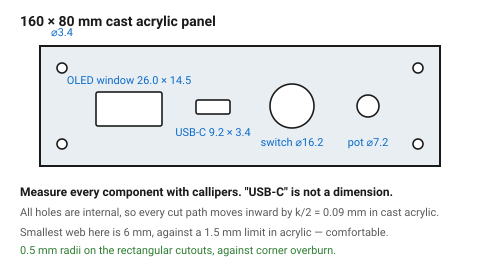
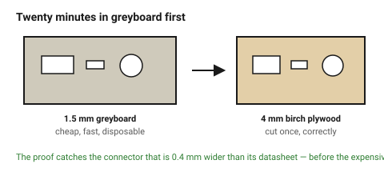

# Worked example — a front panel with cutouts

The other common laser job: a flat panel carrying bought components. Nothing
here is structural — the whole difficulty is that **every hole has to fit
something that already exists**, which makes it an exercise in measuring
other people's parts.

Target: a 3 mm cast acrylic panel, 160 × 80 mm, carrying a USB-C socket, a
16 mm panel switch, a potentiometer, a 0.96″ OLED display and four M3 screws.

## When this applies

Instrument panels, enclosure faces, mounting plates, control surfaces — any
sheet whose job is to hold bought hardware.

## Good starting values

### Every hole, and where its number comes from

| Component | Hole | Drawn | Fit | Why |
|---|---|---|---|---|
| M3 mounting screws ×4 | ⌀ 3.4 mm | 3.4 | clearance | ISO 273 medium; never a close fit on a four-screw pattern |
| Panel switch, 16 mm | ⌀ 16.2 mm | 16.2 | clearance +0.2 | the threaded bush must pass; the nut covers the gap |
| Potentiometer, 7 mm bush | ⌀ 7.2 mm | 7.2 | clearance | plus an anti-rotation notch if the pot has a lug |
| USB-C socket | 9.2 × 3.4 mm | rectangle, 0.5 mm corner radius | clearance +0.2 | **measure the actual socket** — "USB-C" is not a dimension |
| OLED 0.96″ | 26.0 × 14.5 mm window | rectangle | clearance +0.3 | the glass, not the PCB; leave the PCB behind the panel |
| OLED mounting | 4 × ⌀ 2.4 mm | 2.4 | clearance | M2 |

### Kerf compensation on this panel

All the holes are internal, so every cut path moves **inward** by k/2. With
cast acrylic at k = 0.18 mm that is 0.09 mm per side. Drawn ⌀ 3.4 mm comes out
at ⌀ 3.4 mm; drawn without compensation it comes out at 3.58 mm — still a
clearance hole, which is why this panel tolerates a missed compensation and a
finger-jointed box does not.

### Geometry checks for this panel

| Check | Value here | Limit | Verdict |
|---|---|---|---|
| Smallest hole | 2.4 mm | ≥ 1.5 mm in acrylic | ok |
| Smallest web (between OLED window and switch) | 6 mm | ≥ 1.5 mm | ok |
| Edge distance, M3 holes | 6 mm from edge | ≥ 2 t = 5.7 mm | ok, barely |
| Corner radius on rectangular cutouts | 0.5 mm | — | added for overburn |

## How to build it

1. **Measure every component with callipers.** Datasheet dimensions are
   nominal and connectors in particular vary between manufacturers. This step
   is the whole job.
2. Lay out the component positions first, then check the webs between them.
3. Add 0.5 mm radii to rectangular cutouts — see
   [`corners-and-overburn`](../03-geometry/corners-and-overburn.md).
4. Put the labels on the `Engrave` layer, 5 mm cap height, medium-weight sans,
   stroke ≥ 0.5 mm.
5. **Engrave the back face and mirror the text**, if the panel is clear
   acrylic and should look like the lettering is floating under the surface.
   This also protects the engraving from wear.
6. Leave the protective masking on both faces through the whole job.
7. Cut a **cardboard proof first**. Twenty minutes, and it catches the
   connector that is 0.4 mm wider than the datasheet said.

## When to do it differently

- **A panel that will be handled a lot** → 3 mm acrylic flexes. Go to 5 mm, or
  support the long edges.
- **A panel with many identical holes** → cut one test strip with the hole at
  three sizes (nominal, +0.1, +0.2) and try the real component in each.
- **Backlit or edge-lit lettering** → engrave the back face deeply and leave
  the front face untouched; the frosted engrave catches light from an LED at
  the edge. Cast acrylic only.
- **Metal-look panels** → laser-cut acrylic and apply a brushed vinyl, or have
  the panel water-jetted. Anodised aluminium can be marked but not cut on a
  CO₂ machine.

## Images

*Every hole traced back to a measured component. "USB-C" is not a dimension —
the socket in your hand is.*

*The same file in 1.5 mm greyboard. It catches the connector that is wider
than its datasheet, before the acrylic is cut.*

## Source & date

- Clearance hole sizes: ISO 273 medium series, as tabulated in
  [`fits-press-slip-clearance`](../01-basics/fits-press-slip-clearance.md).
- Component dimensions are examples; every one of them should be measured.
- `confidence: medium`.
