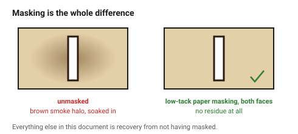
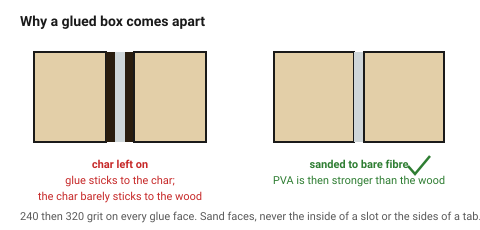

# Char — preventing it, and cleaning up what is left

Wood does not vaporise, it **burns**. Every cut leaves a carbonised layer on
the edge and a brown film of smoke residue around it. That is not a defect —
it is how the process works — but it matters for three reasons:

1. **Char is a weak boundary layer.** Glue sticks to it, and it does not stick
   to the wood underneath. Char left on a glue face is the most common reason
   a laser-cut box comes apart.
2. **It transfers.** Unsanded edges mark hands, clothes and the next part in
   the stack.
3. **It reads as cheap.** A sanded edge is the difference between a prototype
   and a product.

Preventing char is much cheaper than removing it, and both belong in the
design, not just the workshop.

## When this applies

Every wooden part. Especially every part that will be **glued**, **handled**
or **seen**.

## Good starting values

### Prevention, in order of effect

| What | Setting | Why |
|---|---|---|
| **Air assist** | **30–40 PSI from a real compressor** | the single biggest lever. A stock aquarium pump gives 2–5 PSI, which is not enough to blow burning gases out of the kerf |
| **Passes** | 2 fast rather than 1 slow | dwell time is what makes char; two quick passes at lower power beat one slow one at full power |
| **Speed vs power** | high speed, high power | slow-and-gentle chars *more*, not less |
| **Masking** | low-tack paper tape, **both faces** | seals the surface and keeps oxygen off it; removes the brown halo entirely |
| **Focus** | slightly **below** the surface on thicker stock | puts the narrowest part of the beam mid-thickness |
| **Bed** | pins or a raised grid | stops back-reflection scorching the underside |
| **Extraction** | running, and checked | smoke that is not pulled away settles on the sheet |

### Removal, once it is there

| Method | Use for | Note |
|---|---|---|
| **320-grit paper** | edges and faces | the standard answer; 240 first if the char is heavy |
| **Damp cloth** | smoke film on the face | immediately after cutting, before it sets |
| **Melamine sponge** ("magic eraser"), barely damp | stubborn face staining | test on scrap: it abrades |
| **Scraper / card scraper** | straight edges | faster and flatter than paper on a long edge |
| **Nothing** | jigs, internal parts, anything painted | char under paint is invisible |

### What sanding costs the fit

Sanding removes material, so **a joint sanded after cutting is a joint that
no longer fits**. Two rules:

- **Sand faces, not joint surfaces.** Never sand the inside of a slot or the
  sides of a tab.
- **Sand before assembly, not after.** An assembled box cannot be sanded in
  its internal corners, and the corner is where char shows most.

## How to build it

1. **Mask the visible face before cutting.** Everything else in this document
   is recovery from not having done this.
2. Cut with air assist at real pressure, two fast passes.
3. Peel the masking while the part is still in the sheet, if the part is
   small — loose masked parts are hard to hold.
4. **Sand every glue face** to bare wood before gluing. 240 then 320.
   → [`gluing-wood`](gluing-wood.md)
5. Sand the visible faces to 320, **before** assembly.
6. Wipe with a barely damp cloth, let it dry, then finish.
   → [`sealing-and-finishing`](sealing-and-finishing.md)

### Design decisions this implies

| Decision | Why |
|---|---|
| Leave access to internal corners | you cannot sand a corner you cannot reach |
| Break long assemblies into sub-assemblies | so each part can be finished flat |
| Do not design a joint that must be sanded to fit | sand the faces, tune the fit in the file |
| Put deliberate chamfers on visible edges | a chamfered edge sands in one stroke; a sharp arris does not |

## When to do it differently

- **A deliberately charred aesthetic** → some designs want the dark edge.
  Say so, and skip the sanding rather than fighting it.
- **MDF** → char is near-black and does not sand out attractively. Paint it.
- **Veneer and very thin stock** → sanding goes through the face in one
  stroke. Mask, cut once, and do not sand at all.
- **A part with hundreds of small internal cutouts** → sanding each one is not
  realistic. Mask both faces, accept the edges, and design the piece so the
  edges are not the focus.

## Images

*The same cut with and without low-tack paper masking. The brown halo is smoke
residue settling on bare wood; the masking keeps it off the surface entirely.*

*Glue bonds to the char, and the char is barely attached to the wood beneath.
Sanding the glue face back to bare fibre is what makes the joint strong.*

## Source & date

- Air-assist pressure (30–40 PSI vs 2–5 PSI stock), masking and multi-pass
  strategy: [TwoTrees — how to stop charring and burnt edges on laser-cut wood](https://twotrees3d.com/blogs/knowledge/how-to-stop-charring-and-burnt-edges-on-laser-cut-wood),
  [Thunder Laser — preventing burning when laser cutting](https://www.thunderlaserusa.com/blog/preventing-burning-when-laser-cutting),
  [Signwarehouse — tape for laser engraving wood without burn marks](https://signwarehouse.com/blogs/content/tape-laser-engraving-wood-without-burn-marks).
- 320-grit and damp-cloth cleanup: [Tyvok — how to laser engrave and cut plywood](https://tyvok.com/blogs/news/laser-engrave-cut-plywood-settings-tips),
  [OMTech — mastering the art of laser cutting plywood](https://omtech.com/blogs/tips/laser-cutting-plywood).
- Sanding before assembly: [Tyvok — sand before or after assembling a laser-cut box](https://eu.tyvok.com/blogs/news/tyvok-a1-mini-sanding-before-box-assembly-access).
- `confidence: medium`.
