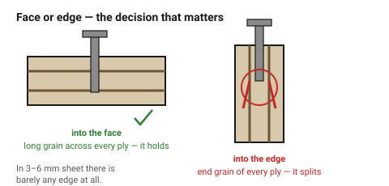
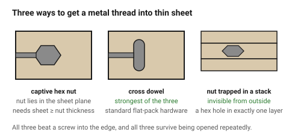

# Fasteners in wood — screws, inserts and captive nuts

Wood takes a screw, which is one of the two reasons this folder defaults to it
(the other is the press fit). But a laser-cut part is thin sheet, and thin
sheet has two very different surfaces to fasten into: the **face**, which is
long grain and strong, and the **edge**, which is the end grain of every ply
and is not.

Almost every fastening failure in laser-cut wood is a fastener put into the
edge that should have gone into the face — or should have been a captive nut.

## When this applies

Any assembly held together by hardware rather than glue: enclosures, frames,
anything that must be opened, anything mounting a bought component.

## Good starting values

### Face or edge

| Into the | Holds | Use |
|---|---|---|
| **Face** of plywood (through the plies) | well | screws, inserts, anything |
| **Edge** of plywood (into the ply ends) | **poorly** | only with a captive nut or a cross dowel |
| Face of MDF | moderately, strips after a few cycles | inserts, not bare screws |
| **Edge of MDF** | **very poorly** | never a bare screw |
| Solid wood, across the grain | well | |
| Solid wood, into end grain | poorly | |

In 3–6 mm sheet there is barely any edge to fasten into at all. **Design the
joint so the fastener goes through one part's face and into a captive nut in
the other**, rather than into the edge.
→ [`t-slot-captive-nut`](../04-joints/t-slot-captive-nut.md)

### Pilot holes for wood screws

Plywood and MDF compress easily, so use the **softwood** pilot size rather
than the hardwood one.

| Screw ⌀ | Pilot in ply / MDF | Pilot in hardwood | Clearance hole (the part being held) |
|---|---|---|---|
| 2.5 mm | 1.8 mm | 2.1 mm | 2.9 mm |
| 3.0 mm | 2.1 mm | 2.5 mm | 3.4 mm |
| 3.5 mm | 2.5 mm | 2.9 mm | 4.0 mm |
| 4.0 mm | 2.8 mm | 3.4 mm | 4.5 mm |
| 5.0 mm | 3.5 mm | 4.2 mm | 5.5 mm |

Rule of thumb: **pilot ≈ 70 % of the screw's outer diameter in soft material,
85 % in hardwood.** Too small and the part splits; too large and there is
nothing to grip.

### Threaded inserts for wood

Knurled or self-tapping brass/steel inserts screwed or pressed into a drilled
hole. They give a machine thread that survives repeated use.

| What | Guidance |
|---|---|
| Hole size | **use the insert manufacturer's own chart**, and take the *softwood* figure for ply and MDF |
| Too small | the insert splits the material as it goes in |
| Too large | it spins freely and has no grip — the most common failure |
| Material around it | ≥ 3 × insert ⌀; more in MDF |
| Flanged vs plain | **flanged** spreads load and is much better in plywood |
| Into an **edge** | clamp the faces while driving it, or it splits the plies |
| Sheet thickness | most wood inserts are 8–15 mm long, so they belong in the **face** of thick stock or in a stacked boss, not in 3 mm sheet |

For 3–6 mm laser-cut sheet, a wood insert usually will not fit. The practical
alternatives are a **captive hex nut** in the plane of the sheet, or a
**stacked boss** built from several layers.
→ [`stacked-layer-construction`](../04-joints/stacked-layer-construction.md)

### Captive nuts and cross dowels — the right answer for sheet

| Method | How | Strength |
|---|---|---|
| **Hex pocket in the sheet plane** | the nut lies inside the material; a screw enters from the edge | good, and demountable — [`t-slot-captive-nut`](../04-joints/t-slot-captive-nut.md) |
| **Cross dowel (barrel nut)** | a cylindrical nut in a cross-drilled hole | excellent; standard flat-pack furniture hardware |
| **Through bolt + washer + nut** | simplest and strongest | visible hardware both sides |
| **Nut trapped between two layers** | a hex hole in one layer of a stack | invisible, very strong |

**Always use a washer** under a screw head in wood. Without one the head
crushes the fibres and the joint loosens as the wood compresses.

## How to build it

1. Decide **face or edge** first. If the answer is edge, switch to a captive
   nut before doing anything else.
2. Size the pilot from the table, using the softwood column for sheet goods.
3. Keep ≥ 3 × the fastener diameter of material around every hole, and ≥ 2 ×
   thickness from any edge.
4. Add a washer, or a countersink with enough material under it.
5. Drive screws **slowly**. Speed generates heat, and heat in a small pilot
   hole burnishes the fibres so they never grip.
6. For anything opened more than a few times, design in a metal thread —
   captive nut or insert — from the start. Retrofitting one into a stripped
   hole is much harder than designing it in.

## When to do it differently

- **MDF** → never a bare screw into the edge, and expect face screws to strip
  after a few cycles. Captive nuts or inserts only.
- **The joint is opened constantly** → cross dowel or through bolt.
- **Appearance matters** → nut trapped between layers of a stack, invisible
  from outside.
- **Very thin sheet (≤ 3 mm)** → no fastener holds in it directly. Stack up a
  local boss, or use a captive nut in the sheet plane.
- **High pull-out load** → through bolt with a washer both sides. Everything
  else is a compromise.

## Images

*The face is long grain across every ply and holds. The edge is the end grain
of each ply and splits — which is why sheet assemblies use captive nuts.*

*Three ways to get a metal thread into thin sheet. All three beat a screw into
the edge, and all three survive being opened repeatedly.*

## Source & date

- Threaded-insert pilot sizing and the softwood-figure rule for sheet goods:
  [Accu — threaded insert pilot hole charts](https://accu-components.com/us/p/505-selftapping-threaded-insert-pilot-hole-size-charts-for-metal-plastic-wood),
  [Woodworking Advisor — how to install threaded inserts for wood](https://woodworkingadvisor.com/how-to-install-threaded-inserts-for-wood/).
- Edge installation splitting, clamping the faces, and flanged inserts
  spreading load in plywood: [Best Home Tools — threaded inserts for plywood](https://besthometools.org/best-threaded-inserts-for-plywood/),
  [Sawmill Creek — threaded inserts for MDF](https://sawmillcreek.org/threads/threaded-inserts-for-mdf.254605/).
- Pilot ratios (≈70 % soft, ≈85 % hardwood) are standard woodworking practice.
- `confidence: medium` — insert dimensions vary by manufacturer; use their
  chart, not this one.
