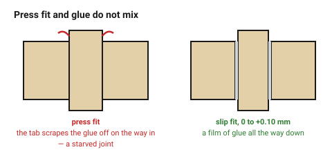
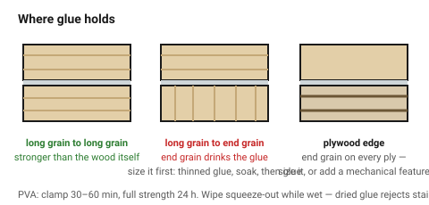

# Gluing laser-cut wood

Most laser-cut wooden assemblies are glued, and most that fail do so for one
of two reasons: **char left on the glue face**, or a **press fit that squeezed
the glue out**. Both are decided at design time, not at the bench.

## When this applies

Any wooden assembly that is not screwed or bolted. Finger-jointed boxes,
laminated stacks, tab-and-slot structures, inlay.

## Good starting values

### Which glue

| Glue | Open time | Clamp | Full cure | Gap filling | Use for |
|---|---|---|---|---|---|
| **PVA (yellow / white wood glue)** | 5–10 min | **30–60 min** | 24 h | poor — wants a tight joint | **the default for wood-to-wood** |
| **PVA type II/III (water resistant)** | 5–10 min | 30–60 min | 24 h | poor | damp-ish environments; still not outdoor |
| **CA (cyanoacrylate)** | seconds | none | minutes | thin: none. Gel: some | tacking, small parts, inlay. **Not structural** |
| **Epoxy** | 5–30 min | 4–6 h | 24 h | **good** | gap filling, oily species, end grain, where clamping is awkward |
| **Polyurethane** | 20 min | 2–3 h | 24 h | foams into gaps | when the joint cannot be clamped tight |
| **Hide glue** | 5 min | 1 h+ | 24 h | poor | reversible joints, restoration |

PVA is stronger than the wood itself in a long-grain joint. It is not the
limiting factor — the joint's **surface preparation and fit** are.

### The two things that actually decide the joint

**1 — Char must come off the glue faces.** Glue bonds happily to the
carbonised layer, and the carbonised layer is barely attached to the wood
beneath it. Sand every glue face to bare fibre: 240 then 320.
→ [`char-and-cleanup`](char-and-cleanup.md)

**2 — Use a slip fit, not a press fit.** A press-fit joint scrapes the
adhesive off on the way in and leaves a starved joint. For anything glued, aim
for **0 to +0.10 mm** clearance and let the glue fill it.

| Joint | Fit | Why |
|---|---|---|
| Glued finger joint | **slip** | glue needs a film |
| Glued tab-and-slot | **slip** | |
| Press fit, no glue | −0.05 to −0.10 mm | the fibres are the fastener |
| Press fit **and** glue | do not | pick one |

### Where glue holds, and where it does not

| Joint surface | Strength | Note |
|---|---|---|
| Long grain to long grain | **excellent** — stronger than the wood | the ideal |
| Long grain to **end grain** | poor | end grain drinks the glue; size it first |
| Plywood **face** to face | excellent | how laminated stacks work |
| Plywood **edge** (exposed end grain of every ply) | moderate | size it, or add a mechanical feature |
| MDF edge | poor | very absorbent; seal with thinned glue first |
| Charred surface | **very poor** | the whole point of this document |

**Sizing** an end-grain face means brushing on thinned glue, letting it soak
in for a few minutes, then gluing normally. It roughly doubles the strength of
an end-grain joint.

### Clamping

| What | Value | Why |
|---|---|---|
| PVA clamp time | 30–60 min | longer does no harm; shorter is a weak joint |
| Full strength | 24 h | do not load the assembly before this |
| Pressure | firm, even | not crushing — squeeze-out should be a bead, not a flood |
| Squeeze-out | wipe while wet | dried glue **rejects stain and finish**, and the patch shows |

## How to build it

1. Design the joint as a **slip fit** if it will be glued.
2. Dry-fit the whole assembly first. A finger-jointed box has exactly one
   assembly order, and glue gives you about four minutes to discover it.
3. Sand every glue face to bare wood.
4. Size end-grain faces if the joint depends on them.
5. Glue, assemble on a flat surface, clamp 30–60 minutes.
6. **Wipe squeeze-out while it is wet**, with a barely damp cloth.
7. Leave 24 hours before loading or finishing.

## When to do it differently

- **The joint cannot be clamped** → polyurethane or epoxy, or design in a
  mechanical feature that holds it while the glue cures (a dovetail, a tab, a
  pin).
- **A stack of laminated layers** → glue all joints and clamp the whole stack
  in one go. Gluing in stages builds a cumulative lean.
  → [`stacked-layer-construction`](../04-joints/stacked-layer-construction.md)
- **The part will be stained** → be fanatical about squeeze-out. Dried glue
  rejects stain, and the mark is permanent.
- **It must come apart again** → do not glue. Use a screwed joint.
  → [`t-slot-captive-nut`](../04-joints/t-slot-captive-nut.md)
- **Acrylic** → wood glue does nothing. Acrylic cement (dichloromethane)
  welds PMMA chemically and is far stronger than any mechanical fit.

## Images

*A press fit scrapes the adhesive off as the tab goes in and leaves a starved
joint. A slip fit carries a film of glue all the way down.*

*Long grain to long grain is stronger than the wood itself. End grain drinks
the glue and needs sizing first — and a plywood edge is end grain on every
ply.*

## Source & date

- Clamp and cure times by adhesive: [Workshop Calc — wood glue dry time chart](https://workshopcalc.com/reference/wood-glue-dry-time-chart),
  [Woodworking Advisor — how long to clamp wood glue](https://woodworkingadvisor.com/how-long-should-you-clamp-wood-glue/),
  [MT Copeland — the ultimate guide to wood glue](https://mtcopeland.com/blog/the-ultimate-guide-to-wood-glue/).
- Gap filling, end-grain sizing and glue selection: [Toolstash — wood glue types and uses](https://toolstash.com/terms/wood-glue).
- Sanding char before gluing: [OMTech — laser cutting plywood](https://omtech.com/blogs/tips/laser-cutting-plywood),
  [Tyvok — laser engrave and cut plywood](https://tyvok.com/blogs/news/laser-engrave-cut-plywood-settings-tips).
- `confidence: medium`.
