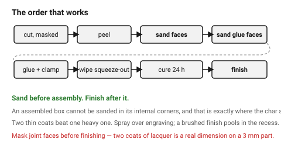

# Sealing and finishing

Two separate questions that get confused: **sealing before the laser**, which
is about keeping smoke off the surface, and **finishing after it**, which is
about protecting and colouring the finished piece.

The first one is a design decision and has to be made before the job runs.

## When this applies

Any wooden part that will be seen or handled. Not for jigs, templates or
internal structure.

## Good starting values

### Sealing before cutting

Smoke residue settles on bare wood and soaks in. A sealed surface lets it wipe
straight off.

| Approach | Effect | Watch out for |
|---|---|---|
| **Low-tack paper masking tape**, both faces | the standard answer — no residue at all | peel before finishing; adhesive can lift soft grain |
| **Transfer / application tape** | same, and easier on large sheets | |
| **Sanding sealer or shellac**, thin coat | smoke wipes off; engraving still works | test first — engrave contrast changes |
| **Thin lacquer**, sprayed | good on pale species | |
| **Polyurethane varnish** | **avoid** | the laser burns and distorts it; the damage cannot be fixed without sanding back and re-varnishing |
| **Nothing** | brown halo around every cut | fine for parts that will be painted or are internal |

### Finishing after cutting

| Finish | Look | Effort | Best for |
|---|---|---|---|
| **Hard wax oil / Danish oil** | warm, matte, natural | 2 coats, wipe on | the usual answer for plywood and hardwood |
| **Spray lacquer** | even, slightly glossy | 2–3 light coats | detailed parts, engraved surfaces — seals porous burnt edges without pooling |
| **Wax** | soft sheen | one coat, buff | small pieces, low wear |
| **Shellac** | amber, fast | brush or pad | quick, reversible, good sealer coat |
| **Paint / primer** | opaque | 2–3 coats, sealer first | MDF, and anything where the material does not matter |
| **Stain then oil** | coloured grain | | **wipe every trace of glue squeeze-out first** — dried glue rejects stain |

### The order that works

```
cut (masked) → peel → sand faces 240 → 320 → sand glue faces to bare wood
   → glue and clamp → wipe squeeze-out wet → cure 24 h
   → final light sand 320 → finish
```

Two points people reverse:

- **Sand before assembly.** An assembled box cannot be sanded in its internal
  corners, and that is where char shows most.
- **Finish after assembly**, unless the finish would prevent gluing — most
  finishes do. If a part must be finished before assembly, mask its glue
  faces.

### Engraved surfaces

An engraved recess is **porous burnt wood**: it drinks oil and darkens more
than the surrounding surface, which is usually desirable. A sprayed lacquer
seals it without pooling. A brushed finish pools in the engraving and dries
unevenly.

## How to build it

1. Decide masking or sealing **before** the job runs.
2. Cut, peel, sand faces — not joint surfaces.
3. Sand glue faces to bare wood, glue, clamp, wipe squeeze-out.
4. Let the glue cure fully — 24 hours — before any finish.
5. Light 320 sand to knock back raised grain.
6. Two thin coats of oil or two or three light sprays of lacquer, rather than
   one heavy coat.
7. For an outdoor-ish part: seal the **end grain of every cut edge** first and
   twice. That is where water gets in, and a laser-cut part is nearly all
   exposed end grain.

## When to do it differently

- **MDF** → sealer or primer first, two coats, then paint. Raw MDF edge drinks
  finish and stays fuzzy.
- **A part that must stay pale** → water-based lacquer; oil yellows over time.
- **Food contact** → laser-cut wood is not food safe: smoke residue and
  adhesives. Say so rather than choosing a finish.
- **Outdoors** → no finish makes laser-cut plywood outdoor-durable. Every cut
  edge wicks. Choose a different process or accept a season.
- **A part with a fitted joint** → mask the joint faces before finishing. Two
  coats of lacquer is a real dimension on a 3 mm part.

## Images


*Sand before assembly, finish after it. An assembled box cannot be sanded in
its internal corners, and that is exactly where the char shows.*

## Source & date

- Seal-before-engraving and finish selection: [A Complete Guide to Finishing Laser Cut Wood](https://coollaserfile.com/a-complete-guide-to-finishing-laser-cut-wood/),
  [OMTech — how to finish laser engraved wood](https://omtech.com/blogs/tips/how-to-finish-laser-engraved-wood),
  [Maker Industry — how to seal laser engraved wood](https://makerindustry.com/how-to-seal-laser-engraved-wood/).
- The polyurethane-varnish warning and the masking alternative: [Sawmill Creek — how do I make laser-ready boards](https://sawmillcreek.org/threads/how-do-i-make-laser-ready-boards.67635/).
- Spray lacquer over engraving rather than brushed finish: sources above.
- `confidence: medium`.
